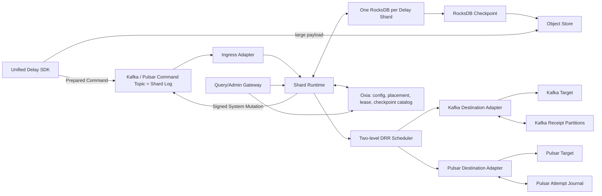
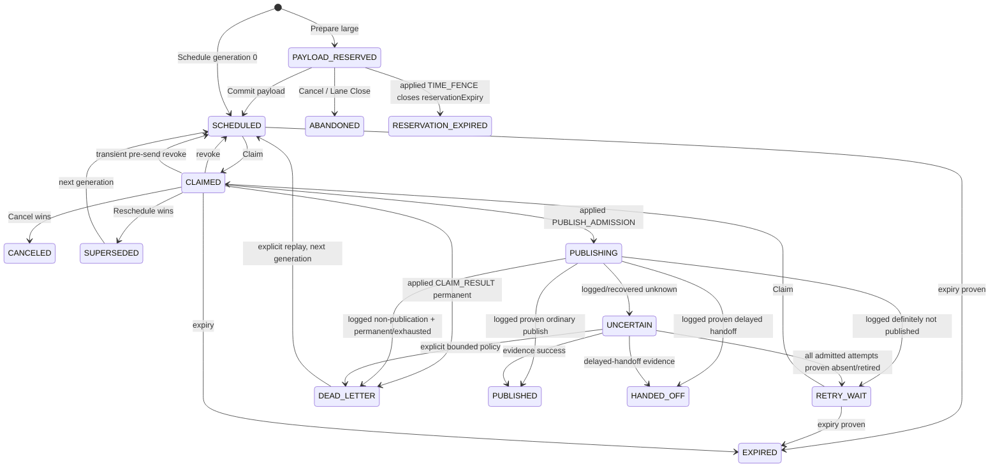

# Nereus Delay V1 设计

状态：V1 语义与协议冻结稿（`V1-FROZEN-2026-08-01`）  
日期：2026-08-01  
适用范围：Kafka/Pulsar 入口，Kafka/Pulsar 目标，单 Active Recovery Cell

本文是 Nereus Delay V1 的实现与验收基线。术语以仓库根目录的 [`CONTEXT.md`](../CONTEXT.md) 为准；关键取舍及其理由见 [`ADR index`](adr/README.md) 中编号 `0001` 至 `0042` 的 Accepted ADR；wire enum、canonical preimage、key tag/width 与 closed code 以 [`V1 Protocol Registry`](V1-PROTOCOL-REGISTRY.md) 为唯一数值注册表；交叉审计结果与 release-evidence checklist 见 [`V1 Design Audit`](V1-DESIGN-AUDIT.md)。若代码、配置示例或旧材料与本文冲突，以本文、Protocol Registry 和对应 ADR 的更具体约束为准；三者仍冲突时发布 gate 失败，不能由实现自行选择。

可执行的 V1 path 没有待实现阶段再决定的语义空位。吞吐、内存、时间间隔等数值必须由发布基准给出，但相应的配置项、交叉约束和停止条件已经冻结；Registry 中尚未冻结 value schema 的非空 subtype 必须保持不可写、不可恢复的 fail-closed 状态，不能由实现自行补语义。

## 1. 摘要

Nereus Delay 是面向 Kafka 和 Pulsar 的统一延迟消息服务。客户端默认把命令异步写入持久 Command Topic；同一物理 partition 同时作为该 shard 的完整 Shard Log，按 Source Position 排序 tenant Command 与受认证的 service System Mutation。Worker 原子应用 Shard Log 到 RocksDB；调度器到期后经目标 Adapter 发布。Oxia 保存配置、placement、Owner Lease 和 checkpoint catalog；Object Store 保存 checkpoint 与大 payload。

V1 的核心等式是：

```text
Delay Shard
  = 一个 Ingress Route 的一个物理 partition
  = Shard Log Source Position 顺序与原子提交单元
  = Oxia ownership / ownerEpoch 单元
  = 一个独立 RocksDB DB
  = checkpoint / restore / 本地删除 / 迁移单元
```

核心冻结项：

| 主题 | V1 契约 |
|---|---|
| `deliverAt` | 消费者最早可见时间，不是开始 publish 的时间 |
| 默认模式 | `MANAGED`；`AUTO_FAST` 必须显式选择 |
| 入口确认 | Broker 持久化只返回 `CommandQueuedReceipt`，不代表 Schedule 已应用 |
| 状态顺序 | 同一入口分区 Shard Log 的物理 Source Position；删除 `command_sequence` |
| 命令幂等 | `commandId + commandHash`，固定 `retryUntil`，Broker time fence 回收 |
| 交付幂等 | `delayMessageId + generation`；baseline 为有界 at-least-once |
| 取消边界 | durable `PUBLISHING` 即 Publish Admission，是不可逆分界 |
| 远端 fencing | `ownerEpoch` 只 fence Nereus 本地状态；远端未知结果为 `UNCERTAIN` |
| 目标隔离 | Command 应用不因目标故障暂停；按持久 Destination Lane 两级 DRR |
| Broker 资源身份 | Kafka request pin native topic UUID；Pulsar Broker 在持久化前校验受保护 incarnation token |
| RocksDB | 一 shard 一 DB，固定 7 个 application CF，加 application-empty mandatory `default` CF |
| 恢复 | Recovery Set 中的 shard checkpoint + 完整 Shard Log replay |
| 大消息 | reserve → immutable upload → attest → commit；不接受任意 object pointer |
| 保序 | 仅单入口分区、单目标物理分区、强 outcome capability 下的 Delivery-Time FIFO |
| 租户身份 | 从 tenant 独占 Ingress Route 和 Broker ACL 推导，不信任 payload |
| 灾备 | 一个 Active Recovery Cell；不假设跨集群复制保留 Source Position |

## 2. 目标、非目标与成功标准

### 2.1 V1 目标

- 支持 Kafka/Pulsar Command Topic 和 Kafka/Pulsar 目标的四种组合。
- 默认异步、高吞吐地排队 Schedule、Cancel、Reschedule、Payload Commit 和 Replay 命令。
- 在 Worker/进程/本地盘丢失后，从 checkpoint 与入口日志恢复所有仍受保护的命令状态。
- 在健康容量范围内，不早于 `deliverAt`，并以可测 due lag 反映晚到。
- 明确表达 Broker ACK 不确定、publish 不确定、可能重复、取消过晚和结果过期。
- 使一个故障目标只影响相应 Lane，而不阻塞 Command 应用或健康目标。
- 提供 checkpoint、查询、DLQ、配额、审计、告警、故障注入和容量验收闭环。

### 2.2 V1 非目标

- 不承诺精确时刻到达、消费者处理成功或通用 exactly-once。
- 不支持任意 endpoint/credential/object URL 随消息传入。
- 不支持跨 Destination Profile 改目标、修改 payload 的 Reschedule 或在线消息迁移。
- 不支持同一 Route Incarnation 在线扩 partition；扩容使用新 incarnation。
- 不支持一个 Worker 级 RocksDB 内的 shard range export/import。
- 不支持只消费 Command Topic 的 warm standby。
- 不支持同一 route 的跨独立 cell active-active 或自动跨 Broker 集群灾备。
- 不引入第二条 Nereus 状态日志；现有 Command Topic partition 就是唯一 Shard Log，同时承载 Client Command 与受认证 System Mutation。
- 不在到期时反序列化业务对象或访问 Schema Registry。

### 2.3 正确性与性能分开验收

以下是无条件正确性门：

1. 未满足时间下界时没有 Publish Admission。
2. Producer 调用之前已有可恢复的 durable `PUBLISHING`。
3. Source ACK/commit 之前，record 结果、业务状态和 `appliedShardLogPosition` 已在同一同步 WriteBatch。
4. Owner Lease/Source Assignment 不明确时 fail closed。
5. 恢复 source/evidence 有 gap 时 fail closed。
6. 受 Recovery Floor 保护的 payload、结果和 checkpoint 不被 GC。
7. 任何未知目标结果都保持 `UNCERTAIN`，不伪造成功或失败。
8. 在 runtime side effects 关闭时，从同一允许 checkpoint 重放同一 source prefix，得到相同的 Command 结果和 command-derived state projection。
9. 目标故障、Lane backlog、circuit-open 或 Lane executor 饱和不暂停 Command application；它们只能关闭对应 Lane 的 publish/claim/admission gate。
10. 在 certified healthy-load envelope、`ACTIVE_FOR_COMMANDS`、可用保留容量、非零 weight 与有界 READY shard/Lane 数的前提下，任何持续 `OPEN + READY` 的健康 Lane 都在注册的 discovery/round/service-gap 上界内获得机会，不能被坏 Lane 或 hot Lane 无限饥饿。
11. 每个 Kafka Fetch/Produce 和 Pulsar SEND 都在实际 Broker 操作边界绑定已 pin 的 Broker Resource Incarnation；一次 activation probe 不能替代该约束。

吞吐、p99 due lag、RTO、查询延迟、checkpoint 带宽、最大打开 DB 数等属于容量认证。发布构建必须携带由基准生成的完整参数集；本文不虚构默认数值。

## 3. 语义契约

### 3.1 时间

`deliverAt` 是 UTC Unix epoch milliseconds，表示消费者最早可被允许看到消息的业务边界：

- Kafka managed：`actionAt = deliverAt`，Worker 在安全时间下界到达后才调用 Producer。
- Pulsar 普通 managed：同样在 `deliverAt` 后普通发送，适用于任意订阅类型。
- Pulsar certified delayed handoff：可在固定 `handoffAt` 提前交给 Broker，但 Broker timestamp 会加入目标时钟 ahead bound，保证不早于业务 `deliverAt`。

消息可以晚到。目标限流、Lane backlog、retry、Broker dispatch 和消费者不可用都会增加延迟。

`expireAt` 是新 Publish Admission 在 Shard Log 内持久化并通过资格判定的最晚时间，不是 Worker apply 时重新采样的墙钟，也不撤销已 admitted 的请求。一条按时持久化的 Admission 可在 source lag/replay 导致 Worker 超过 `expireAt` 后才 apply，但仍必须重建同一 durable attempt；只要 Admission 未在边界前持久化，就不得再新建 attempt。首次 Schedule/成功 Reschedule 的 deterministic timing validation 使用该 Command 的 Broker persistence time `bp`：

```text
expireAt >= max(deliverAt, bp) + minDeliveryWindow
deliverAt <= bp + maxDelayHorizon
expireAt  <= bp + maxMessageLifetime
```

超界为 stable `REJECTED(INVALID_DELIVERY_WINDOW)`。`deliverAt < bp` 但仍有窗口时合法并立即 due。若 record 在 Broker 内按时持久化、只是 apply/replay 时已经超过 `expireAt`，Schedule 仍按原输入 `APPLIED` 并确定性创建 `SCHEDULED`；独立的 Trusted-Time runtime turn 随后把 generation 变为 `EXPIRED`，不能把 source lag 改写成 Command rejection。

时间区间跨越边界时采用 fail-closed 三态判定：

```text
允许 Publish Admission: latestUtcNow < expireAt
确定已经过期:         earliestUtcNow >= expireAt
两者都不成立:         暂停该记录，不 Admission，也不提前写 EXPIRED
```

因此时钟 uncertainty 只会使消息更晚，不会使它早发或被过早终态化。

### 3.2 管理模式

`MANAGED` 是默认值，始终进入 Command Topic，支持：

- `awaitApplied` / Query；
- 在 `PUBLISHING` 前 Cancel/Reschedule；
- quota、audit、checkpoint、DLQ 和 replay。

`AUTO_FAST` 只表示调用方允许 SDK 在任何 I/O 前选择 managed 或 direct Pulsar native。`prepareAutoFast()` 返回 sealed `PreparedSubmission`：

- `ManagedPreparedCommand`；
- `NativePreparedDelivery`。

随后 `submit()` 返回 sealed `SubmissionOutcome`：managed 分支是普通 `EnqueueOutcome`；native 分支是 `NativeDeliveryReceipt | NativeDefinitelyNotQueued | NativeEnqueueUncertain`。只有 acknowledged concrete result 才称 receipt。

选择与提交是两阶段：`prepareAutoFast()` 在任何 I/O 前返回可序列化的 `PreparedSubmission = ManagedPreparedCommand | NativePreparedDelivery`，调用方可先持久化；`submit()` 只能提交 exact object。V1 不暴露可在 uncertainty/crash 后重新选分支的 retryable one-shot `submitAutoFast(request)`。native I/O 开始后绝不自动回退 managed；native prerequisite 在 Producer 接管前失效则返回 `NativeDefinitelyNotQueued`。Native receipt 没有服务端 query/cancel/reschedule/quota/audit 权限。

`AUTO_FAST` 仍绑定 exact Pulsar Broker Resource Incarnation：只有目标 cluster 的 `PULSAR_RESOURCE_GUARD_V1` attestation 有效，SDK/Producer 携 pinned expected token，且其它 delayed-delivery prerequisite 全部满足时才可选择 native。Guard rejection 是 definitive not queued；response loss 是 `NativeEnqueueUncertain`，绝不改走 managed。

### 3.3 交付保证

基础 `AT_LEAST_ONCE` capability：

- Nereus crash 或 ACK 丢失不会把未知请求当作成功；
- 在 pinned retry/expiration policy 内会重试；
- 目标可能看到重复；
- 应用在需要时用 `delayMessageId + generation` 去重。

Kafka transactional receipt 和 Pulsar Broker dedup 是显式 opt-in 的更强 capability，只有所有 prerequisite 可持续验证时才生效。能力漂移会删除 READY 并把 `runtimeReadiness` 置为 `BLOCKED`，不会把 Lane 写成管理员 `ADMIN_PAUSED`，也不会 silent downgrade。

“at-least-once”不表示无限重试。永久错误、`expireAt`、retry budget 或明确 operator policy 可以终态化消息。

### 3.4 顺序

V1 不提供全局顺序。严格模式仅为 `DELIVERY_TIME_FIFO`：

```text
(deliverAt, effectiveScheduleSourcePosition, delayMessageId)
```

其中有效 Schedule position 是创建当前 generation 的 Schedule 或 Reschedule 的 Source Position。严格模式要求：

- Ordering Domain 固定为 `(tenant, Destination Profile version, orderingKey bytes)`；
- 同一个 ordering key 固定到一个 Delay Shard；
- Schedule 应用时固定一个目标物理 partition；
- 一个 Ordering Domain 对应一个有界 Lane；
- Lane 最多一个 unresolved head；
- capability 能闭合旧 Owner/未知请求。

Baseline at-least-once 只能标记 `BEST_EFFORT` order。不同 Ordering Domain 可以在同一 Broker partition 上交错。

`DELIVERY_TIME_FIFO` 首先承诺同一 Ordering Domain 的 Broker durable append/handoff 顺序。只有 Destination Profile 同时认证目标 subscription/consumer 的 partition 或 key ordering 语义时，API 才能声明相同顺序可延伸到 consumer receive；V1 从不承诺 consumer 并行处理完成顺序。

Profile version、Route Incarnation 或明确 migration boundary 改变时属于新的 Ordering Domain；V1 不跨该边界声称连续 FIFO。

## 4. 总体架构



组件职责：

| 组件 | 职责 | 不负责 |
|---|---|---|
| SDK | 路由、ID、canonical body、异步 enqueue、receipt | 服务端 quota/状态权威 |
| Command Topic / Shard Log | Client Command 与 System Mutation 的完整持久顺序、削峰、重放 | 物化业务状态 |
| Ingress Adapter | Shard Log Source Position/time、seek、ACK-after-sync | 目标发布 |
| Shard Runtime | 单写者状态机、原子 batch、lease gate | 跨 shard 原子事务 |
| RocksDB | 活跃状态、索引、结果、runtime mutation | 远端复制 |
| Scheduler | eligibility、fairness、Claim/Admission | 绕过状态机发送 |
| Destination Adapter | 精确 target record、能力证据、错误分类 | 改写 binding/payload |
| Capability Evidence Log | Kafka committed receipt / Pulsar sequence mapping 与恢复 cursor | Command 顺序或通用业务状态 |
| Oxia | immutable config、placement、lease、catalog CAS | 大 payload |
| Object Store | immutable checkpoint/payload | 恢复选择权威 |
| Query/Admin | owner 路由、barrier read、控制操作 | 读取 stale 本地 DB |

## 5. Route、Shard、ID 与租户

### 5.1 Ingress Route

一个 Route Incarnation 固定：

- Broker cluster/topic resource incarnation；
- partition count；
- `ROUTING_HASH_V1`；
- Command envelope/body versions；
- tenant Security Domain；
- durability、retention、record-size policy；
- Shard Quota Grants；
- canonical quota accounting 和 payload-proof verification versions；
- worker source adapter。

Route 生命周期：

```text
ACTIVE_FOR_NEW -> CONTROL_ONLY -> DRAINING -> RETIRED
```

Route 版本保存 immutable Broker-time `newScheduleAcceptUntil`。进入 `CONTROL_ONLY` 的操作先停止 SDK 新选择该 route，再以 source-ordered marker 在各 shard 激活一个不得追溯到 control request 之前的 cutoff。首次逻辑 Schedule 只有在 Broker persistence time 不晚于 cutoff 时才可应用；已存在的同 Command retry/no-op、Cancel、Reschedule，以及受权 signed Replay/Resolve/control System Mutation 不使用这个 cutoff。旧 route 在存在活跃消息、System Mutation、retry window、result obligation 或 Recovery Set 引用时必须保持可写/可读。

Broker resource identity 固定为：

```text
Kafka  = authenticated clusterId + native topicId + partition
Pulsar = authenticated cluster identity
         + administrator-protected random nereusResourceIncarnation property
         + physical-partition topicCreationTimestamp
```

Pulsar Route/Profile 注册必须为**每个 physical partition topic**（不是只写 partitioned base metadata）创建或 attest service-owned random token，锁定 base/partition property 管理 ACL，并记录每个会使用的物理 partition creation identity；SEND/SUBSCRIBE guard 读取的是 actual persistent Topic ManagedLedger property。Token 是运行时 fencing 字段，creation identity 是额外的注册/审计交叉检查。Token 不得在删除重建时复制。无法逐 partition stamp、保护或查询这些身份的部署不能注册 V1 resource。Topic 删除重建、同名替换或 token/creation identity mismatch 必须分配新 Route Incarnation。Source Assignment 激活时先验证 identity；不匹配为 `SOURCE_INCARNATION_MISMATCH` fail closed。

Broker Resource Incarnation 不是“Lane activation 时查一次”的弱前置检查。V1 固定以下 request-level enforcement：

**Kafka `PINNED_TOPIC_ID_V1` channel**

- Kafka Command/evidence source 使用 FetchRequest v13+，Command/fence/control/target/receipt/DLQ writer 使用 ProduceRequest v13；请求中携 Route/Profile 固定的 exact native topic UUID 和 physical partition。
- TLS endpoint identity/authentication 与每个连接看到的 Kafka cluster ID 必须匹配 pinned cluster；在证明 cluster identity 前不得 Fetch/Produce。
- Metadata 仍可更新 leader/epoch，但只能为 pinned UUID 找 leader；name → UUID 变更产生 `RESOURCE_INCARNATION_MISMATCH`，不得把请求改写成新 UUID。
- 禁止协商回退到只携 topic name 的 Fetch/Produce 版本。任一可能承载该 partition 的 Broker 不支持要求的版本时，Route/Lane 不得激活。
- stock `KafkaProducer` 在 request build 时从当前 metadata 重新取得 topic UUID，因此它本身不满足这个契约；V1 Kafka Adapter 必须使用经验证的 pinned-topic-id client patch/transport。Transactional target 与 receipt 必须在同一 transaction 中分别携各自 pinned UUID。
- Broker 对已删除 UUID 返回 `UNKNOWN_TOPIC_ID` 等结果时，Adapter 将其归类为 incarnation loss 并 block，而不是刷新到同名 replacement。

**Pulsar `PULSAR_RESOURCE_GUARD_V1`**

- 每个可能承载 V1 Command/fence/control writer、managed target、Attempt Journal、DLQ Export 或 `AUTO_FAST` target 的 Broker 都必须加载同一受认证的 Nereus BrokerInterceptor guard；cluster capability attestation 固定 guard protocol/version、plugin digest、Broker set/config generation，并由受信部署控制器签名。缺失、过期或成员覆盖不完整的 attestation 使 Route/Profile 注册或 writer/Lane 激活失败。
- Nereus Producer metadata 固定 expected cluster/profile/resource token、physical topic、partition 和 guard protocol。Guard 在 `onPulsarCommand(SEND)` 中通过 `producerId` 取得即将执行 `handleSend` 的 actual Producer/Topic，同步比较 Producer metadata 与该 persistent Topic ManagedLedger 的受保护 `nereusResourceIncarnation`。
- token、topic、partition、principal 或 guard protocol 不匹配，以及 guard 无法证明 actual Topic identity，必须抛出带 stable `NEREUS_RESOURCE_GUARD_REJECTED_V1` detail 的 `InterceptException`，wire code 固定为 `ServerError.NotAllowedError`。Pulsar 在 `handleSend`/`topic.publishMessage` 前返回 `SEND_ERROR`，所以 exact pending operation 收到并验证该 guard error 是 `NOT_PUBLISHED + LANE_UNAVAILABLE`；连接关闭、关联失败或错误响应丢失仍是 `UNKNOWN + LANE_UNAVAILABLE`。
- `producerCreated` callback 和 `onMessagePublish` 不是拒绝边界：前者在 Producer success 后调用且异常可能被吞掉，后者没有 typed `InterceptException` 返回契约。实现不得用它们替代 pre-handle `SEND` guard。
- Pulsar auto-topic-creation 对所有 V1 resource 关闭；创建、删除和 incarnation property mutation 只授权给资源控制器。任何 replacement 必须生成新 token。
- V1 所有 guarded Pulsar Producer channel（Command/system、managed target、Attempt Journal、DLQ 与 AUTO_FAST）固定 `batching=false` 且每 channel 最多一个 in-flight SEND，以使 NotAllowed guard error 与 exact pending operation/sequence 一一对应；并发通过有界的 Lane/Route channel slots 获得。未验证的 stock batching/multi-inflight path 不进入发布包。

Pulsar Command source 没有目标 side effect，但也不能让 client reconnect 悄悄切到 replacement。Ingress Adapter 为每个 consumer connection generation 设置 `UNCERTIFIED` gate；每次 initial connect/reconnect 后，先验证 actual physical topic token/creation identity，再允许该 generation 的 record 进入 Shard Runtime。Identity mismatch 关闭 Source Assignment，且该 generation 的 record 一条也不能 apply/ACK。Kafka Command source 则由 pinned Fetch request 在 Broker 边界完成同一约束。

### 5.2 路由算法

`tenantRoutingScope` 是 Route registry 为一个 Security Domain 生成并永久绑定的 exact 32-byte opaque value；它随 authenticated SDK Route snapshot 分发，不是 tenant 名称、payload field 或 caller input。Route Incarnation 内不可改变。

```text
digest = SHA-256(
  "nereus-delay-routing-v1" ||
  lp32(routeIncarnationUuid[16]) ||
  lp32(tenantRoutingScope[32]) ||
  lp32(routingKey)
)

partition = unsignedBigEndian64(digest[0..7]) mod partitionCount
```

- ordered：`routingKey = orderingKey`；
- unordered：`routingKey = delayMessage UUID bytes`。

所有 SDK 使用规范 test vectors。partition count 在 incarnation 内不可变化。

这里及后续 hash 的 `lp32(x)` 均为 `u32be(byteLength(x)) || x`；不得使用语言默认整数、字符长度或省略固定为空的字段。

### 5.3 Self-routing ID

`delayMessageId` 和 `commandId` 使用同一 fixed-width locator：

```text
byte 0       formatVersion = 1
bytes 1..16  routeIncarnation UUID
bytes 17..20 partition uint32 big endian
bytes 21..36 logical UUIDv7
bytes 37..40 CRC32C(bytes 0..36)
```

文本分别为 `ndm1_` / `ndc1_` + unpadded Base64url。CRC 只防误码，不授权。UUIDv7 timestamp 只用于 first-seen age validation 和追踪，不用于命令顺序。

初始 Schedule generation 为 `0`。Reschedule 和 Dead Letter Replay 做 checked `generation + 1`；retry 不变 generation。

### 5.4 租户身份

V1 每个 Ingress Route 只属于一个 tenant Security Domain。Worker 从 route registry 与 Broker ACL 推导 tenant，不信任 payload 中的 tenant、endpoint 或 credential。

若多个调用方共享 route，它们被视为共享同一数据面权限。需要 per-producer 身份时必须分 route；共享多租户 Topic + signed command 不属于 V1。

## 6. Client API 与 receipt

概念 API：

```java
interface DelayClient extends AutoCloseable {
    PreparedCommand prepareSchedule(ManagedSchedule request);
    PreparedCommand prepareCancel(DelayMessageId id, Optional<Precondition> p);
    PreparedCommand prepareReschedule(
            DelayMessageId id, Instant deliverAt, Instant expireAt,
            Optional<Precondition> p);
    PreparedCommand prepareLargeSchedule(
            ManagedLargeScheduleIntent request);
    PreparedCommand prepareLargePayloadCommit(
            PayloadReservationReceipt reservation,
            PayloadCommitProof proof);

    CompletionStage<EnqueueOutcome> enqueue(PreparedCommand command);
    CompletionStage<List<EnqueueOutcome>> enqueueBatch(
            List<PreparedCommand> commands);

    CompletionStage<CommandQueryResult> awaitApplied(
            QueuedCommandLocator locator, Duration timeout);
    CompletionStage<CommandQueryResult> getCommandResult(
            CommandLocator locator);
    CompletionStage<MessageQueryResult> getMessage(
            MessageLocator locator);
    CompletionStage<PayloadUploadHandleOutcome> issuePayloadUploadHandle(
            PayloadReservationReceipt reservation);
    CompletionStage<PayloadAttestationOutcome> attestPayloadUpload(
            PayloadReservationReceipt reservation);

    PreparedSubmission prepareAutoFast(AutoFastSchedule request);
    CompletionStage<SubmissionOutcome> submit(
            PreparedSubmission submission);
}
```

`prepare*` 不做网络 I/O。它固定 route/partition、IDs、canonical bytes、hash 和 `retryUntil`，并允许调用方把 Prepared Command 持久化。

进入 V1 managed submission 的 frame 必须通过 Registry-shaped body 的严格
`encodeFrameV1/decodeFrameV1` 校验；兼容旧 body 不能被包装成 V1
`PreparedSubmission`，也不能到达 Producer ownership。旧版 `enqueue()` 兼容桥仍可
使用 legacy frame，但不能冒充 V1 receipt/submission。任何 V1 receipt/union 中的
`PreparedCommandRefV1` 也必须从同一 strict V1 frame digest 派生；embedded 或旧
SDK bridge 遇到 legacy body 必须 fail closed，不能把 compatibility bytes 标成
`ProtocolTupleV1`。

同步 `prepare*` 只可抛出携 `StableErrorV1(stage=PREPARATION)` 的 typed `PreparationFailure`，对应本地可确定的 invalid input/snapshot/size/metadata；失败时不存在 Command identity enqueue obligation。已有 `PreparedCommand` 的 `enqueue` 对所有预期网络/容量结果正常完成为三态，不让调用方从异常类猜是否入 Broker；只有损坏的 Prepared bytes、SDK invariant 或进程级不可恢复错误才 exceptional completion。

`AutoFastSchedule` 是 bounded inline-only type。`prepareAutoFast` 只使用本地已验证、尚未过期的 immutable capability snapshot 做选择，不发网络请求；它返回：

```text
ManagedPreparedCommand:
  exact PreparedCommand bytes/hash

NativePreparedDelivery:
  nativeDeliveryId
  exact target record and shifted Broker timestamp
  pinned Profile/Broker Resource Incarnation
  full signed NativeCapabilitySnapshotV1 with resource-guard and Credential Binding authorization lease
  canonical bytes and submissionHash
```

该 native type 的 exact field numbers、inline/Pulsar metadata、business/shifted timestamps、Profile/resource/attestation fields、完整 signed `NativeCapabilitySnapshotV1` 与 domain-separated submission-hash preimage 由 Protocol Registry §6.3 固定；`nativeDeliveryId` 是 prepare 时、I/O 前生成并与 bytes 一起持久化的 nonzero 32-byte identity，不含 managed `delayMessageId`。Snapshot 绑定 exact Destination/Capability Profile、Pulsar resource/partition、guard attestation/config generation、Credential Binding generation/digest/resolved fingerprint、SDK principal scope、Trusted-UTC validity 和 issuer signature；secret reference/plaintext 永不进入 snapshot/prepared bytes。

Native credential authority 在线下 snapshot issuer 用一个 Oxia transaction 同时 compare current Head triplet 并对 exact generation 的 `CredentialBindingProtectionV1.nativeCapabilityProtectionUntil` 做 monotonic max-CAS，durable reread 后才线性化；protection-before-rotation 允许该 bounded old-generation snapshot，rotation-before-protection 则拒绝 stale issuer。`prepareAutoFast` 只消费已分发且未过期的 signed snapshot，所以仍是 zero I/O。等价 Credential Binding 轮换不追溯撤销已经签发的 snapshot；它只阻止新 snapshot 使用旧 generation。旧 binding/audit material 必须保留到 protectionUntil、所有可能已取得 Producer ownership 的 native request 和 quiescence 都结束。snapshot 不是紧急吊销：紧急停止要撤销 Pulsar resource guard/实际 credential，Producer 已接管的竞态仍是 uncertain。

`submit` 的所有结果都带 exact prepared type/identity/hash。Producer ownership 前必须验证 full snapshot signature/expiry/projections、guard prerequisite，以及 SDK credential provider 解析出的 immutable version/public-fingerprint digest 等于 snapshot；expiry、普通 prerequisite 失效、credential drift 分别返回 `NATIVE_PREPARED_SUBMISSION_EXPIRED`、`AUTO_FAST_PREREQUISITE_UNAVAILABLE`、`CREDENTIAL_BINDING_DRIFT` 的 `NativeDefinitelyNotQueued` 和 exact local non-persistence proof。Producer ownership 后的 response loss 返回指向同一 prepared object 的 `NativeEnqueueUncertain`，retry 复用原 bytes/ID，不重新 prepare。超过 inline/native limit 的调用方显式使用 managed Large Payload API；AUTO_FAST 不隐藏 reserve/upload/attest/commit 多阶段协议。

### 6.1 Enqueue outcome

| 结果 | 含义 | 调用方动作 |
|---|---|---|
| `QUEUED` | Broker 已按 route durability 持久化 | 可 await/query；不等于 applied |
| `DEFINITELY_NOT_QUEUED` | Adapter 携闭合 `NonPersistenceProofV1` 证明 Broker 不会持久化 | 可修正或原样重试；新逻辑命令才重新 prepare |
| `ENQUEUE_UNCERTAIN` | 可能已持久化 | 原样 retry 同一 Prepared Command |

Future timeout、取消等待、连接断开、进程退出不自动等价于 `DEFINITELY_NOT_QUEUED`。

Managed ingress 在 Producer ownership 前先验证 nonzero 16-byte
`physicalEnqueueAttemptId`；无效 attempt 只产生本地 definitive rejection，绝不调用
transport。对 transport 返回的 result 也执行 closed-product 校验：`PERSISTED`
必须使用 `OK` stable code、完整的 canonical Broker resource/position 字段，
`DEFINITIVELY_NOT_PERSISTED`/`UNKNOWN` 不得携带成功 position 或 `OK`。适配器
result 无法构造成合法 receipt（包括 malformed projection、缺少 response evidence
或 query boundary 与 Broker persistence time 冲突）时，不能让异常穿透 Future，也
不能生成非持久化 proof；必须返回带同一 Prepared Command/physical attempt 的
`ENQUEUE_UNCERTAIN`，并把 `INTEGRITY_ERROR` 仅作为 bounded diagnostic。

合法 non-persistence proof 仅为 Producer ownership 前本地拒绝、Kafka authenticated definitive rejection、Pulsar pre-persistence guard rejection，或已认证 Adapter/library 的 pre-ownership cancel。Timeout、Future cancel、丢 callback、连接/进程退出及未验证 exception 没有 proof branch，必须 `ENQUEUE_UNCERTAIN`。

Batch 结果逐条返回且保持输入顺序；Broker batching 不提供跨命令原子性。

### 6.2 Receipts

所有可序列化 receipt 使用 Protocol Registry 固定的 `NDR1` type/version/length/CRC32C frame；CRC 只区分损坏字节，不授权 tenant，也不替代 Source Position/DB reread。`CommandQueuedReceiptV1` 只属于 tenant Client Command，exact fields 为 Registry §6.3 的闭合表，语义包括：

- `commandId` 和 `MessageSubject(delayMessageId)`；shard-scoped System Mutation 使用 `ControlOperationReceipt`/internal audit，不能伪装成 Command receipt；
- Route Incarnation、partition、Source Position；
- command hash/body version；
- 本次 16-byte `physicalEnqueueAttemptId`；它只用于 tracing/三态关联，不进入 Prepared Command 或 `commandHash`，下一次物理 retry 使用新值；
- allowlisted `SafeBrokerAckV1`（Broker kind、cluster-safe acknowledgement position/ID、persistence timestamp；不接受开放 metadata map）；
- receipt 类型和可用能力。
- `receiptQueryUntil = checkedAdd(sourcePosition.brokerPersistenceTime, queuedReceiptQueryWindow)`；其 position audit/evidence 受 TIME_FENCE 与 Recovery Floor 保护到该边界关闭。不能从 SDK receipt time 或 Worker apply wall clock 起算。

任何 legacy/in-process queued receipt 也必须先绑定同一个 `ShardId` 的
`commandId`、`delayMessageId` 与 Source Position；固定 source 的 embedded
client 还必须验证 pinned source identity。`awaitApplied`/query 在校验失败时
必须立即返回 typed receipt mismatch（或本地等价的确定性错误），不得先 drain、
apply 或推进 Source Position。Receipt 是定位与查询凭证，不是可跨 shard/source
重解释的 bare command locator。

在 embedded `awaitApplied` 中，若命令尚未 apply、因而还没有 POSITION 审计，只有
pending 队列中 exact `(commandId, delayMessageId, Source Position)` 记录可以暂时
证明该 locator；其它同 shard receipt 仍必须在 drain 前拒绝。drain 后必须再次读取
POSITION 审计，不能以 `commandId` 单独暴露逻辑结果。若该 exact pending record
的 apply 结果是 position-level rejection（例如 `COMMAND_ID_CONFLICT` 或
`COMMAND_RETRY_WINDOW_EXPIRED`），`awaitApplied` 必须返回这次物理 apply 的结果；
不能在 drain 后改按 `commandId` 读取首次逻辑结果，或把没有逻辑 `Command Result`
的 fence rejection 返回为 `null`。已经完成 apply、没有 pending record 时，仍须先
验证 durable POSITION，再读取可用的逻辑结果；V1 wire query 的 command-hash 与
POSITION 审计校验边界不因此放宽。

Embedded conformance service 若由测试或本地驱动先显式调用 `drain()`，会在
`EmbeddedDelayServiceConfig.maxPendingCommandCount` 规定的有界窗口内保留已完成
physical apply result，供之后的 legacy `awaitApplied` 按 exact Source Position
返回；窗口淘汰后若 POSITION 只能定位到一个不同 Source Position 的逻辑结果，
必须 fail closed，而不能把该逻辑结果冒充为本次物理结果，也不能返回 `null`。
这只是本地 seam 的结果保留，不改变 V1 wire receipt 或 durable POSITION schema。

`CommandAppliedReceipt` 只在 shard 已 durable `APPLIED` 或 `REJECTED` 后存在，包含 stable outcome、reason、applied Source Position，以及该 outcome 适用的 generation/Message Control Version (`stateVersion`)/`PublicDestinationBindingViewV1`；拒绝或 `NOT_FOUND` 不伪造不存在的 message fields，也永不序列化内部 Binding/secret/evidence/object descriptor。

`NativeDeliveryReceipt` 使用独立 `nativeDeliveryId`，不伪装为 managed Delay Message。

`PreparedCommandRefV1`、`SafeBrokerAckV1` Kafka/Pulsar branches、`PayloadReservationReceiptV1`、`ControlOperationReceiptV1`、`NativePreparedRefV1`、`StableErrorV1`、所有 union presence 与 digest preimage 均由 Registry 固定；开放 metadata map、exception-class-as-code 或实现自选 locator field 被禁止。

`CommandApplyStatus` 与业务 outcome 是两个维度：

| Apply status | 含义 | 例子 |
|---|---|---|
| `APPLIED` | 合法命令已按当前状态求值并持久化结果；不要求一定改变状态 | `SCHEDULED`、`CANCELED`、`TOO_LATE`、`ALREADY_PUBLISHED`、`NOT_FOUND`、`VERSION_CONFLICT` |
| `REJECTED` | 命令未获准进入对应业务状态转换 | `INVALID_DELIVERY_WINDOW`、`UNAUTHORIZED`、`DESTINATION_NOT_ALLOWED`、`HARD_QUOTA_EXCEEDED`、`ROUTE_NOT_ACTIVE` |

机器只依赖 stable code、stage、Registry 的六类 closed retryability 和 typed details，不依赖诊断文本。尤其 `RETRY_EXACT_BYTES` 与 `NEW_PREPARATION_REQUIRED` 不可混用：前者禁止换 ID/body，后者禁止复用已经终态拒绝/过期的 Prepared identity。被拒绝的 Schedule 不创建 Delay Message，但结果必须可查询。`SubmissionOutcome` 是穷尽式 union：managed 分支包含 `EnqueueOutcome`，native 分支包含 `NativeDeliveryReceipt`、`NativeDefinitelyNotQueued` 或 `NativeEnqueueUncertain`；native I/O 后没有 managed fallback。

### 6.3 SDK backpressure

SDK 必须配置 pending command count/bytes、Producer buffer、batch/linger、request/delivery timeout、close drain deadline。Producer 尚未接管请求时的本地 buffer full 可以是 definitive；接管之后按 uncertainty 处理。SDK 不无限阻塞应用线程。

Kafka/Pulsar Command Producer 与 system TIME_FENCE/control writer 都绑定 Route Broker Resource Incarnation：Kafka 使用 pinned Produce v13 topic UUID，Pulsar Producer metadata 携 Route token并经过每次 SEND guard。否则同名重建会把 `QUEUED` 赋给错误的 Route resource，V1 禁止注册或启用这种 writer。

Destination Profile 绑定的 Kafka/Pulsar target resource 也必须在 Adapter 构造边界
验证 canonical UTF-8/NFC 的 cluster/topic identity；不能先以非 canonical 文本创建
Producer request，再依赖返回 receipt 或 query 阶段发现身份错误。

## 7. Command wire protocol

### 7.1 Shard Log envelope

Broker value 使用固定外层 frame；Broker key/header、Source Position、trace 与 Producer metadata 不进入该 frame：

```text
ShardLogFrameV1 =
  magic:u32be                 = 0x4e444c31  // ASCII "NDL1"
  framingVersion:u8           = 0x01
  recordKind:u8               = 0x01 CLIENT_COMMAND | 0x02 SYSTEM_MUTATION
  flags:u16be                 = 0x0000
  payloadLength:u32be
  payload[payloadLength]      = canonical ShardLogEnvelope bytes
  crc32c:u32be                = CRC32C(all preceding frame bytes)
```

`payloadLength` 必须不超过 Route 的 `maxShardLogPayloadBytes`，总 frame 必须恰好消费 Broker value；trailing bytes、unknown flags、kind/oneof 不一致、bad CRC 或非最小 Protobuf 都是 malformed framing。只有 frame、outer identity、Route binding 和 bounded diagnostic 都无法可信建立时才写 `QUARANTINED_SOURCE_RECORD`；不能把其伪装成某个 Command rejection。所有数值、schema field 与 test vector 由 V1 Protocol Registry 固定。

```protobuf
message ShardLogEnvelope {
  uint32 log_envelope_version = 1;      // exactly 1
  oneof record {
    DelayCommandEnvelope client_command = 2;
    ShardSystemMutationEnvelope system_mutation = 3;
  }
}

message ShardSubjectV1 {
  bytes route_incarnation_uuid = 1;     // exactly 16 bytes
  uint32 partition = 2;
}

message DelayCommandEnvelope {
  uint32 envelope_version = 1;       // exactly 1
  bytes command_id = 2;              // canonical ndc1 binary
  bytes delay_message_id = 3;        // message/reservation Client Commands only
  reserved 4;
  reserved "tenant_id";
  CommandType command_type = 5;
  reserved 6;
  reserved "command_sequence";
  int64 retry_until_epoch_ms = 7;
  bytes canonical_body = 8;
  bytes command_hash_sha256 = 9;
  uint32 body_version = 10;           // exactly 1
  reserved 11;
  reserved "shard_subject";
}

message ShardSystemMutationEnvelope {
  uint32 envelope_version = 1;        // exactly 1
  bytes system_mutation_id = 2;       // stable 32-byte identity
  ShardSubjectV1 shard_subject = 3;
  SystemMutationType mutation_type = 4;
  int64 retry_until_epoch_ms = 5;
  bytes canonical_body = 6;
  bytes mutation_hash_sha256 = 7;
  uint32 body_version = 8;             // exactly 1
  bytes author_identity = 9;            // typed Owner/Control/Fence/Service writer
  uint32 signing_key_version = 10;
  bytes signature = 11;                // covers the exact outer semantic fields
}
```

V1 Client Commands 必须且只能使用 `delay_message_id`；旧草案的 `shard_subject` field number/name 永久 reserved。Shard-wide control、TIME_FENCE、Replay/Resolve 与 runtime mutation 全部使用 signed `ShardSystemMutationEnvelope` 和 exact `shard_subject`；需要 Message locator 时只放在 canonical mutation body，禁止 dummy outer Message ID。body 重复 identity-sensitive locator/type/deadline，envelope/body 必须相等。`command_sequence` 的编号与名字永久保留。Source Position 是 Client Command 与 System Mutation 的唯一 shard-state 顺序。

### 7.2 Canonical body

```text
commandHash =
  SHA-256(
    "nereus-delay-command-hash-v1\0" ||
    u8(framingVersion) || u32be(logEnvelopeVersion) ||
    u32be(envelopeVersion) || u32be(bodyVersion) ||
    u16be(commandType) || lp32(commandId) || lp32(delayMessageId) ||
    i64be(retryUntilEpochMs) || lp32(canonicalBody)
  )

systemMutationHash =
  SHA-256(
    "nereus-delay-system-mutation-hash-v1\0" ||
    u8(framingVersion) || u32be(logEnvelopeVersion) ||
    u32be(envelopeVersion) || u32be(bodyVersion) ||
    u16be(systemMutationType) || canonicalShardSubject ||
    i64be(mutationRetryUntilEpochMs) || lp32(canonicalBody)
  )
```

`lp32(x) = u32be(length(x)) || x`；`canonicalShardSubject = routeIncarnationUuid[16] || u32be(partition)`。hash preimage 不依赖 Protobuf field emission order；它按上式精确拼接。这样任何 log/envelope/body version、type、subject、identity 或 deadline 的变化都会改变 hash，v2 不能用与 v1 相同 bytes 冒充旧语义。System Mutation ID 依赖 `mutationHash`，所以 mutation hash 不反向包含 ID；签名则覆盖 ID 与 hash。

所有 System Mutation 的 Ed25519 signature 都验证以下 digest，而不是只签 `canonical_body`：

```text
SHA-256(
  "nereus-delay-system-mutation-signature-v1\0" ||
  u32be(frameMagic) || u8(framingVersion) || u8(SYSTEM_MUTATION) ||
  u32be(logEnvelopeVersion) || u32be(envelopeVersion) ||
  u32be(bodyVersion) || u16be(systemMutationType) ||
  lp32(systemMutationId) || canonicalShardSubject ||
  i64be(mutationRetryUntilEpochMs) || lp32(canonicalBody) ||
  lp32(mutationHash) || lp32(authorIdentity) || u32be(signingKeyVersion)
)
```

`signature` 自身不进入 digest。`APPLY_SHARD_CONTROL_V1` 的 canonical body 还必须逐字段绑定下文列出的 operation/target/precondition；通用签名公式不能替代这些 body-level required fields。

V1 body 的 enum number、field number/type、presence、长度/计数上限和 oneof 由 V1 Protocol Registry 的 closed body tables 固定；正文中的字段清单不是另一个可扩展 schema。共同 canonical 规则是：

- 禁止 map、`Any`、float、unknown field、duplicate singular field；
- 对所有长度、递归和 collection count 设上限；
- optional presence 显式；
- set-like repeated field 按规定 byte comparator 排序；
- Kafka headers 保留顺序和重复；
- 每个文本字段单独规定 UTF-8/normalization；
- 服务端 parse 后规范重编码，必须与原 bytes 完全相等。

通用 Protobuf deterministic 开关本身不被当作跨语言 canonical 证明。

### 7.3 Operation

| Command | 关键字段 | 成功效果 |
|---|---|---|
| `SCHEDULE` | exact profile/policy versions、timing、mode、payload、adapter metadata | 创建 generation 0 |
| `PREPARE_LARGE_SCHEDULE` | 完整 Schedule intent、length/checksum、reservation TTL | 创建 reservation |
| `COMMIT_LARGE_SCHEDULE` | reservation、exact object identity、`PayloadCommitProof` | reservation → generation 0 |
| `CANCEL` | optional expected generation/version | 当前 generation → CANCELED |
| `RESCHEDULE` | optional expected generation/version、new deliver/expire | old → SUPERSEDED；new generation |

Reschedule V1 不改 payload、binding、ordering mode 或 Retry Policy。

Privileged/System Mutation 闭集是：

| System Mutation | 关键字段 | 成功效果 |
|---|---|---|
| `APPLY_SHARD_CONTROL_V1` | exact Control Operation/request/target、control kind/version/hash/expected prior version；computed mutation ID/hash在 Oxia target 外部登记 | source-ordered Profile/quota/admission/Lane control |
| `REPLAY_DEAD_LETTER_V1` | exact Control Operation、terminal precondition、new timing、duplicate acknowledgement | new generation |
| `RESOLVE_UNCERTAIN_V1` | exact Control Operation、attempt、evidence/override | resolve、retry 或 terminalize |
| `TIME_FENCE_V1` | signed route/partition、`closeThrough`、fence key version、Trusted-UTC proof 与 deterministic Proof ID | 单调关闭 ingress deadlines |
| `PUBLISH_ADMISSION_V1` | exact generation/attempt、完整可重建 `PreparedPublishDescriptorV1` + hash、channel/Ready Certificate/resource charge | durable `PUBLISHING` boundary |
| `PUBLISH_OUTCOME_V1` | exact attempt/outcome/evidence、Trusted-UTC interval、closed retry decision/charge transfer | apply outcome/counter |
| `EXPIRE_GENERATION_V1` | exact generation/Trusted-UTC interval evidence | source-ordered expiry |
| `EVIDENCE_RESOLUTION_V1` | exact attempt/cursor/evidence | recover outcome |
| `RESOURCE_RETIRE_INTENT_V1` | exact external/local identity/version | guarded delete intent |
| `RESOURCE_DELETE_CONFIRMED_V1` | exact intent/delete evidence | finish external delete |
| `CLAIM_RESULT_V1` | exact Claim/precondition、permanent pre-send failure、Trusted-UTC/charge | source-ordered `DEAD_LETTER` before Admission |
| `DLQ_EXPORT_RESULT_V1` | exact export ID/envelope、numbered attempt outcome 或 evidence resolution、retry/charge | source-ordered DLQ outbox state |

它们不是 tenant API；Route 固定 schema/signing-key set，service-only Broker ACL 与 canonical signature 同时通过才可应用。Callback/timer/evidence/GC worker 只能准备并 enqueue exact mutation，不能绕过 Shard Log 直接改变会影响未来 Command 的权威状态。

`SCHEDULE`、`PREPARE_LARGE_SCHEDULE` 与 `REPLAY_DEAD_LETTER_V1` 必须携带精确的 Destination Profile/Retry Policy version，不允许 apply/replay 解析“latest”。Replay、Resolve 与 shard control body 引用 Oxia 中已认证、hash/scope/target 匹配的 immutable Control Operation；`TIME_FENCE_V1` 使用 Route 固定的 ingress-fence writer/key set，不为每次 fence 创建 operation。

`APPLY_SHARD_CONTROL_V1` 的 signature domain 必须绑定 record kind、mutation ID/hash、Route Incarnation、physical partition/exact shard subject、body version/body/hash、retry deadline、Control Operation ID/request hash、target index、semantic version/hash、expected prior control version、author identity 与 signing-key version。Marker body 的 `ControlRefV1` 只含 operation ID/request hash/target index；不得把本条 expected mutation ID/hash 放入自身被 hash 的 body，避免不可生成的自引用。完成 canonical body 后计算 mutation hash/ID，再由 Oxia operation 逐 target 外部登记 expected mutation ID/hash；apply 必须与该登记逐 byte 相等。exact duplicate 是 no-op，changed bytes、cross-target/shard reuse、未登记 marker 或 scope/hash mismatch 都是 position-level `UNAUTHORIZED_SYSTEM_MUTATION`，无控制效果。Oxia transient/unproven absence 停在该 Source Position；authoritative mismatch 写 bounded position audit 并继续。非法 fence 同样不得推进关闭水位。仅凭 tenant Route produce 权限不能伪造这些操作。

### 7.4 Version rollout

Route Incarnation 维护 source-ordered activated writable version set。只有所有 eligible Worker 已声明支持，控制面才可先写 activation marker、再允许 writer 选择新 body version。

- frame、outer identity、Route binding 和 version fields 可可信解析，但 version 不在该 Route 当时已激活集合：它没有合法写入权，固定写 position-level `REJECTED(UNACTIVATED_PROTOCOL_VERSION)` 并推进；不能在 reject 与 quarantine 间任选；
- framing/identity/hash scope 无法可信解析：固定写 bounded `QUARANTINED_SOURCE_RECORD(MALFORMED_OR_UNTRUSTED_IDENTITY)` 并推进，不声称某个 Command ID 的结果；
- version 已由前置 authenticated marker 激活、但当前 eligible Worker 不支持：这是 deployment invariant violation；停在该 position，并把 shard lifecycle 写为 `FAILED(reason=UNSUPPORTED_ACTIVATED_PROTOCOL)`，禁止跳过；
- System Mutation version 还必须通过 service signature 和 Route system schema set；well-framed 但未激活为 `UNACTIVATED_SYSTEM_PROTOCOL_VERSION`，签名/ACL/scope 不合法为 `UNAUTHORIZED_SYSTEM_MUTATION`，二者都写 bounded position audit并推进且没有 mutation authority。

Activated writable set 同时固定 `(framingVersion, logEnvelopeVersion, recordKind, envelopeVersion, bodyVersion)`；writer 只有在 marker 前置、全 eligible reader 支持且旧 reader 已从 assignment 排除后才可选择新 tuple。dedupe 保存并比较该 version tuple；不存在“同 hash、不同 version 仍算 duplicate”的兼容捷径。

## 8. Shard Log 与 Source Position

### 8.1 Kafka

必须验证：

```text
cleanup.policy=delete
message.timestamp.type=LogAppendTime
fixed partition count
acks=all
enable.idempotence=true
certified replication / min ISR
unclean leader election disabled
retention >= recovery formula
FetchRequest >= 13 with pinned native topicId
ProduceRequest >= 13 with pinned native topicId
```

Worker：

```text
enable.auto.commit=false
isolation.level=read_committed
cooperative weighted assignor
group offset commit disabled in V1
```

Ingress Kafka client 必须是 `PINNED_TOPIC_ID_V1` channel：Fetch session 和每次 FetchRequest 都使用 Route 中的 native topic UUID，metadata 只能更新该 UUID 的 leader。若 Broker 只能协商 Fetch v12 或更低、UUID 不存在、同名 topic 映射到另一 UUID，Source Assignment 保持 paused/uncertified，绝不按新 topic name 继续消费。

Kafka Source Position：

```text
routeIncarnation
authenticated clusterId / native topicId
partition
offset
optional leaderEpoch
brokerLogAppendTime
```

read-committed Activation Barrier 不使用 name-only `ListOffsets/endOffsets`。Pinned transport 发 FetchRequest v13+，并从**同一个** FetchResponse partition block 同时验证 exact topic UUID 与 `lastStableOffset`，保存 `KAFKA_EXCLUSIVE_OFFSET(b)`；该 LSO 是下一条可读位置的排他游标，不是假造出的 record Source Position。Kafka V1 禁用 stock name-based group OffsetCommit；RocksDB position 是唯一恢复权威。若未来启用 hint commit，必须使用经验证的 topic-ID OffsetCommit v10+ patch，且仍只能在 DB sync 后提交。

### 8.2 Pulsar

必须验证：

- persistent partitioned topic；
- fixed partition count、无 compaction；
- acknowledged entry retention；
- certified ensemble/write/ack quorum；
- Broker entry timestamp interceptor；
- Broker timestamp exposure enabled、client protocol >= 18，并逐 Broker probe exact interceptor/exposure；
- durable subscription；
- Oxia desired placement 下每个物理 partition 一个 Broker-enforced Exclusive consumer。
- auto-topic-creation disabled、incarnation property/delete ACL 受资源控制器保护。
- `PULSAR_SUBSCRIBE_RESOURCE_GUARD_V1` 在每个 eligible Broker 启用。

Pulsar Source Position：

```text
routeIncarnation
Broker Resource Incarnation / physical partition topic / creation identity
ledgerId
entryId
batchIndex
batchSize
brokerEntryTimestamp
```

Ingress consumer 必须支持 batch-aware 外部/升级记录，但 V1 自有 guarded Pulsar writer 固定 `batching=false`、每 channel 一个 in-flight SEND。一个 Broker entry 的所有 batch member 都 durable applied/quarantined 后，Exclusive source 才 cumulative ACK 该 entry 的最后一个 batch-aware `MessageId`；V1 client protocol >= 18 并启用 ACK receipt，只有 DB sync 后才发 ACK，receipt 丢失仍按安全重复处理。半 batch crash 会重放整个 entry，前半依赖 record dedupe。

每次 initial connect/reconnect 创建新的 source connection generation。Patched client 在每个 `SUBSCRIBE` metadata 携 expected token、physical topic/partition、creation identity 和 guard protocol；Broker 在 `PersistentTopic.subscribe` 对 exact `this` Topic/ManagedLedger 同步比较，只有验证成功才 add Consumer/返回 success，失败用 stable `NotAllowed + NEREUS_RESOURCE_GUARD_REJECTED_V1`。该 generation 在 guarded success 前保持 `UNCERTIFIED`，零 FLOW/record 进入 apply queue；旧 generation 的 queued callback 带 token，晚到时只 audit，不 apply/ACK。Admin name lookup 或 `consumerCreated` callback 不能替代这个 Broker-bound gate。同一机制必须用于 Pulsar Attempt Journal、DLQ/evidence reader 的每次 reconnect。

### 8.3 Position 比较、successor 与稳定排序

Source Position 只在同一 Route Incarnation、物理 topic 和 partition 内可比较：

```text
Kafka position order:
  offset:uint64

Pulsar position order:
  (ledgerId:uint64, entryId:uint64, normalizedBatchIndex:uint32)
```

Kafka 的 `sourceOrderToken` 是 offset 的 8-byte unsigned big-endian 编码。Pulsar 使用 ledger、entry、batch index 的 fixed-width big-endian 拼接；非 batch entry 的 normalized batch index 为 `0`，且 entry 类型也进入 position audit，禁止把 batch/non-batch 误认为同一位置。

Kafka successor 是 `offset + 1`。Pulsar checkpoint 若停在 batch member，则 restore seek 到包含它的 entry，逐 member 重放并用 position audit/dedupe 跳过已应用成员；subscription cursor 只在整个 entry 处理完成后 ACK。

`canonicalSourcePosition` 的解码必须重新编码为完全相同的字节；非法 UTF-8、替换字符
或任何其它非 canonical wire 变体都不是合法 Source Position，必须在进入
`meta_cf`、dedupe、receipt 或 checkpoint manifest 前 fail closed。

Activation Barrier 是带 Broker 类型和边界方向的 cursor，不与普通 record Source Position 混用：

- Kafka：取得 lease 后从一个 pinned Fetch v13+ response 的同一 exact topic UUID partition block 捕获 read-committed `lastStableOffset`，保存为 `KAFKA_EXCLUSIVE_OFFSET(b)`；当 consumer 的 next fetch position `>= b` 时达到 barrier。`ListOffsets/endOffsets` 只有 topic name，禁止作为 correctness barrier。事务 marker、aborted record 会形成 offset gap，但不要求伪造 position audit。
- Pulsar：取得 lease 后，Exclusive consumer 的 initial connect/reconnect 先由 source-locked `PULSAR_SUBSCRIBE_RESOURCE_GUARD_V1` 在 Broker add-consumer 前验证 exact Command Topic resource token、physical-topic creation identity、partition 与 principal。只允许从这个仍有效的 guarded consumer connection generation 调用 batch-aware `getLastMessageId`；response 与其 resource identity/partition/connection-generation attestation 一起写 `PULSAR_INCLUSIVE_MESSAGE_ID(resource,partition,m)`。API/transport 若只能给 name-bound MessageId 而不能证明同一 guarded resource generation，Route 不得激活。只有 `m` 及其最后一个 batch member都已 durable apply/quarantine 后才达到 barrier。

Kafka barrier 的 `authenticatedClusterId` 也必须在构造时满足 Source Position 的 canonical UTF-8/NFC 约束；无效文本不能先进入 assignment 再在 replay 阶段失败。

运行时 Pulsar barrier 必须同时保存 inclusive 最后 member 的 `normalizedBatchIndex` 和该 entry 的 `batchSize`；若恢复 cursor 或 catch-up record 位于同一 `(ledgerId, entryId)`，batch shape 不一致必须在 apply 前 fail closed。只保存 member index 的旧兼容构造器不属于 V1 source-assignment 证据。

空 partition 使用显式 `EMPTY_BARRIER`（Kafka pinned Fetch LSO `0` 或 Pulsar negative-entry sentinel 经 Adapter 规范化）。Barrier 固定 Route Incarnation、物理 topic/partition、Broker type 和 captured value；捕获失败、类型错误或身份不匹配时不能进入 `ACTIVE_FOR_COMMANDS`。
即使是空 Pulsar barrier，也必须先校验本地已有非空 cursor 的 resource incarnation 与 physical topic；空边界只表示无需重放记录，不会放宽物理 source identity。旧 DB 中来自另一 Pulsar resource 的 cursor 必须 fail closed，不能直接激活。

### 8.4 ACK-after-sync

对连续 Shard Log records，Shard Runtime 可以一次 WriteBatch 应用多个 Client Command/System Mutation，但 source turn 必须受配置的 record、canonical bytes 与 elapsed-time cap；达到任一 cap 就让出 event loop 给 lease、callback-to-log、expiry、control 和 scheduling work：

```text
validate each record in position order
write dedupe/result/position audit
write message/timeline/inflight/terminal state
write lane/quota counters
meta.appliedShardLogPosition = last position
RocksDB WAL sync
then ACK/commit source
```

WriteBatch 任一部分失败则整体不推进。Broker committed cursor 比 DB 更靠前时也必须 rewind。
Source consumer 的 look-ahead cursor 只能在该记录的 shard WriteBatch 成功返回后推进；
校验、fencing 或存储失败必须让同一 physical record 保留在 cursor 上，供下一次
bounded replay turn 原样重试。不能先消费 source cursor、再把失败记录交给调用方自行
猜测或重新定位。

写入 `dedupe_cf` 的 `CommandResult` 与 `SystemMutationResult` 必须携带完整、canonical
的 `SourcePosition` bytes；空值、截断值或非 canonical wire 变体在结果对象构造/解码时
就 fail closed，不能等到某个查询路径再决定是否接受该 source anchor。

每个 physical record 先按 outer kind 分支；Client Command 与 System Mutation 不共享 identity/query namespace。

Client Command 先验证 source-ordered `closedIngressDeadlineThrough` 和 Broker persistence time：若 `retryUntil <= closedIngressDeadlineThrough`，或 persistence time 晚于 `retryUntil`，则无论 compact dedupe 是否仍存在，都产生该 position 的 `REJECTED(COMMAND_RETRY_WINDOW_EXPIRED)`，且不覆盖已有逻辑结果。前一个条件使 Broker 时钟在栅栏之后回拨也不能重新打开已关闭的 retry window。窗内先查 Command Identity：同一 `commandId + commandHash` 的后续记录是 no-op，保留首次权威结果，只写 Source Position audit并推进；相同 `commandId`、不同 hash 产生 position-level `REJECTED(COMMAND_ID_CONFLICT)`。只有 first-seen identity 才进入 Client operation validation。携 Source Position 的 queued receipt 可查询这次物理结果；bare `commandId` 始终指向首次合法占用。

`dedupe_cf/POSITION` 是按 record kind 分支的 closed physical-record audit：Client Command value 为该 physical record 的 `commandId[41]`，System Mutation value 为 `systemMutationId[32]`，两者都不是逻辑 Result。若 RocksDB batch 已成功而 source ACK 丢失，exact 同一 Source Position 重放必须先用匹配的 POSITION audit 识别已经产生的 position-level result 或已应用 mutation，返回首次权威结果且不重复执行/追加审计；后续 physical duplicate 会写入新的 POSITION locator，但逻辑 `SYSTEM_MUTATION` 仍保留 first Source Position。缺少匹配的 POSITION/COMMAND 或 POSITION/SYSTEM_MUTATION evidence、cross-shard identity 或同一位置的 record-kind 冲突仍 fail closed。

System Mutation 使用：

```text
systemMutationId =
  SHA-256(
    "nereus-delay-system-mutation-id-v1" ||
    mutationType || logicalOperationIdentity ||
    exact shard subject || mutationHash
  )
```

它是 deterministic 32-byte ID，不是 UUIDv7，不适用 Command preparation-age/future-skew 公式。Canonical signed body 固定 `mutationRetryUntil`，并满足 `bp <= mutationRetryUntil <= checkedAdd(bp, maximumSystemMutationRetryWindow)`；超出或已被 `closedIngressDeadlineThrough` 关闭时写 position-level `SYSTEM_MUTATION_RETRY_WINDOW_EXPIRED`，无 mutation authority。

`logicalOperationIdentity` 不是一律取 operation/attempt ID。Control marker 精确 hash `(controlOperationId,targetIndex,controlKind-or-mutationType)`，因此同一 quota plan 在同 shard 的 decrease/drained/increase 必须占不同 target index；Evidence Resolution hash `(publishAttemptId,evidenceId)`。每个 business Publish Attempt 只允许一个 initial `PUBLISH_OUTCOME_V1`，其后晚到证据必须用 `EVIDENCE_RESOLUTION_V1`。每个 Claim 只有一个 `CLAIM_RESULT_V1`，它与该 Claim 的 Admission 按 Source Position 竞争。DLQ Export 的每个 numbered physical attempt 只有一个 `(dlqExportId,physicalAttemptNo)` outcome，后续 proof 绑定 exact `(dlqExportId,evidenceId)`。Retire identity 还绑定 exact resource identity hash + expected resource-state version。完整 preimage 由 Protocol Registry 固定。

`dedupe_cf/SYSTEM_MUTATION` 保存 ID、hash、type、author/scope、first Source Position、retryUntil 和 stable apply result。同 ID/hash retry 是 no-op；同 ID/different hash、同 Control target/different expected mutation hash，或一个已签名 logical operation 映射多个 ID 都是 integrity violation并 fail closed。first-seen mutation 还要验证 service ACL category、signature、activated schema、author/Owner/Control target 与 exact precondition。无权 mutation 写 bounded `UNAUTHORIZED_SYSTEM_MUTATION` position audit并推进；需要证明但 Oxia 暂不可证明的 control target 停在该 position。

同一已验证 `System Mutation` 若在后续 physical Source Position 再次出现，只推进该 position 并复用首次 durable result；若该 position 的 WriteBatch 已成功但 source ACK 丢失，exact replay 在已持久化的当前 position 上仍返回该 result，不重复执行 mutation，也不因 result 的 first Source Position 仍指向首次记录而误报 source-position conflict。

这里的 author 验证是**记录生成时的历史授权**，不是把 apply 时 current Owner 当作签名内容。Control/Fence/Service writer generation 必须在该 Source Position 受保护的 accepted-writer set 中；Owner-authored record 必须由 accepted Worker signing key 签名、携 exact `OwnerIdentity/leaseFencingDigest`，并满足各 body 的 Owner/precondition equality。一个合法旧 Owner Admission 在新 Owner apply 时不能仅因 epoch 已变化被拒绝；否则 checkpoint/replay 会改变结果。current lease/Store/certificate 只决定此刻能否发出首次 Producer call。V1 的安全 TCB 假设 service writers 与 Workers 非 Byzantine并在本地 lease guard 关闭后停止生成 Owner mutation；tenant ACL/signature 防伪不声称能抵御已攻陷的 service signing key。writer key、generation、Owner audit 和撤销历史至少保留到所有相关 mutation retry window 与 Recovery Floor replay window关闭。

System Mutation dedupe 只有在 deadline 被 TIME_FENCE 关闭、source 越过 fence、descendant Recovery Floor 包含 apply 且 `systemMutationAuditMinimum` 已过后才能 GC。Replay/Resolve/control 的结果只通过 `ControlOperationReceipt`/audit 查询；runtime mutation 不进入 `CommandQueryResult`。所有 mutation 仍写 position audit并推进同一 `appliedShardLogPosition`。

不同 first-seen Schedule Command 复用 active、retained 或 compact retired identity 的 `delayMessageId` 时稳定 `REJECTED(DELAY_MESSAGE_ID_CONFLICT)`，不得覆盖实体。Identity tombstone 被安全删除后，同一 ID 因 source-closed freshness deadline 稳定 `REJECTED(DELAY_MESSAGE_ID_EXPIRED)`。Cancel/Reschedule 在初始 Schedule 尚未按 Source Position 出现时返回 `APPLIED(NOT_FOUND)`；V1 不保存 deferred cancel tombstone，也不按调用方时间重排。

### 8.5 确定性应用与有序控制

对任一 Shard Log record，权威 apply 必须是以下输入的确定性函数：

```text
canonical Client Command or signed System Mutation bytes
+ Source Position / Broker persistence time
+ 此 position 之前的 shard durable state
+ record 精确引用的 immutable config versions
+ 此 position 之前已应用的 APPLY_SHARD_CONTROL_V1
```

因此：

- apply 不访问目标 Broker，不用实时 topic/auth/capability 状态决定 APPLIED/REJECTED；
- apply 不以 Worker wall clock、当前本地磁盘水位、watch 到达时刻或 cache miss 决定稳定结果；
- timing validation 使用 record 的 Broker persistence time、Route cutoff 和 pinned limits；重放时不会因“现在更晚”改写原 Command 结果；
- immutable config 的暂时不可读、Oxia 不可证明或 physical disk safety 问题会停在当前 Source Position，不会被伪装成业务拒绝；Command apply 不访问 Object Store；
- live target/capability drift 只删除对应 Lane 的 READY 并写 runtime `BLOCKED`；已经 pin 的语义不被改写；
- Profile acceptance、Lane/tenant/shard quota、`StopNewSchedules`、grant activation 和要求精确边界的 Lane control 通过 signed `APPLY_SHARD_CONTROL_V1` 在同一 partition 排序。

完整性规则：任何会改变后续 Command 的 state eligibility、Command outcome、logical quota credit、query result 或 external-delete obligation 的非 Command 事件，都必须先成为同一 partition 中的 canonical System Mutation。Publish/DLQ callback、permanent pre-send materialization result、Trusted-Time expiry、evidence resolution 和 GC worker 只能 enqueue exact record；其 callback/timer 本身不是权威写入点。可逆 Claim 的创建/撤销、transient materialization backoff、circuit probe、Ready index/cursor 和 executor permits 是可丢失或可重建 runtime state；一旦 permanent Claim 结果要进入 `DEAD_LETTER`，或 DLQ Export 结果要改变 outbox/GC 义务，就必须分别经 `CLAIM_RESULT_V1` / `DLQ_EXPORT_RESULT_V1`。

Publish Admission 也由 `PUBLISH_ADMISSION_V1` 线性化：Claim 后先把 exact mutation 持久化到 Shard Log。消费到该 record 时先按 source-replayable per-shard reserve grant 检查完整 worst-case vector：

- fit：同一 WriteBatch charge reserve 并写 `PUBLISHING + attempt ledger + appliedShardLogPosition`；
- 不 fit：写 deterministic `ADMISSION_CAPACITY_GATED`，撤销可逆 Claim、按 bounded backoff 恢复原 timeline eligibility、记录 mutation result 并推进 `appliedShardLogPosition`；不分配 attempt/attemptNo、不写 `PUBLISHING`、不调用 Producer。这不是 Schedule rejection，后续 outcome/retirement 释放容量后 scheduler 可生成新的 exact Admission mutation。

因此 reserve 不足不能把 source 停在 Admission record 上，也不能阻止后续 Outcome/Resolution/Cancel/terminal/GC。只有**已 charge** obligation 连其 outcome 都无法 durable apply 才进入 Shard Safety Backpressure。

只有成功 Admission WAL sync 后，仍持 lease 且持有该 exact locally-authored ephemeral admission token 的 Owner 才可调用 Producer。恢复/replay、Owner/Store 改变或 token 丢失时不补发“第一次调用”：Admission 本身仍确定性恢复 `PUBLISHING`，然后由后续 exact `PUBLISH_OUTCOME_V1(UNKNOWN, OWNER_FENCED, RECOVERY_FIRST_SEND_UNCERTAIN, UNCERTAIN_HOLD)` 进入 `UNCERTAIN`。Admission record 若排在 Cancel/Close/Break/expiry 后则为 `STALE_SYSTEM_MUTATION`；若排在其前，后续 Command 稳定 `TOO_LATE`。

`PUBLISH_OUTCOME_V1`、`EXPIRE_GENERATION_V1`、`EVIDENCE_RESOLUTION_V1`、`CLAIM_RESULT_V1` 与 `DLQ_EXPORT_RESULT_V1` 同样在 apply 时转移各自的 quota/counter。故障恢复重放的是原始 runtime/Command 交错，不能重新读取当前时钟或重新决定旧 Command。

Control target 只有在 marker 的 Source Position durable applied 后才从 `QUEUED` 变为 `EFFECTIVE`。Route-wide operation 要等所有目标 shard marker；marker 之前的 Command 仍按旧版本执行，之后按新版本执行。初始 Profile/grant/control version 在 Route 开放 tenant produce 之前先写入每个 shard。

Marker body 携 canonical control payload；Oxia record 用于认证 actor/scope/hash。该 record、所引用 config version 和认证材料在所有可能重放 marker 的 Recovery Floor/source window 内受保护，V1 不物理删除 semantic versions。

批量 apply 在第一个无法确定性推进的 record 处截断；它可以提交此前的连续前缀，不能越过该位置。

### 8.6 Time fence 与 dedupe GC

Kafka 必须是 LogAppendTime；Pulsar 必须使用 Broker entry timestamp。它们决定每个业务 Command 是否在自身 retry/timing window 内，但普通业务 record 不推进 GC 关闭水位，避免一次 Broker 时钟跳跃提前关闭其他 Command。

独立 system fence writer 只在其 Trusted UTC `earliestUtcNow` 已超过候选 boundary 加 safety margin 后，为 exact Route/partition 生成 canonical `TimeFenceV1` body/proof：

```text
routeIncarnation / partition
closeThroughEpochMs
fenceProofKeyVersion
TrustedUtcIntervalEvidenceV1 proofTime
proofId
deterministic Ed25519 signature
```

其中 `proofTime.earliestEpochMs >= checkedAdd(closeThroughEpochMs, timeFenceSafetyMargin)`；host-derived evidence 由外层 fence writer 签名背书，signed time-service evidence 还验证自身 key/signature。Proof ID 不由 writer 随机选择：

```text
proofId = SHA-256(
  "nereus-delay-time-fence-proof-v1\0" ||
  routeIncarnationUuid[16] || partition:u32be ||
  closeThroughEpochMs:i64be || fenceProofKeyVersion:u32be ||
  lp32(canonicalProtobuf(proofTime))
)
```

外层 System Mutation `signingKeyVersion` 必须等于 `fenceProofKeyVersion`。签名 key/version 由 Route immutable config 固定，public key 保留到所有可重放 fence 都越过 Recovery Floor；private key 只在 fence writer。Shard apply 验证 canonical proof/time、route/partition/scope/key 后，在同一 WriteBatch：

```text
closedIngressDeadlineThrough =
  max(previousClosedIngressDeadlineThrough, closeThroughEpochMs)
```

该 Source Position 之后的 record 不得再使用 `deadline <= closedIngressDeadlineThrough` 获得“仍在窗口内”的结果，即使 Broker timestamp 回拨。Response loss 重试 exact Prepared Fence；同 proof 重复是 no-op。Fence 缺失会停止 GC/expiry reclamation并告警；普通 Command apply 只可在专用 fence-evidence budget 仍能容纳下一条 record 的最坏 durable dedupe/result/quarantine evidence 时继续。

首次见到 Command 时：

- `retryUntil` 必须等于 UUIDv7 time + route 固定 retry window；
- Broker persistence time 必须不晚于 `retryUntil`；
- 对 Broker persistence time `bp`，checked arithmetic 必须证明：

```text
checkedSub(bp, maximumPreparationAge)
  <= uuidV7Time
  <= checkedAdd(bp, maximumUuidFutureSkew)
```

overflow/underflow 或越界稳定 validation rejection；future-skew 不能只留作未配置的文字上限。

上述公式先独立校验 `commandId.uuidV7Time`。对首次创建 absent Message Identity 的 Schedule，还要用同一个 `bp` 独立校验 `delayMessageId.uuidV7Time`；Command ID 合法不代表 Message ID 合法。其 `messageIdentityReuseUntil` 也使用后者做 checked addition。

Owner 可以 bounded fetch 并严格 decode exact next Shard Log record，以区分 signed fence 与业务 record；但在 apply/consume/ACK 一个业务 record 前必须计算：

```text
remainingFenceEvidenceBytes
  >= worstCaseNextRecordEvidenceBytes + fenceStopSafetyMarginBytes
remainingFenceEvidenceRecords
  >= 1 + fenceStopSafetyMarginRecords
```

任一不成立时，必须停在下一条 record **之前**，不 ACK/commit 它，保留 exact `appliedShardLogPosition`，进入 runtime `FENCE_STALLED_CAPACITY`，并发布 `source_partition_paused{reason="time-fence-capacity"}`。reserve/high watermark 还必须容纳已读取 bounded batch prefix 的结果和 stop/audit record。

排在被阻塞 business record 之后的新 fence 不能越过 Source Position 自救。唯一不扩容的例外是 exact next record 本身就是 authenticated `TIME_FENCE`，且专用 fence reserve 足以 apply 它；否则必须先激活更大的 certified evidence envelope，或迁移到有该 envelope 的 Worker，再从同一 successor 按序重放到 fence。其后还要完成 guarded GC、完整 counter/invariant audit 和同位置 recheck 才恢复普通 apply。Destination failure 不能触发该 reason。

dedupe 只有在 persisted `closedIngressDeadlineThrough >= retryUntil`、Source Position 已通过形成该关闭水位的 fence、Recovery Floor 包含该 mutation 且最小 retention 已过后才能 GC。

首次 Schedule 还计算：

```text
messageIdentityReuseUntil =
  checkedAdd(delayMessageId.uuidV7Time, maximumPreparationAge)
```

只要实体仍 active/retained，`id_cf/MESSAGE` 指向它；完整 terminal/history/payload 可按各自 retention 回收后，该 key 仍降级保留 compact `RETIRED_IDENTITY(messageIdentityReuseUntil, retirementMutationSequence)`，阻止另一个 first-seen Schedule 复用 ID。该 tombstone 只有在 `closedIngressDeadlineThrough >= messageIdentityReuseUntil`、source 已越过形成关闭水位的 fence、Recovery Floor 包含 retirement 且最小 identity retention 已过后才可删。此后任何携旧 ID 的 first Schedule 即使 Broker timestamp 回拨，也因 closed deadline 稳定 `REJECTED(DELAY_MESSAGE_ID_EXPIRED)`；因此不存在 terminal GC 与 UUID age check 之间的复活窗口。

### 8.7 Retention invariant

实际最早 retained position 必须不晚于 Recovery Floor checkpoint 的 replay successor。静态时间/容量覆盖：

```text
Recovery Set span
+ maximum checkpoint age and jitter
+ detection/outage budget
+ restore/download budget
+ worst-case replay duration at certified rate
+ time uncertainty
+ safety margin
```

低 margin 时阻止 SDK/Route 新生产并在当前 Source Position 进入 `ShardPauseReason.RECOVERY_RETENTION_RISK`，同时推进 checkpoint/floor；不按瞬时 margin 生成业务拒绝。已经形成 gap 时 shard `FAILED(SOURCE_GAP)` fail closed。

## 9. Oxia control plane 与 ownership

固定 keyspace：

```text
/nereus-delay/v1/routes/<routeIncarnation>
/nereus-delay/v1/destinations/<profileId>/<version>
/nereus-delay/v1/credential-bindings/<profileKind>/<profileId>/<version>/head
/nereus-delay/v1/credential-bindings/<profileKind>/<profileId>/<version>/generations/<secretGeneration>
/nereus-delay/v1/credential-bindings/<profileKind>/<profileId>/<version>/protections/<secretGeneration>
/nereus-delay/v1/retry-policies/<id>/<version>
/nereus-delay/v1/quota-grants/<tenant>/<route>/<partition>/<version>
/nereus-delay/v1/placements/<route>/<partition>
/nereus-delay/v1/shards/<route>/<partition>/owner-lease
/nereus-delay/v1/shards/<route>/<partition>/checkpoint-catalog
/nereus-delay/v1/shards/<route>/<partition>/checkpoint-uploads/<checkpointId>
/nereus-delay/v1/shards/<route>/<partition>/recovery-pins/<ownerEpoch>/<pinId>
/nereus-delay/v1/control-operations/<operationId>
```

路径 component 使用统一安全编码，不拼接未校验业务字符串。

Route、Profile、Retry Policy、capability prerequisite 和 grant 都是 immutable version；lifecycle/blocked/desired state 是分离的 versioned record。Worker 只有在取得完整兼容 control snapshot、验证所有已 pin version 可读取，并把 snapshot identity 写入 shard DB 后才能进入 `ACTIVE_FOR_COMMANDS`。Watch 只作刷新提示；cache miss 不等于 `DESTINATION_NOT_FOUND`，无法向 Oxia 证明 authoritative absence 时停在当前 Source Position。

### 9.1 双闸门

Shard mutation/publish 同时要求：

1. 当前 Source Assignment；
2. 当前 Oxia session-bound Owner Lease。

`ownerEpoch` 从 Oxia monotonic sequence 分配，允许有 gap。canonical lease 是 single-holder ephemeral record，包含 shard、worker/process run、epoch、random fencing digest、assignment identity、state 和 session identity。

### 9.2 接管

```text
UNASSIGNED
  -> ACQUIRING
  -> RESTORING
  -> CATCHING_UP
  -> ACTIVE_FOR_COMMANDS
  -> DRAINING
  -> UNASSIGNED

any nonterminal -> FENCED -> UNASSIGNED | ACQUIRING
any nonterminal -> FAILED
```

`FENCED` 表示 assignment/lease/guard 已关闭且本 Worker 零 mutation/publication authority；它是可重新分配的 transition stop。`FAILED` 只用于已证明的 source gap、store/catalog integrity failure 或无法自动恢复的 protocol invariant；原因与 repair operation 持久化在 Oxia shard status/audit，未经显式修复不能自动回 ACTIVE。

状态、暂停 overlay 与失败原因是三个闭合维度，禁止把 reason 当成临时新增 lifecycle state：

| 维度 | V1 closed values / 语义 |
|---|---|
| `ShardLifecycleState` | 上图的 `UNASSIGNED/ACQUIRING/RESTORING/CATCHING_UP/ACTIVE_FOR_COMMANDS/DRAINING/FENCED/FAILED` |
| `ShardPauseReason` | `NONE/OWNERSHIP_GUARD/RESTORE_IN_PROGRESS/ROCKSDB_WRITE_UNSAFE/DISK_SAFETY/CONTROL_INTEGRITY/TIME_FENCE_CAPACITY/INGRESS_ABUSE/PLACEMENT_NO_CAPACITY/RECOVERY_RETENTION_RISK`；只关闭相应 acquisition/source/Claim gate，不凭名称制造业务结果 |
| `ShardFailureReason` | `SOURCE_GAP/STORE_CORRUPTION/CATALOG_OR_LINEAGE_INTEGRITY/UNSUPPORTED_ACTIVATED_PROTOCOL/CONTROL_PROTOCOL_INTEGRITY/UNRECOVERABLE_EVIDENCE_GAP`；仅在 durable proof 存在时配合 `FAILED` |

所以 `FENCE_STALLED_CAPACITY` 是 `ACTIVE_FOR_COMMANDS + ShardPauseReason.TIME_FENCE_CAPACITY` 的 runtime/audit 别名，不是第九种 lifecycle state；`SOURCE_GAP` 与 `UNSUPPORTED_ACTIVATED_PROTOCOL` 是 `FAILED` reason。所有稳定编号、query projection 和 retryability 由 Protocol Registry 固定。

接管步骤：

1. 获得 Source Assignment 并 pause partition；建立 pinned/uncertified source channel。
2. 分配新 epoch，以 expected-not-exists 创建 owner lease。
3. response loss 时 reread exact lease identity。
4. 选择并验证 local Store Incarnation；必要时 restore checkpoint。
5. 打开 DB，按 Adapter-defined replay successor 从 `appliedShardLogPosition` 恢复（Kafka 下一 offset；Pulsar containing entry + batch-aware skip）。
6. 证明 exact Broker Resource Incarnation；Kafka 开启 pinned UUID Fetch，Pulsar 认证当前 connection generation；随后捕获 typed Activation Barrier，并按 Adapter 的 inclusive/exclusive reached predicate replay。
7. 把每个 Destination Lane 恢复为 `RECOVERING_EVIDENCE`；baseline/strong capability 分别做自己的 channel fence/evidence barrier。
8. 复核 assignment、lease、DB/store、source continuity 和 shard invariant。
9. CAS 同一 ephemeral lease 为 `ACTIVE_FOR_COMMANDS`，恢复 source application/query。
10. 每个 Lane 独立完成 evidence/capability 验证后进入 `runtimeReadiness=READY`；Scheduler 只 scan/Claim/Admission `admissionGate=OPEN && runtimeReadiness=READY` 的 Lane。

某 Lane 的 target/receipt/journal 不可用只让该 Lane 留在 `RECOVERING_EVIDENCE`/`BLOCKED`，不得阻止 shard Command application 或其他健康 Lane。Shard 生命周期只使用精确状态 `ACTIVE_FOR_COMMANDS`；Lane readiness 是独立闸门，不用含混的 `ACTIVE` 同时表示两者。

### 9.3 Lease guard

Worker 使用 Oxia session activity + monotonic local deadline 建立比 server session timeout 更保守的 lease guard。以下任一情况先关闭 shard event gate：

- session/assignment loss 或不确定；
- lease epoch/token/store mismatch；
- JVM pause 越过 guard；
- Oxia timeout 无法重新证明；
- revocation。

关闭后禁止新 command batch、Claim、Admission、callback mutation 和 checkpoint publication。正确性不依赖 watch callback 及时到达。

Lease validity 只对非负的观测时间成立：`nowEpochMs >= 0 && nowEpochMs < expiresAtEpochMs`。所有接收时间的 authority API 都必须拒绝负值；本地 shard gate 也不能因为绕过 authority 直接调用 `validAt(-1)` 而重新获得 mutation 或 publication authority。

### 9.4 Drain

planned drain：

1. 停止 source fetch、due Claim 和新 Admission；
2. 撤销 `CLAIMED`；
3. 在 lease 有效期内有界等待已 admitted callback；
4. flush/sync DB；如提交 source hint，必须只提交不超过该次 flush 已持久化的
   `appliedShardLogPosition`，并在 transport callback 返回后重新确认 lease；
5. 可选 final checkpoint；若编排器已取得该 manifest 的 16-byte `checkpointId`，
   必须把 identity 传入物理 checkpoint primitive，使完整镜像中的
   `lastCheckpointId` 与该产物绑定；
6. close DB，释放 lease。

超时/宕机依赖 session expiry；旧 Admission 在新 Owner 下先重放为同一 `PUBLISHING`，再由新 Owner 的 exact recovery-unknown Outcome 进入 `UNCERTAIN`。

## 10. RocksDB 物理模型

### 10.1 一 shard 一 DB

目录：

```text
<root>/shards/<routeIncarnation>/<partition>/
  ACTIVE
  incarnations/
    <storeIncarnation>/
      db/
        CURRENT
        MANIFEST-*
        OPTIONS-*
        *.sst
        *.log
  checkpoint-tmp/<checkpointId>/
  restore-tmp/<checkpointId>-<nonce>/db/
```

部署可以让 `<root>` 本身指向一个受控的数据卷，但 `shards/<routeIncarnation>/<partition>`
这三个 worker-owned path component 必须是 `NOFOLLOW_LINKS` 下的真实目录，不能用
符号链接把 shard DB、checkpoint 或 restore staging 重定向到另一个物理 ownership
边界。open 和 restore 都必须在创建 RocksDB 或复制 checkpoint 前逐级创建/验证这些
目录；任何组件不是目录或是符号链接时都 fail closed。

`ACTIVE` 是 checksummed pointer record，只含 format version 与 current Store Incarnation。创建 fresh DB 或 restore 总是在 temp 完成；安装时 rename 到新的 `incarnations/<newStoreIncarnation>`，以 install-mode 打开并同步写入新的 Store Incarnation/owner-open metadata，关闭后才用 `ACTIVE.tmp -> ACTIVE` atomic rename 切换，并 fsync file 与父目录。Crash 在 pointer 前只留下 orphan incarnation；pointer 后即使尚未 normal open，下次启动也能验证并继续。禁止覆盖已打开 DB 或把完整 checkpoint merge 到另一个 DB。

`checkpoint-tmp`、`restore-tmp` 和 `ACTIVE.tmp` 都属于该 shard 的本地临时边界：目录和文件必须在 `NOFOLLOW_LINKS` 下通过真实目录/文件校验，不能用符号链接把 checkpoint、restore 或 pointer 写入另一个物理路径。

同一 Worker 进程的 owned-shard reservation 必须绑定 exact `ShardId`，不能只按
数量计数；同一个 Shard 在第二次 `open` 时必须在 RocksDB open/create 前拒绝。
这样即使两个接管线程同时看到尚不存在 `ACTIVE`，也不会各自创建可写的不同
Store Incarnation 后再互相覆盖 active pointer。

RocksDB 已经成功 `open` 后，任何 `meta_cf` 读取/解码、format/identity 校验或 install-mode 写入失败，都必须在释放 Worker 的 DB/owned-shard slot 前关闭 DB、默认 Column Family、所有命名 Column Family handle 及其 options；失败的 activation 不得遗留活跃 native handle 或文件锁。这个失败清理边界与 `restore-tmp` 的清理边界相同，保证下一次修复、重试或接管可以重新打开同一物理 DB，而不把一次本地校验异常变成永久资源泄漏。

Restore 的 staged validation、install-mode probe 和正式 installed open 都必须显式纳入同一个失败清理边界。任一 `ShardStore.close()` 报告可重试的 native/slot teardown 失败时，清理路径最多再重试一次；在仍不能证明对应 Store 已完整关闭前，禁止删除它可能持有的 `restore-tmp` 或未发布 incarnation 目录，必须保留该目录供离线修复。只有所有相关 Store 都已完成 teardown，且 `ACTIVE` 未指向该 incarnation，失败路径才可以删除自有目录。

Fresh open 在写入 `ACTIVE` 之前也遵循同一规则：pointer 安装失败会有界重试已打开 Store 的关闭并保留原始 I/O 错误；若仍无法证明关闭完成，不得丢弃该 orphan incarnation，必须留给离线修复。

Store close 的顺序也是固定协议：先写 clean-close marker，随后立即 fence 所有公开 Store 操作，再逐项关闭默认/命名 Column Family handle、RocksDB、options；只有全部 native DB teardown 成功后才能释放 DB/owned-shard Worker slot。每一项关闭和 slot release 都必须独立记账；JNI/native 关闭失败时仍继续尝试其余 native 项，但不得提前释放仍代表活跃 native handle 的容量 slot，也不得把 Store 或 shared resources 标成永久 closed，后续 close 必须只重试尚未成功的项，直到资源完全释放。共享 Worker 资源对 rate limiter、WriteBufferManager 和 block cache 使用相同的 retryable teardown 语义；关闭失败不能让容量 slot 或 native handle 永久丢失。Embedded client 也必须保持 fenced-but-retryable，不能在 Store/Worker teardown 首次失败时永久吞掉后续 close。

计划内 drain 若 Store close 报告可重试失败，或 Store 已关闭但 exact lease release 未得到确认，OwnerDrainCoordinator 必须保持本地 shard 为 `DRAINING`、保留 authoritative lease，并在后续 drain 调用中只重试尚未确认的 teardown/release；不得重新执行 Claim revoke、callback poll、flush 或 checkpoint，也不得把仍可重试的状态标为 `FENCED` 后丢失重试入口。只有 Store 完整关闭并确认 exact lease release 后才进入 `FENCED`。

`meta_cf` 必须验证：

```text
storeFormatVersion
routeIncarnation
partition
shardIdentity
dbIdentity
storeIncarnation
appliedShardLogPosition
closedIngressDeadlineThrough
lastIngressFenceProofId
shardMutationSequence
nextClaimSequence
evidenceCursors
lastCheckpointId
lastOpenedOwnerEpoch
cleanCloseMarker
recoveryLineageBase
lastObservedRecoveryFloor
recoveryCatalogGeneration
recoveryInstallOpenState
```

本地物理 checkpoint primitive 若已经取得本次 checkpoint 的 16-byte
`checkpointId`，必须在创建 RocksDB 镜像前把它写入上述 `lastCheckpointId`，使
该 metadata 随完整 DB 镜像一起恢复；物理创建失败时要同步恢复此前的 projection，
不能让运行中的 DB 声称一个并不存在的 checkpoint。未携带 checkpoint identity
的兼容性调用只能创建本地镜像，不能宣称已经完成 manifest/catalog publication。

### 10.2 固定 Column Families

“固定七个”指七个 application CF。RocksDB mandatory `default` CF 作为第八个 physical CF 一并 open，但 application 禁止读写且必须为空；它仍计入 descriptor、cache/memtable/file budgets、checkpoint manifest 与 restore/open validation。缺任一 application/default CF、出现未知 CF，或 default 非空都 fail activation。

| CF | namespace | 用途 |
|---|---|---|
| `timeline_cf` | DUE / ORDERED / READY / EXPIRY / SYSTEM | 到期记录、ordered queue、Lane ready index、独立 expiry index |
| `id_cf` | MESSAGE / RESERVATION / PAYLOAD_REF | 当前实体 locator、retired identity tombstone 与 payload ownership |
| `inflight_cf` | CLAIMED / PUBLISHING / UNCERTAIN | 可恢复 runtime side-effect state，含完整 Prepared Publish descriptor/hash |
| `dedupe_cf` | COMMAND / RESULT / POSITION / FENCE / SYSTEM_MUTATION | Client Command 与 signed mutation 幂等、查询结果、位置审计、时间 fence |
| `terminal_cf` | GENERATION / DLQ_EXPORT | 不可变 generation 历史和 export 结果 |
| `gc_cf` | TASK / PROTECTION | time-ordered guarded deletion |
| `meta_cf` | FIXED / LANE / QUOTA / PRODUCER / SCHEDULER / CONTROL_RESERVE / RECOVERY / SLO_OUTBOX | shard identity、Lane、quota、producer sequence、持久公平游标、控制保留量、lineage/Floor 与独立观测 outbox 状态 |

不增加 per-feature application CF，避免每个 shard 的 memtable/metadata 放大。

`meta_cf/RECOVERY` 的四个固定 key 只承载本地物理恢复投影，并且使用同一个
WAL-synchronised WriteBatch：`recoveryKeyKind=1` 是
`RecoveryCandidateRefV1` lineage/base（`LOCAL_STORE` 必须带当前 Store
Incarnation）；`2` 是本 Store 最后观察到的完整 `RecoveryFloorRefV1`，其
Source Position 必须属于当前 Shard；`3` 是非零 raw `uint64`
`catalog_generation`（Floor 存在时必须与 Floor field 4 相等）；`4` 是带
digest 的 `RecoveryInstallStateV1` install/open phase、Store Incarnation 和可选
checkpoint identity。Fresh Store 不写 synthetic candidate，目录名和 checksummed
`ACTIVE` pointer 都不能替代这四项事实。缺失任一项只表示本地没有 recovery-reuse
proof；是否仍在 current Floor ancestry 内必须由 Recovery Catalog/Oxia authority
另行证明，不能由 Store 自己推断。
打开已有 DB 时还必须在任何 open-phase 重写之前验证 install state 的 checkpoint
identity 与 lineage/base 一致；没有 lineage/base 的 install state 不得携带 checkpoint
identity。这样原始 `meta_cf/RECOVERY` 的漂移不会被 open 流程先写成新的 `OPEN`
projection 后掩盖。

`meta_cf/LANE` 的 ACTIVE branch 在 Protocol Registry 上是直接嵌套的
`ActiveLaneStateV1`（`LaneRecordEnvelopeV1` field 10）；它与同一个 shard 的
READY key/certificate、immutable Profile refs、canonical Lane tuple 和 per-Lane
`ChargeVector` 一起构成完整 Lane projection。读取时必须先区分 typed branch 和
旧兼容适配值：typed bytes 解码失败不得回退成 `LaneRecord`，也不得把 typed state
静默降级再写回。兼容适配只允许覆盖尚未具备完整 Profile/tuple/certificate 输入的
历史本地存储；一旦触碰 typed ACTIVE，任何 readiness/gate/scheduler/quota 更新都
必须保留不可变字段并在同一个 WriteBatch 写入最新 per-Lane usage；缺少 BLOCKED
reason、READY key/certificate 或超出本地数值范围时必须 fail closed。这个兼容边界
不改变 V1 的 wire/recovery 语义，待 Schedule/Profile/Oxia activation 输入完整后
再移除适配路径。

### 10.3 Key

所有 key 以 record type + key format version 开头。整数为 fixed-width unsigned big endian，variable bytes 长度前缀且有上限。

关键形态：

```text
unordered:
  [DUE=0x01][v1=0x01][destinationLaneId][eligibleAt][sourceOrderToken][delayMessageId][generation]

ordered:
  [ORDERED=0x02][v1=0x01][destinationLaneId][deliverAt][sourceOrderToken][delayMessageId][generation]

lane ready:
  [READY=0x03][v1=0x01][nextEligibleAt][destinationLaneId][laneVersion]

expiry:
  [EXPIRY=0x04][v1=0x01][expireAt][destinationLaneId][delayMessageId][generation]

payload reservation expiry:
  [RESERVATION_EXPIRY=0x05][v1=0x01][reservationExpireAt][reservationId]

message index / identity tombstone:
  [MESSAGE=0x01][v1=0x01][delayMessageId]

inflight:
  [CLAIMED|PUBLISHING|UNCERTAIN][v1=0x01][ownerEpoch][claimId|publishAttemptId]

command dedupe:
  [COMMAND=0x01][v1=0x01][commandId]

system mutation dedupe:
  [SYSTEM_MUTATION=0x05][v1=0x01][systemMutationId]

position audit:
  [POSITION=0x03][v1=0x01][typedCanonicalSourcePosition]

SLO observation outbox:
  [SLO_OUTBOX=0x08][v1=0x01][sampleId]

terminal:
  [GENERATION=0x01][v1=0x01][delayMessageId][generation]

GC:
  [TASK=0x01][v1=0x01][notBefore][kind][resourceId][expectedVersion]
```

`EXPIRY` 只解码 Message Generation；`RESERVATION_EXPIRY` 只解码 Payload Reservation，scanner 不靠 value 或长度猜 subtype。timestamp 为 nonnegative `u64be` epoch-ms，Generation 为 checked `u32be`，Lane/runtime/control/Owner generation 为 checked `u64be`；canonical fixed identities 不再加长度，真正 variable components 使用 bounded `u32be length + bytes`。完整 CF tag、component width/order、empty/max/overflow golden vectors由 V1 Protocol Registry 固定，任一实现不得把符号名当字符串写入 key。Value 使用 typed version envelope + required-field validation + CRC32C。禁止 Java serialization、native endian、字符串 delimiter key 和 wall-clock TTL compaction filter。

`ORDERED` key 中的 `deliverAt` 是严格业务顺序字段，不是 scheduler 唤醒时间。其 value 必须携 canonical `actionAt`、当前 retry eligibility 和 head-blocking state；同 Lane 的 READY key 使用 blocking head 的 `headEligibilityAt=max(actionAt,retryEligibilityAt)`。普通 managed 的 `actionAt=deliverAt`；certified Pulsar handoff 的 fixed Profile-version lead 使 `actionAt=deliverAt-handoffLead` 在该 Lane 内保持同序。V1 禁止 per-message handoff lead；若未来允许它改变上述同序关系，必须升级 key/protocol，而不能复用 V1 ORDERED layout。

`timeline_cf/DUE|ORDERED` value 是 exact `TimelineWorkRefV1`，其 closed work kind 为 `INITIAL_SCHEDULE | DEFINITIVE_RETRY | UNCERTAIN_RETRY`，并自校验完整 encoded key/hash、`actionAt`、retry eligibility、candidate attempt number、runtime revision、semantic-work digest 与 work-instance digest。前者排除本地 runtime revision，供 source replay precondition；后者包含它，供 snapshot/Claim fencing。`UNCERTAIN_RETRY` 还必须绑定 `PINNED_POLICY` 或 exact source-ordered `CONTROL_OVERRIDE` authority；后者携 `ResolveUncertain` ControlRef/Source Position，不能成为无来源的本地 flag。`id_cf/MESSAGE` 不只保存 public aggregate state；它保存 exact `GenerationRuntimeIndexV1`：当前工作 oneof（无、timeline、Claim、PUBLISHING）、canonical `AttemptObligationRefV1` set、Admissions/uncertain-retry 计数、duplicate risk 与 digest。每个 ref 含 exact inflight encoded key/hash、ledger state、attempt/generation，所以旧 Owner ledger 可直接定位。`inflight_cf/PUBLISHING|UNCERTAIN` 每个 key 是一个独立不可变 attempt ledger，而不是 aggregate Message 状态的替代品。

### 10.4 单写者与 invariant

Shard event loop 是唯一 writer。Scheduler 用 bounded RocksDB snapshot 读索引，Claim 前在 event loop 重新验证 exact ID locator、generation/runtime revision、Owner Lease 和 permits。

每个 WAL-enabled authoritative WriteBatch 在 `meta_cf` 里 checked unsigned increment `shardMutationSequence`；同一 batch 的 mutation 共用该值。它只用于 checkpoint/GC barrier，不用作 Command 顺序或外部 ID。`0xffffffffffffffff` 是耗尽值，不能继续递增或 wrap；`0x7fff... -> 0x8000...` 仍是合法 successor。

当前-attempt callback 比较 generation/runtime/owner/store；保留的 prior-`UNKNOWN` callback 比较 immutable attempt-ledger token 与 owner/store，再对当前 generation 做 reconciliation。两者都不能用一个旧 aggregate revision 直接覆盖当前状态。

必须持续审计：

- 一个当前 Delay Message 只有一个 `id_cf/MESSAGE` aggregate/current-work index；
- 对同一 Message Generation，恰有零或一个当前 TIMELINE/CLAIMED/PUBLISHING work；同时允许零到 pinned max Admissions 个尚未闭合的 PUBLISHING/UNCERTAIN attempt ledger。当前 PUBLISHING 既是 current work 又在 obligation set，历史 UNCERTAIN 只在 obligation set；
- terminal generation 的当前 work 必为 NONE，但其 immutable terminal history 可与已经 admitted、尚未完成 evidence/charge retirement 的 attempt ledger 共存；旧 generation terminal history 也可与新 generation current index 共存；
- 当前非终态 generation 的 canonical obligation set 与各 `inflight_cf` ledger 双向一致；当前 generation 终态后，该 set 与 terminal open-obligation summary byte-equal。Replay 创建新 generation 时，旧 obligation 只留在旧 terminal summary，绝不能拷入新 runtime index；每个 ledger 的 message/generation 必须恰由适用的 current/terminal locator 覆盖；
- counters 与 records 总和一致；
- ordered head/ready version 一致；
- Source Position 单调；
- terminal generation 的 decision state/code/time 与 pinned semantic inputs 不可修改；其 open-obligation/evidence/charge summary 只能随 exact attempt ledger 单调结算，duplicate risk 只能 false→true；
- active entity 或 compact retired identity tombstone 必有其一，直到该 ID 的 freshness deadline 已被 source fence 关闭；
- producer sequence 不回退。

歧义 fail closed；repair 只能在 fenced shard 上确定性执行。

## 11. 状态机与控制线性化

Client Command/System Mutation 的线性化点都是包含 record result 与 Source Position 的 durable WriteBatch。Publish 的不可逆点是 `PUBLISH_ADMISSION_V1` 被 shard consumer durable apply 为 `PUBLISHING`。



上图只表示 public aggregate state，不表示物理 locator。`GenerationRuntimeIndexV1` 把 aggregate state 与唯一 current send work 分离：current work 是 `NONE | TIMELINE | CLAIMED | PUBLISHING`；TIMELINE 又固定为 `INITIAL_SCHEDULE | DEFINITIVE_RETRY | UNCERTAIN_RETRY`。一个 generation 同时最多有一个新的 send work，但可保留多个由 pinned max Admissions 有界的 attempt obligations。

`RETRY_WAIT` 的硬 invariant 是该 generation 的全部 admitted attempts 都已证明 `NOT_PUBLISHED` 并完成 strong-capability retirement；只要任一旧 attempt ledger 为 `UNCERTAIN`，aggregate state 保持 `UNCERTAIN`，即使 current work 已是 timeline、Claim 或新的 PUBLISHING。Baseline 只能在 unordered `BEST_EFFORT` Lane 内插入 `UNCERTAIN_RETRY` work；strict `DELIVERY_TIME_FIFO` 必须 HOLD/evidence/显式 break-or-close，不能在 V1 偷跑 possible-duplicate retry。这个模型不得借 current work 恢复 Cancel/Reschedule，也不能把旧 possible-delivery obligation 藏进普通 `RETRY_WAIT`。

一次 `UNKNOWN + policy SCHEDULED` apply 在同一 WriteBatch 把该 attempt 变为 UNCERTAIN ledger，并把 obligation ref 原子替换为 exact UNCERTAIN-key ref，保持 aggregate `UNCERTAIN`，再插入一个 `UNCERTAIN_RETRY` timeline work；只有后续新 Admission 真正 durable apply 时才同时消耗一个 Admission 和一个 uncertain-retry count。若旧 attempt 后来全部证明 absent，任何基于旧 obligation-set digest 的 reversible Claim 先撤销，再把剩余 timeline work 规范化为 `DEFINITIVE_RETRY`/`RETRY_WAIT`；若任一旧 attempt 证明 success，则删除 timeline 或撤销 Claim并 terminalize。已经 durable Admission 的另一个 PUBLISHING attempt 不可撤销：它作为 terminal record 的 open obligation 留存，后续只结算自身 evidence/charge，结果标记 possible duplicate。

Strict Ordering Lane 若把 unresolved `UNCERTAIN` 通过 operator policy terminalize，必须在同一 source-ordered mutation 保留 `ORDER_OUTCOME_UNRESOLVED(destinationLaneId, laneIncarnation, generation, attemptSet)` barrier。它继续占据 ordered head、没有 successor READY key，直到可验证 outcome proof，或 `BreakOrderingDomain`/strict `CloseDestinationLane` 的显式 order-loss acknowledgement 生效。

### 11.1 Claim

Claim 是 reversible reservation：

- 先获取 Worker/Lane message + byte permit；
- timeline → `inflight_cf/CLAIMED`；
- 在 `meta_cf/FIXED` checked reserve/WAL-sync 本 Store 单调 `claimSequence`，按 Protocol Registry 的无环 preimage 生成并 persist `claimId`、deadline、owner/store/runtime revision；
- Claim source precondition 冻结 original `TimelineWorkKindV1`、timeline semantic-work digest（含 key/time/candidate/policy-or-control authority，但不含 local runtime revision）、Admissions/uncertain-retry counters 与 canonical attempt-obligation-set digest；Claim record 另存 work-instance digest 做本地 fencing。旧 attempt 的 Outcome/Resolution 改变语义/set 时必须撤销 Claim；纯 restore/requeue 只换 instance digest，不得使已经进 Shard Log 的合法 Admission stale；
- payload materialization、checksum、serialization、target size validation 都在 Claim 阶段；
- 生成不含 attempt/channel/sequence/reserved outcome metadata 的 immutable `PreparedPublishTemplate`；
- timeout/Cancel/Reschedule/ownership loss 可撤销；
- 不允许调用目标 Producer。

Claim 的纯撤销/超时和 transient pre-send failure 都回到相同 semantic timeline key/work kind/authority/candidate attempt，可更新可重建的 Lane circuit/backoff，不消耗 Publish Admission count，也不把 generation 伪造成 `RETRY_WAIT`；重新插入时 semantic digest 保持一致，必须 checked increment runtime revision 并重算 instance digest，不能 byte-reuse 旧 snapshot token。payload checksum/immutable object loss、deterministic serialization/record-size 等已证明 permanent pre-send 结果若要把 generation 改为 `DEAD_LETTER`，executor 只能准备 exact `CLAIM_RESULT_V1`并等它按 Shard Log Source Position apply。该 mutation 携 Claim precondition、`CLAIM_PERMANENT_FAILURE`、Trusted-UTC 和 charge transfer；它与 Cancel/Reschedule/Expiry/Close 以及同 Claim Admission 排序，callback 不得直写 terminal state。
V1 中 field 20 的 `ChargeVectorV1 transfer` 必须与 Claim precondition field 12 的 `claimed_charge` 做 canonical byte-equality；它只能释放该 reversible Claim 已冻结的 charge projection，不能由 callback 另行改写 quota。完整 grant policy、外部 charge authority 与 materialization/recovery accounting 仍按本设计的 release boundary 单独完成。

### 11.2 Publish Admission

executor 持有 `PreparedPublishTemplate`，请求 shard event loop 准备 Admission；真正线性化必须经过 Shard Log：

```text
revalidate current message/generation/runtime,
           source semantic-work digest/kind/authority,
           counters/attempt-obligation-set digest
revalidate ACTIVE_FOR_COMMANDS lease, admissionGate=OPEN,
           runtimeReadiness=READY, and safe time
revalidate expireAt and capability
reserve exact attemptNo / target channel or sequence candidate
derive publishAttemptId from exact claimId/message/generation/attemptNo
finalize reserved metadata and immutable Prepared Publish
compute exact Prepared Publish hash
freeze exact ClaimPrecondition + ReadyCertificate + TrustedUtc decision evidence
prepare/sign exact PUBLISH_ADMISSION_V1
enqueue exact System Mutation to this shard's Shard Log
when that Source Position is consumed:
  validate exact body/descriptor/certificate/time evidence and Broker persistence time
  compare only source-ordered Message/Lane/attempt/quota preconditions
  consume matching Claim, or reconstruct from its signed precondition when replay omitted it
  persist PUBLISHING + attempt ledger + reproducible descriptor
          + checked Admissions counters + canonical obligation set
          + appliedShardLogPosition
  RocksDB WAL sync
only then, and only with matching live Owner/Store/Claim/token/certificate/time gate:
  producer.sendAsync
```

`PUBLISHING durable happens-before Producer call` 是硬 invariant。Admission enqueue uncertain 只重试同一 System Mutation；它不能直接调用 Producer。若 source-ordered replay-stable 前置状态已被更早的 Cancel/Close/Break/expiry/evidence 改变，record 成为 `STALE_SYSTEM_MUTATION`。相反，Owner/Store/runtime Lane/work-instance 更换、apply 时墙钟已超过 `expireAt`、或本地 Claim/token 因 checkpoint/replay 不存在，不得改写一条在 Broker 内按时持久化且 message/Lane-control/semantic-work/counters/obligation-set 前置条件匹配的 Admission：apply 仍确定性写入同一 `PUBLISHING`。只有 matching live Owner/Store/Claim/token/certificate/monotonic-time gate 可做 first send；无此 gate 时，recovery 在后续 Shard Log position 写入唯一 initial `PUBLISH_OUTCOME_V1(UNKNOWN, OWNER_FENCED, RECOVERY_FIRST_SEND_UNCERTAIN, UNCERTAIN_HOLD)`，再按 capability/policy 解析，不在 Admission apply 分支为本地实现状态。后续可验证结果只能走 `EVIDENCE_RESOLUTION_V1`，不得竞争写第二个 initial Outcome。

Admission 的时间资格只由 body 内 Trusted UTC decision evidence 和该 record 的 Broker persistence time确定：decision 区间必须证明 `actionAt` 已到、`expireAt` 与 Ready Certificate 尚未过期；Broker time 与 decision evidence 必须在已认证 divergence/enqueue-age 上界内。失败为 `STALE_SYSTEM_MUTATION`，撤销 matching Claim、不分配 attempt、不调 Producer。一旦该 record 按时成功 Admission，后续 physical send 可晚于 `expireAt`；`expireAt` 不撤销已线性化的发送义务。Exact field/equality/formula 见 Protocol Registry。

Admission parser 只在没有 Profile semantic catalog 时采用保守的 ordinary-managed 关系；配置了 exact immutable `ProfileCatalog` 的 shard，必须先按 descriptor 的两个 ProfileRef 取回 Destination 与 Delivery Capability semantic bytes，再验证 ordinary managed 或固定 lead 的 certified Pulsar handoff，并检查已 pin 的 physical partition 位于 Profile 的 count/explicit policy 内。缺少 catalog、ProfileRef/hash 不一致、能力位不足、目标资源/分区不一致或 handoff lead 计算下溢，均在 Producer 前 fail closed 为 `STALE_SYSTEM_MUTATION`；不能把 `actionAt < deliverAt` 当作任意提前发送许可。

实现层的 `DelayShardConfig` 必须携带 `maxIngressBrokerTimestampDivergenceMs` 与
`maximumAdmissionMutationEnqueueAgeMs` 两个已激活边界。`DelayShard` 在每个
`PUBLISH_ADMISSION_V1` apply/replay 中把 source position 的 Broker persistence time
`bp` 传给 `PublishAdmissionBody.requireBrokerTiming`，用 checked arithmetic 强制：
`bp + divergence < min(expireAt, readyCertificate.validUntil)`，且 `bp` 到
Trusted UTC decision interval 的距离不超过 `enqueueAge + divergence`。边界缺失、负值或
加减溢出均 fail closed 为 `STALE_SYSTEM_MUTATION`，不会创建 attempt 或调用 Producer。
嵌入式兼容构造器只提供受限的本地回归上界；发布构建仍必须从 Broker-time certification
与 capacity artifact 注入这两个正式值，不能把兼容值当作生产认证结果。
本地 apply/replay 在这些 timing/profile fence 失败时，会先撤销仍与 body 完全匹配的 live Claim，
再持久化 `STALE_SYSTEM_MUTATION`；因此不会留下可继续执行的 Claim，也不会分配 attempt。

`PublishAttemptId` 不能只由 generation/attemptNo 生成：capacity-gated/stale Admission 不消耗 attemptNo。V1 额外绑定 exact `claimId`；被 gate 的 Claim 被撤销，下一次 Claim/Admission 得到新 ID，而 uncertain enqueue 继续复用原 exact ID/body。Claim sequence 或 generation/attempt overflow 都 fence shard，禁止 wrap。

```text
preparedPublishHash =
  SHA-256(
    "nereus-delay-prepared-publish-v1\0" ||
    canonicalProtobuf(PreparedPublishDescriptorV1)
  )
```

`PreparedPublishDescriptorV1` 的 exact field numbers、nested target/channel/payload/business/reserved metadata 和 Kafka/Pulsar reserved-field mapping 全由 Protocol Registry 固定；它不含 `preparedPublishHash` 自身。`PUBLISH_ADMISSION_V1` 同时携完整 descriptor 与 hash，apply 要求所有重复 identity 与 body/Ready Certificate byte-equal，并把完整 descriptor 在授权 Producer 前持久化。Descriptor 保存 inline bytes 或 immutable payload reference + checksum，足以在 crash 后重建同一 logical target record；Producer compression、protocol framing 和 Broker batching不进入 hash。

其中 descriptor 的 `adapter_kind`、`adapter_encoding_version`、`target_resource` 和 `physical_partition` 必须分别与嵌套 `ChannelResourceIdentityV1` 的 adapter、版本、目标资源和物理分区完全一致；descriptor 的 `business_metadata` branch 也必须与 adapter 一致。descriptor 的 Destination Profile 还必须与 channel credential lease 绑定的 ProfileRef 完全一致，并且其 immutable `adapter_encoding_version` 必须与 V1 descriptor 的固定版本 `1` 一致。`HASH_ONLY` 和未命中显式允许集合的 `EXPLICIT_OR_HASH` 必须按 Profile 固定的 routing input、Profile id/version 和 V1 hash domain 重算 physical partition；无法从 descriptor 证明 routing bytes 时 fail closed。Profile 字段的 kind 也按字段位置固定为 Destination 与 Delivery Capability。哈希正确但这些跨对象 identity 不一致的 Admission 在解析阶段 fail closed，不能靠后续 Producer 或 callback 才发现。

每个 durable Admission 创建不可变 `PublishAttempt` ledger entry，并把 exact PUBLISHING-key `AttemptObligationRefV1` 加入 `GenerationRuntimeIndexV1.attemptObligations`。如果 apply 前已有旧 UNCERTAIN ledger，它只允许来自 `UNCERTAIN_RETRY`、只允许 unordered `BEST_EFFORT`，并 checked increment `uncertainRetryAdmissionsUsed`：`PINNED_POLICY` 还要求 pre-count 小于 policy 自动预算，`CONTROL_OVERRIDE` 则要求 byte-exact authenticated Resolve ControlRef/Source Position，但两者都不能超过 max Admissions/time/expiry/capacity gate。仅仅写 retry timeline、Claim 或重试同一 Admission enqueue 不计数。Message Generation 是聚合状态：同一时刻最多有一个“当前”新 send，但 baseline callback deadline 后开始重试时，旧 `UNKNOWN` attempt 仍可能在远端完成，其 identity/evidence 不得被新 attempt 覆盖。`inflight_cf` 保留所有尚需解释的 admitted attempts，数量受 pinned max Admissions 限制；generation terminal 时把 canonical open-obligation ref 摘要和 duplicate-risk 移入 `terminal_cf`，而未闭合 ledger 本身继续保留到 outcome/evidence/charge retirement 完成。

`PUBLISH_ADMISSION_V1` 的 canonical body 一旦进入 durable attempt ledger，解析失败不是 legacy adapter 分支，必须 fail closed；运行时只有不带 canonical System Mutation common-body prefix（field 1 nested 的 protobuf tag `0x0a`）的 pre-V1 synthetic ledger 才允许使用 all-zero charge compatibility projection。该兼容边界只服务嵌入式旧适配器，不改变 source-ordered production path：生产 Admission 必须保留 exact canonical body，不能因 charge decode 失败降级为零、释放容量或继续 publish。

同一 Owner/Store 下的迟到 callback 按 exact attempt 记入 ledger。若该 generation 尚未 terminal，任何可验证 success 都可使其 terminal；可逆 TIMELINE/CLAIMED work 同 batch 删除，另一个已经 admitted 的 attempt 则不能撤销，继续列入 open obligations 并使结果标记 possible duplicate。Terminal 后的合法 callback/evidence 只能减少该 attempt 的 obligation/charge 或单调提高 duplicate risk，不得重写 terminal state/code/time。若 Replay 已创建新 generation，旧 callback 只比较旧 ledger/terminal summary，绝不读取或 terminalize 新 `id_cf/MESSAGE` runtime index。旧 Owner、旧 Store、错误 generation 或无法验证的 callback 只作 audit；跨 Owner 的可验证结果只能走 Profile 已定义的 external evidence path。Strong capability 在允许新 retry 前先解析旧 attempt。

### 11.3 Cancel / Reschedule

- `PAYLOAD_RESERVED`：Cancel → `ABANDONED`；Reschedule 返回 `RESERVATION_NOT_COMMITTED`。
- `SCHEDULED`、`RETRY_WAIT`、`CLAIMED`：可成功。
- `PUBLISHING`（含 strong-capability retirement pending）、`UNCERTAIN`、`HANDED_OFF`：`TOO_LATE`。
- `PUBLISHED`：`ALREADY_PUBLISHED`。
- `CANCELED`：`ALREADY_CANCELED`。
- `ABANDONED` reservation：`ALREADY_ABANDONED`。
- `EXPIRED`：`ALREADY_EXPIRED`；`DEAD_LETTER`：`ALREADY_DEAD_LETTERED`；caller 明确引用旧 `SUPERSEDED` generation：`GENERATION_SUPERSEDED`。不存在 free-form “terminal conflict”。

判断先看 `GenerationRuntimeIndexV1.attemptObligations`，不能只看 current work：只要存在任一 `ledgerState=UNCERTAIN` ref，public aggregate 必为 `UNCERTAIN`，Cancel/Reschedule 固定 `TOO_LATE`，即使 current work 物理上是可逆 timeline 或 Claim；该失败结果不撤销 policy-authorized retry。相反，没有 admitted obligation 的普通 Claim 才按上表可撤销。Expiry/Lane Close 是安全收口而非管理成功：它们删除可逆 current work，但绝不删除 admitted obligation，随后保持 `UNCERTAIN` 或走 pinned possible-delivery terminal policy。

`expectedStateVersion` 是可选 CAS，不承担排序。初始 Message Control Version (`stateVersion`) 为 1；成功 Reschedule/Cancel 递增。内部 Claim/retry/callback 只递增 runtime revision。

Reschedule 原子写旧 generation `SUPERSEDED` 和新 generation timeline。Dead Letter Replay 创建下一 generation 并递增 Message Control Version。Retry 保持 generation 和 Message Control Version。

`SCHEDULED`/`RETRY_WAIT` 只有在 `earliestUtcNow >= expireAt` 时进入 `EXPIRED`。`UNCERTAIN` 不能因到达 `expireAt` 被改写成“从未发布”：它先尝试 capability resolution，最终只能保留 unknown，或按显式 bounded policy 进入带 `possibleDestinationDuplicate=true` 的 `DEAD_LETTER`。

## 12. Scheduler、Lane 与时钟

### 12.1 Destination Lane

Lane ID 由有界 canonical tuple 计算：

```text
tenantRoutingScope: exact 32 bytes
adapterKind: V1 numeric enum
authenticated targetClusterId: bounded canonical bytes
BrokerResourceIncarnation: canonical tagged bytes
physical topic identity + partition
DestinationProfileId + version
OrderingDomainHash | unorderedBucket
DeliveryCapabilityProfile
```

Destination Profile reference 必须是 `ProfileKindV1.DESTINATION`，Delivery Capability reference 必须是 `ProfileKindV1.DELIVERY_CAPABILITY` 且其 Adapter 与 Destination Adapter 相同。两者的 domain-separated semantic hash 已绑定 kind；V1 Lane tuple 不再重复编码 kind byte，任何错 kind ref 都在构造 tuple 前 fail closed。

因此 source-position-pinned resolver 在把 Schedule/Prepare 交给 Lane projection 前，必须 exact-resolve Destination Profile、其 credential Head，以及该 Profile 引用的 Delivery Capability semantic；capability 缺失、ref/kind 不一致或 Adapter 不匹配都固定 `ROUTE_SNAPSHOT_UNAVAILABLE`，不得让下游 resolver 猜测或降级到 legacy body。

Lane 是 quota、concurrency、retry、circuit、fairness、due lag 和 failure metric 单元，不是 ownership/recovery 单元。

variable components 使用 unsigned-u32 big-endian length prefix，integers/enum 使用 registry 固定 width/value，不能用 display name、delimiter string 或语言默认序列化。`destinationLaneId` 是：

```text
SHA-256(
  "nereus-delay-destination-lane-v1" ||
  0x01 ||
  canonicalTupleBytes
)
```

Protocol Registry 固定 empty/max/ordered/unordered/Broker-incarnation golden vectors。首次创建 Lane 还生成：

```text
laneIncarnation =
  first128Bits(
    SHA-256(
      "nereus-delay-lane-incarnation-v1\0" ||
      destinationLaneId[32] ||
      lp32(canonicalSourcePosition)
    )
  )
```

它是 replay-deterministic，并进入 producer/channel/evidence identity。若该 Lane 后来 `ORDERING_BROKEN/CLOSED/RETIRED`，compact terminal guard 使同一 tuple 永不能重新 `OPEN`；继续业务必须使用新 Profile/Ordering Domain/Broker Resource Incarnation，产生新的 `destinationLaneId`。`laneIncarnation` 不是绕过 terminal guard 的重开旋钮。

Ordered message 的 bucket 是完整 Ordering Domain hash。Unordered message 使用 Profile 固定的 `unorderedLaneBucketCount`：

```text
unorderedBucket =
  unsignedBigEndian64(
    SHA-256("nereus-delay-lane-v1" || delayMessageId[41])[0..7]
  ) mod unorderedLaneBucketCount
```

该 count 属于 immutable Profile version；不得按单条消息创建 Lane。创建新 Lane 要在同一 Command WriteBatch 检查持久 Lane-count grant。

Lane 使用两个正交持久轴，禁止把可重放的管理语义与 live capability 混成一个状态。`OPEN`/Pause/Resume/Break/Close 的管理边界都由 Command Source Position 决定；`CLOSED -> RETIRED` 只是 Recovery Floor 保护下的物理退休，不改变已经冻结的 Lane 管理语义。

```text
admissionGate (source-ordered):
  ABSENT -> OPEN
  OPEN <-> ADMIN_PAUSED
  OPEN | ADMIN_PAUSED -> ORDERING_BROKEN | CLOSED
  ORDERING_BROKEN -> CLOSED
  CLOSED -> RETIRED

runtimeReadiness (owner/runtime-derived):
  RECOVERING_EVIDENCE -> READY | BLOCKED
  READY -> BLOCKED | RECOVERING_EVIDENCE
  BLOCKED -> RECOVERING_EVIDENCE
```

首次 Schedule 创建 Lane 时，同一 deterministic Command WriteBatch 分配 Lane Incarnation、逻辑 quota/strong slot grant，初始化 `laneControlVersion=1`，并写 `admissionGate=OPEN`、`runtimeReadiness=RECOVERING_EVIDENCE`；Command 不等待 Producer、target、receipt 或 journal 连接。异步 Lane activator 验证 pinned runtime prerequisite、建立/fence Lane-scoped channel并追平 evidence barrier，成功后在 shard event loop 写 `READY`。只有 `admissionGate=OPEN && runtimeReadiness=READY` 才可 scan/Claim/Admission。

`READY` 只表示当前 Owner 已取得该 Lane 的发送权与证据前置条件，不保证目标此刻健康；普通 publish failure 进入 circuit/backoff。Capability/auth/topic drift 只把 runtimeReadiness 写为 `BLOCKED`，不改 admissionGate 或已应用 Command 结果；修复后重新 `RECOVERING_EVIDENCE -> READY`。Owner/Store 改变时所有未 retired Lane 的 runtimeReadiness 都回到 `RECOVERING_EVIDENCE`，但 source-ordered `ADMIN_PAUSED/ORDERING_BROKEN/CLOSED` 绝不因恢复被清除。

`READY` 不是无期限 boolean。每次 transition 写 exact `ReadyCertificateV1`：

```text
OwnerIdentity / Store Incarnation / Lane Incarnation
Adapter channel generation
evidence barrier and typed evidence cursors
Broker resource attestation/config generation
Credential Binding generation/digest and resolved immutable credential-version fingerprint digest
protected CredentialUseLeaseV1 and lease expiry
Trusted-UTC certificate expiry
```

Lane activation/credential renewal 先解析 immutable reference，再在一个 Oxia transaction compare current Head triplet并把 exact generation 的 managed-channel protectionUntil monotonic 扩展到 lease expiry；durable reread 后才生成 `CredentialUseLeaseV1`、checked-incremented new channel generation 和 certificate，lease bytes 绝不原地替换到旧 channel identity。Claim、Admission preparation 和 first Producer call 都重验 live certificate/lease generation、digest、expiry 和 locally loaded credential fingerprint；首次 physical call 从本地 gate 到 library ownership 必须小于 `maximumCredentialAuthorizationToProducerCallAge`，不做 per-message Oxia read。不匹配时在调用前 fail closed；若 exclusive send token 仍能证明 `BEFORE_LIBRARY_OWNERSHIP`，expired/wrong-holder lease 写 initial `NOT_PUBLISHED/LANE_UNAVAILABLE/CAPABILITY_UNAVAILABLE`，binding/fingerprint mismatch 写 `.../CREDENTIAL_BINDING_DRIFT`，都携 exact non-submission evidence；若在该 Outcome 持久化前 crash，恢复仍保守进入 `RECOVERY_FIRST_SEND_UNCERTAIN`。`PUBLISH_ADMISSION_V1` apply/replay 只把 body 内 certificate 作为历史决策证据：验 digest、captured generations、decision interval 和 Broker persistence-time 不等式，不用当前 Owner/channel/config/credential binding 反向改写已持久化的 Admission。Head rotation 通知会提前使旧 Lane 失去 READY并阻止续租，但等价轮换不追溯撤销已保护且未过期的 call lease。Owner/store/channel/evidence/attestation/credential lease 改变、loaded fingerprint drift 或 certificate/lease 即将过期时，shard event loop 先在一个 WriteBatch 删除旧 READY/certificate、递增 `laneVersion`，安装新 generation/certificate 后才放回 READY，之后 fence/close 旧 channel。旧 activator/callback/Claim 不得用较旧 generation 重建 READY 或准备新 Admission。

`PauseDestinationLane` marker 只把 `OPEN -> ADMIN_PAUSED`，撤销可逆 Claim、删除 READY key并阻止新 Admission；`ResumeDestinationLane` 只允许 exact `ADMIN_PAUSED -> OPEN`。Resume 不能清除 capability `BLOCKED`，也不能重开 `ORDERING_BROKEN/CLOSED`。若恢复 OPEN 时 runtimeReadiness 已 READY，marker 同 batch 重建当前 READY key；否则等待 activator。

### 12.2 Ready 与 Expiry indexes

每个满足 `admissionGate=OPEN && runtimeReadiness=READY` 且仍有可调度 work 的 Lane 在 `timeline_cf` 恰有一个 versioned READY head；其它 Lane 必须为零个。`meta_cf/LANE` 保存 optional exact current READY key；Cancel/Reschedule/Claim/retry/circuit、Pause/Resume/Break/Close、readiness/owner change 在同一 WriteBatch `delete(oldReadyKey) + optional put(newReadyKey)` 并递增 runtime `laneVersion`。`laneVersion` 用于拒绝并发 snapshot/cursor 中看到的旧 key，不把 append-only stale keys 当正常状态；它不参与 `expectedLaneControlVersion` CAS。

对 typed ACTIVE branch，上述 READY/key 更新必须同时更新 `ActiveLaneStateV1` 的
`encodedReadyKey`、certificate 及 per-Lane `ChargeVector` projection；READY 必须
同时具备 key 与 certificate，非 READY 必须清除二者。若当前本地输入无法无损提供
这些字段，更新应停在 fail-closed，而不是写入一个看似可调度但缺少证明的 Lane。

READY discovery 看 `GenerationRuntimeIndexV1.currentWork` 与 exact `TimelineWorkRefV1`，不能把 public aggregate `UNCERTAIN` 当作“一定没有 timeline”的捷径。unordered Lane 的 policy-authorized `UNCERTAIN_RETRY` 因而可以有 READY；ordered Lane 禁止该 work kind，旧 UNCERTAIN head 只保留 order barrier、没有 successor READY。Claim 前必须同时复核 work kind、candidate attempt number、runtime revision、obligation-set digest 和两类剩余 budget。

ordered Lane 的 ready time 来自 blocking head；`ORDERED` key 按业务 `(deliverAt, effective Schedule Source Position, delayMessageId)` 选择该 head，而 `headEligibilityAt=max(actionAt,retryEligibilityAt)` 决定何时唤醒。后续消息不能越过 `CLAIMED/PUBLISHING/UNCERTAIN/RETRY_WAIT` head。

每次 READY discovery 和 scheduler poll 都必须携带由 Trusted UTC/evidence barrier
证明的 `dueThroughEpochMs`，并以 `eligibleAtEpochMs <= dueThroughEpochMs` 作为
包含边界；不能因为 `actionAt` 或本地 wall clock 较早就提前 Claim/Admission。
未来 READY head 可以暂时保留在进程内队列，但 due-aware poll 必须继续 fence 它，且
durable discovery cursor 不能消费一个尚未到 due 边界的唯一 future key，避免重启后
无法 rediscover。现有不带时间参数的 scheduler overload 只保留为 embedded/test
兼容 seam；生产 Worker/Shard 路径必须使用带 trusted due-through 的接口。

```text
nextEligibleAt =
  max(
    ordered headEligibilityAt or unordered earliest eligibility,
    circuitOpenUntil,
    laneRetryBackoffUntil,
    executorRetryAt
  )
```

正常打开的 DB 必须物理上每 Lane 至多一个 READY key，并满足上述 gate/readiness 双向不变量。发现无法由 snapshot 并发解释的 orphan/stale key、schedulable Lane missing key、非 schedulable Lane 残留 key 或 version mismatch 时停止该 shard scheduling，告警并在 fenced 状态做 deterministic index rebuild；不允许依赖后台 GC，也不允许退化为全 timeline 热路径扫描。

Expiry discovery 与 publish readiness 完全分离。每个仍可能因 `expireAt` 禁止未来 Admission 的 active generation，在 `timeline_cf/EXPIRY` 恰有一个：

```text
[EXPIRY][v1][expireAt][destinationLaneId][delayMessageId][generation]
```

`ADMIN_PAUSED`、`ORDERING_BROKEN`、`BLOCKED`、`RECOVERING_EVIDENCE`、circuit-open 或远期 retry 都不能删除/推迟该 key。独立 bounded expiry scanner 只在 `earliestUtcNow >= expireAt` 后准备 exact `EXPIRE_GENERATION_V1`；其 Shard Log Source Position 与 Cancel/Reschedule/Admission 决定胜者。无 unresolved attempt 时该 record 终态为 `EXPIRED`；仍有 possible-delivery attempt 时只关闭新 Admission/retry 并保持 `UNCERTAIN` 或执行 pinned possible-delivery terminal policy。Terminal/Reschedule/Close 同 batch 删除旧 expiry key；stale generation event 是 no-op。Payload Reservation 使用独立 `[RESERVATION_EXPIRY=0x05][v1][reservationExpireAt][reservationId]`，由 reservation scanner 解码并走同样的 Trusted-Time/source-fence GC 规则；它不能与 Message Generation `EXPIRY` 共用 tag。

### 12.3 两级 DRR

Worker 先在至少有一个 `admissionGate=OPEN && runtimeReadiness=READY` Lane 的 `ACTIVE_FOR_COMMANDS` shards 间 weighted DRR，选中 shard 后只在这些可调度 Lanes 间 weighted DRR：

- 每轮 deficit 加 `weight * baseQuantumBytes`；
- cost 为 `max(accountedPublishBytes, minimumRecordCost)`；
- deficit 可累积但有 cap，cap 必须覆盖最大 admitted record；
- `weight * baseQuantumBytes`、`baseQuantumBytes * deficitMultiplier` 与 deficit 累加必须使用 checked/saturating arithmetic；任何配置或恢复值导致的溢出都必须 fail closed，禁止整数 wrap-around；
- 每次 visit 同时受 message、byte、elapsed-time cap；
- ordered Lane 每次最多 head；unordered 可有界多条；
- global permit 不足时不再 Claim。

Ready discovery 使用持久 rotating cursor 与 active DRR ring：bounded scan/permit exhaustion 从 successor 续跑，走到末尾 wrap；已经 active 的 hot early key 不重复占 discovery prefix。每个 shard DB 的 inner Lane cursor、ring generation、`lastServedRound` 与 capped deficit 以 Protocol Registry 的五个 closed value 持久在自己的 `meta_cf/SCHEDULER`，每 bounded cycle/成功 Claim 同步推进；恢复的 first round 在所有 discovered Lane 各获一次机会前不能重复服务同一 Lane。Worker-level outer shard DRR 是从有限 `ACTIVE_FOR_COMMANDS` shard DB 集合重建的 bounded process state；构建后同样先给每个 eligible shard 一次机会，V1 不跨独立 shard DB 伪造一个原子持久 Worker ring。进展保证以连续 ownership interval 为边界。

这里的 `eligible` 必须按本轮 trusted due-through 重新计算：只有存在
`eligibleAt <= dueThrough` 的 schedulable head 的 Lane/Shard 才进入 recovery
first pass、outer deficit 或 service-gap 分母。仅有 future head 的 Lane/Shard 可以
继续保留在 READY/pending projection，但不能让恢复首轮等待它到期，也不能因此阻塞
同一连续 ownership interval 内已经 due 的其它 work。

在 ready 数有界、weight 非零、全局保留容量持续可用、record 同时不超过 deficit/visit/Lane/shard/Worker/Adapter 全部 byte cap 的前提下，每个健康 Lane 每完整一轮至少被访问一次，并在：

```text
ceil(recordCost / (weight * baseQuantumBytes))
```

轮内获得足够 deficit。发布 capacity artifact 必须由最大 shard/Lane 数、visit time、discovery cap、event-loop scheduler share 推导 `maxSchedulerRoundDuration` 与 `maxHealthyLaneServiceGap`，runtime 对这两个 exact threshold 出证据。

一次 visit 只完成 bounded snapshot scan、Claim/Admission handoff，不等待 Broker future。Lane/Shard/Worker 各自有 message 与 byte inflight cap；单个 Lane 或 shard 在存在其他 ready work 时不得占满 Worker 全部 permits。Logical callback deadline 把 Future 结果记录为 `UNKNOWN` 并释放逻辑 execution turn，但 underlying request/buffer/connection 的 physical/zombie charge 一直保留到真实 completion、cancel confirmation 或 fenced channel teardown；达到 Lane zombie cap 只 block 该 Lane。

### 12.4 Trusted UTC Interval

Worker 维护：

```text
[earliestUtcNow, latestUtcNow]
```

其来源为批准的时间同步、测得 uncertainty、drift bound 与 monotonic elapsed time。

- due：`earliestUtcNow >= actionAt`；
- Admission before expiry：`latestUtcNow < expireAt`；
- forward/backward step、sync loss、过大 uncertainty、长 pause 会关闭 Admission；
- stabilization window 后恢复；
- raw `currentTimeMillis()` 不直接触发批量 due。

定义 `trustedUtcIntervalWidth = latestUtcNow - earliestUtcNow`。发布配置必须证明：

```text
minDeliveryWindow
  > maxTrustedUtcIntervalWidth
    + maxHealthyAdmissionDecisionDelay
```

严格大于来自 `latestUtcNow < expireAt`。其中 decision delay 包括 expiry/source/event-loop arbitration 与 Admission System Mutation round trip 的认证上界；不满足则 timing policy/Worker 启动失败，不能接受一个在健康无 backlog 情形也永远无法同时满足 due/expiry gate 的消息。

### 12.5 Work-class isolation

Shard Log apply、lease event、callback-to-System-Mutation、expiry、scheduler、query、GC、checkpoint 使用独立有界 queue/pool。Shard event loop 仍是单 writer，但按配置的 class weight 和 record/byte/elapsed caps 轮转；lease loss 可立即关闭 gate。一个 source/expiry/outcome/due turn 都有硬上限，任何持续有 work 的 class 在 `maxEventLoopClassDelay` 内获得 turn；due burst 不能无限推迟 source，Command flood 也不能饿死 outcome/expiry。

## 13. Destination Profile 与 Adapter

### 13.1 Versioned binding

Schedule 只能引用预注册 Destination Profile 的精确 version。应用时从 immutable version 确定并持久化：

```text
profileId / profileVersion
adapter type
canonical cluster/topic + Broker Resource Incarnation
physical partition
partition/hash policy version
ordering mode
timing capability
outcome capability
immutable credential authorization-scope/policy digest
credential binding protocol version
record-size/schema/TTL policy
destinationLaneId
```

Profile publication 只创建 immutable semantic version，不授权任意 Source Position 使用它。每个获授权 Route partition 在 `meta_cf` 持久：

`ProfileRefV1` 不是只信 Oxia value 的 `(id,version)` 指针：它还固定 `ProfileKindV1` 与 Protocol Registry §5.1.1 的 domain-separated `profileSemanticHash`。Destination、Delivery Capability、Object Store 与 Evidence Verifier Profile 各有 closed canonical body；runtime endpoint discovery、secret plaintext/reference/current generation 和 health overlay 不进入 semantic hash。Profile kind/body/hash 不一致、semantic body 有 unknown field，或 capability Adapter 与 Destination Adapter 不同都使 publication/activation fail closed。

Credential 不得在“immutable Profile”里又当可变字段。Destination/Object Store Profile 只 hash 不可变的 authorization scope/policy 与 binding protocol；每代 service-owned secret reference 是 immutable `CredentialBindingV1(profileRef, secretGeneration, privateReference, referenceDigest, CredentialEquivalenceAttestationV1, bindingDigest)`，`CredentialBindingHeadV1` 以 checked revision 指向 current generation，`CredentialBindingProtectionV1` 单调保存 native snapshot/upload-handle protection high-watermark。Attestation 绑定 Profile/generation/reference digest/scope digest、resolved immutable credential-version/public-fingerprint digest、verifier/key version、Trusted UTC 区间/接受截止、exact probe-evidence digest 和 Ed25519 签名，不是 operator boolean。Private reference 必须指向 immutable provider version，禁止 `latest`/可变 alias；runtime resolve 到不同 version/fingerprint 时只把相关 Lane `BLOCKED(CREDENTIAL_BINDING_DRIFT)`。Profile 发布在 lifecycle 激活前原子创建已验证的 generation 1、head revision 1 和 protection record。Schedule apply 只 pin semantic Profile/Destination Binding，不 pin当前 secret generation；因此等价轮换不改 command result、Lane ID 或旧消息路由。

`RotateEquivalentSecretReference` 是 private control-plane CAS，仅适用于 `DESTINATION`/`OBJECT_STORE`。Prepared request/PROFILE target 同时固定 expected Head `(secretGeneration,bindingDigest,headRevision)`；`newGeneration = checkedAdd(expectedGeneration, 1)`，new reference digest 必须匹配 private reference，且 platform verifier 必须证明其 principal/resource/operation scope 与 Profile immutable scope digest 完全一致。验证失败为 `CREDENTIAL_EQUIVALENCE_NOT_PROVEN`，不能由 operator boolean 越过。一个 Oxia transaction 验 expected Head triplet 和 retained-generation budget，创建 exact immutable next generation/protection 并推进 Head；response loss 只 reread/retry 这些 bytes，成功结果携 new generation/binding digest/Head revision/digest。CAS 生效后，受影响 Lane 先原子删 READY/certificate并进入 `RECOVERING_EVIDENCE`，再关闭旧 channel；新 `ChannelResourceIdentityV1`/certificate 同时绑定 new generation、binding digest、attested resolved credential-version/public-fingerprint digest 和 new protected lease。保护 transaction 先于 rotation 时，旧 lease 可在 exact expiry 内继续；rotation 先于保护/renewal 时，stale issuer CAS 失败。旧 binding/reference 必须保留到所有 protectionUntil、physical/zombie completion/fenced teardown 和 quiescence horizon 都结束。等价轮换不是远端 Broker fencing 或紧急吊销；需要即时停止新发送时必须同时 source-order Pause/Close Lane，必要时撤销 Broker resource guard/credential 本身，并按可能已发送处理竞态。Command application 与其它 Profile/Lane 不等待该轮换。

```text
profileAcceptance(profileId, version):
  ABSENT
  | ACTIVE_FOR_FIRST_BINDING
  | CLOSED_FOR_FIRST_BINDING
```

`PublishDestinationProfileVersion` 的 target snapshot 对每个 shard 写 signed `APPLY_SHARD_CONTROL_V1(PROFILE_BINDING_ACTIVATE)`，绑定 exact Profile semantic hash/operation target。只有排在 activation marker **之后**的 first-seen Schedule/Prepare 才可新建 binding；marker 前稳定 `REJECTED(PROFILE_VERSION_NOT_ACTIVE_AT_SOURCE_POSITION)`。新 Route 在所有初始 Profile activation marker applied 前不得开放 tenant produce 或 SDK selection。

deprecation 先停止 SDK 新选择，再向冻结 target set 写 `PROFILE_NEW_BINDING_CLOSE`。marker 后的 first binding 稳定 `REJECTED(PROFILE_DEPRECATED_FOR_NEW_USE)`；exact duplicate 在 identity lookup 后复用 marker 前首次结果，已创建 reservation 的 Commit、现有 Message Identity 的 Cancel/Reschedule 和保留原 binding 的受权 Replay 不被追溯改写。deprecated version 不得在后来 Route 激活；新业务发布新 Profile version。运行时 `BLOCKED` overlay 只移除已有 Lane 的 READY；它不写 `ADMIN_PAUSED`、不 reroute，也不把 Schedule replay 改写为不同结果。Schedule apply 不连接目标 Broker；live topic/auth/capability/resource-incarnation 检查属于 Lane activation/publish path。

Kafka Profile pin authenticated cluster ID + native topic UUID，并要求实际 Fetch/Produce request 使用该 UUID。Pulsar Profile pin 管理员 ACL 保护的 random `nereusResourceIncarnation` topic property 和每个物理 partition 的 Broker creation timestamp，并要求每次 SEND 经过 `PULSAR_RESOURCE_GUARD_V1`。Kafka receipt topic 与 Pulsar Attempt Journal 也 pin 同等级身份。Lane activation 证明同名资源 identity 不同后写 `BLOCKED(DESTINATION_INCARNATION_MISMATCH)`；evidence topic mismatch 是 gap，不是空日志。旧消息绝不投向 replacement incarnation，新资源必须发布新 Profile version。

V1 目标物理分区只允许：

```text
EXPLICIT_PARTITION
TARGET_PARTITION_HASH_V1
```

Profile 固定 target partition-count snapshot、允许的显式范围，以及 hash 输入字段（ordering key、message key 或 Delay Message UUID）。Hash：

```text
digest = SHA-256(
  "nereus-delay-target-partition-v1" ||
  lp32(profileId) || u64be(profileVersion) ||
  lp32(routingBytes)
)
physicalPartition =
  unsignedBigEndian64(digest[0..7]) mod targetPartitionCount
```

`profileVersion` 使用完整的 `uint64` bit pattern；Java signed high-bit 值不得被当作
负数拒绝或改用另一种编码。Admission 在重算该哈希时必须与 ProfileRef 的 canonical
`u64be` 字节完全一致。

Worker 把整数 partition 直接交给 Adapter，不调用 Kafka/Pulsar 默认 partitioner。目标扩 partition 或修改输入策略创建新 Profile version。

### 13.2 Adapter SPI

```java
interface DestinationAdapter {
    CapabilityProbe probe(DestinationBinding binding);
    CompletionStage<FenceResult> fencePreviousOwner(
            DestinationBinding binding, OwnerIdentity owner);
    CompletionStage<PublishOutcome> publish(PreparedPublish publish);
    CompletionStage<PublishOutcome> resolveUncertain(
            PublishAttempt attempt, EvidenceCursor cursor);
}
```

`publish()` 与 `resolveUncertain()` 返回同一个 nominal `PublishOutcome` closed product；resolution 仍可合法返回 `UNKNOWN`，区别只在调用阶段与 evidence cursor，不另造一个含义不明的 `ResolvedPublishOutcome`。Future/remote evidence 只产生候选结果；Adapter 必须把 exact attempt 与证据编码成 `PUBLISH_OUTCOME_V1` 或 `EVIDENCE_RESOLUTION_V1` 并写回同一 Shard Log。只有该 Source Position durable apply 后，结果、retry schedule、quota/counter 才权威生效；callback 线程不得直接改 RocksDB。`PublishOutcome` 不是把 side effect 与故障作用域揉在一起的枚举，而是 closed product：

```text
sideEffect:
  PUBLISHED | NOT_PUBLISHED | UNKNOWN

disposition:
  NONE
  | MESSAGE_RETRIABLE
  | MESSAGE_PERMANENT
  | LANE_UNAVAILABLE
  | OWNER_FENCED
  | ADAPTER_BUG

stableCode / evidenceDescriptor / diagnostic
```

合法组合由 protocol version 固定：

- `PUBLISHED` 只能配 `NONE`，并携 capability 所需 durability evidence；
- `NOT_PUBLISHED + MESSAGE_RETRIABLE|MESSAGE_PERMANENT` 才能进入普通 retry/terminal message policy；
- `NOT_PUBLISHED + LANE_UNAVAILABLE` 结束 exact attempt、打开/block Lane，并把 generation 放回受 Lane gate 的等待状态；它不是永久消息失败；
- `UNKNOWN` 无论同时发现 Lane/Owner/Adapter 故障，都必须先持久化 `UNCERTAIN`，故障作用域只决定 circuit/safety 动作，不能把 side effect 改成 failure；
- `OWNER_FENCED`/`ADAPTER_BUG` 触发 shard safety path；若当前 Owner 已不能写，callback 只 audit，由新 Owner 从 durable `PUBLISHING` 与 evidence 恢复。

对 `PUBLISHED`/`NOT_PUBLISHED` 这类 definitive Outcome，以及
`EVIDENCE_RESOLUTION_V1` 的 verified result，body 中的 `ChargeVectorV1 transfer`
必须与该 attempt 的 Admission ledger 所保留 charge 做 canonical byte-equality。
不相等时 apply 只写 `REJECTED(STALE_SYSTEM_MUTATION)` 和 source position，不得改变
attempt、message、timeline 或 quota；`UNKNOWN` 的 transfer 仍是 opaque placeholder，不能
触发 definitive charge release。

timeout/connection loss after submission 默认 `UNKNOWN`。收到 Kafka pinned UUID 的 `UNKNOWN_TOPIC_ID` 或 Pulsar exact guard rejection 是 `NOT_PUBLISHED + LANE_UNAVAILABLE`；对应 response 丢失仍是 `UNKNOWN + LANE_UNAVAILABLE`。

Adapter Channel 是 Lane-scoped 的本地提交/缓冲隔离单元：

- Producer API 调用不在 shard event loop 或 Scheduler visit 内阻塞；
- Claim 在 Admission 前同时取得 Lane/shard/Worker 的 logical task/byte permit 与 Lane-owned physical-outstanding **requests/bytes** permit；Admission 把 exact attempt 原子计入 Lane、Worker 和 target-cluster 的 connection/producer/request/physical-byte/buffer/thread envelope；
- 每 Lane、Worker 和 target cluster 的 submit tasks、buffered messages/bytes、connections/producers、同步调用线程、physical outstanding requests/bytes、zombie requests/bytes 和 call deadline 都有硬上限；
- 目标库的同步 `send`/metadata/auth/buffer wait 必须在 Lane-bounded Adapter executor 中运行并受 `adapterSubmitDeadline` 约束，绝不占 shard correctness thread；
- `callbackDeadline` 只释放 logical waiter。physical/zombie charge 必须保留到 exact completion、library-confirmed pre-ownership cancellation，或 exact Producer/channel generation 被 fenced teardown；丢弃 Future、timer timeout 或 thread interrupt 都不算物理释放；
- Lane 达到 zombie cap 时只把该 Lane `runtimeReadiness=BLOCKED` 并停止新的 Admission；不能把其 charge 转嫁给其它 Lane；
- 一个共享 Producer/transport 只有在能够证明 per-Lane reserve、物理 charge 归属、无跨 Lane head blocking、独立 outcome/circuit，以及 Worker/cluster 为其它 READY Lane 固定保留 connection/producer/thread/request/byte minima 时才可复用；
- 否则 Kafka/Pulsar Adapter 为 Lane 建立独立 bounded producer channel；达到持久 shard channel/Lane grant 时确定性拒绝新建 Lane，而不在运行时无限打开资源。Worker 瞬时 connection cap 不改变 Command 结果，只使该 Lane `runtimeReadiness=BLOCKED(CAPACITY)` 并触发 placement/容量修复；绝不写管理员 `ADMIN_PAUSED`。
- Kafka channel 必须把 pinned topic UUID 带到实际 ProduceRequest；Pulsar channel 必须把 expected incarnation 带入 Producer metadata 并由 Broker guard 在每次 SEND 前核对。单独的 `probe()` 成功不是 publication authority。
- Adapter close 一旦被请求就立即 fence 新的 ingress、submission 和 publish；底层 channel/Producer teardown 若失败，必须保留该 fence 并把 close 视为未完成，允许后续生命周期重试，直到底层关闭成功。首次失败不能把后续 close 变成 no-op，也不能把未完成 teardown 当作 physical charge 已释放。

  Close gate 必须把“是否接受一次同步 transport invocation”与 close 请求放在同一个线性化边界内；禁止先独立读取 closed 标志、再在 gate 外调用 transport 的 check-then-call 竞态。已经在线性化点前接受的 invocation 可以在 close 请求后完成并按 UNKNOWN/physical charge 规则收敛，但 close 线性化后不得再开始新的 transport invocation。该 gate 不得为了同步 transport 而长期持有 adapter monitor；阻塞调用仍必须运行在 Lane-bounded Adapter executor。

Worker 和每个 target cluster 还分别限制 Adapter connections/producers/threads/requests 总量。新 channel 只有在其完整 Lane minimum envelope 可容纳且 `minOtherReadyLane*` reserve 仍成立时才可创建。允许临时借用空闲容量，但借用者必须在下一次 Admission 前可被抢占，不能把其它 READY Lane 降到认证最小值以下。

每次 Admission 必须按 request 和 byte 两个维度同时预留“所有当前 physical request 同时变成 zombie”的最坏向量；并对 Worker 与 target-cluster 每个维度证明：

```text
retainedPhysical
+ candidatePhysicalAndPotentialZombieCharge
+ sum(committed minima of every other READY Lane)
<= hardCap
```

借用只撤销未来 Admission；尚未真实释放的 borrowed physical/zombie charge 不能算 free。无法完整承诺 minimum envelope 的 Lane 保持 `BLOCKED(CAPACITY)`，不得签发 `ReadyCertificateV1` 或报告 `READY`。

Cluster-wide outage 可以使同 cluster 的多个 Lane 同时不可用，但单 topic、credential、buffer 或 Future 故障不能借共享 Adapter queue 消耗健康 Lane 的保留容量。隔离测试必须包含永久阻塞的同步 metadata call、忽略 cancellation 的 Future、callback 丢失和反复 channel churn；逻辑 timeout 必须最终停在故障 Lane 的 zombie cap，同时健康 Lane 在认证 service-gap 内继续 Admission。

Physical admission registry 的注册生命周期不等于 Lane 的 ownership 或 retirement authority。Source-ordered terminal retirement 只有在对应 Adapter channel/Producer generation 已 fenced、所有 physical 与 zombie reservation 都已 quiesce、且 READY 已关闭后，才能调用带 exact `laneIncarnation` 的本地 `unregisterLane` 释放进程内登记和容量元数据；注销遇到 READY、残留 charge 或 incarnation mismatch 必须 fail closed。旧 channel 的迟到 teardown callback 不得删除新 incarnation 的登记。该操作只回收本地可重建资源，不替代 Oxia grant release、terminal guard、Recovery Floor 或 source-ordered retirement proof。

同一边界适用于 scheduler registry：terminal Lane 的 source-ordered guard 已安装、exact incarnation 已 fencing 且其本地 work queue 为空后，scheduler 才能 unregister 该 Lane，并在一个持久 projection WriteBatch 中同时移除 active ring、deficit、last-served 和 discovery 账本。非 terminal、仍有 pending work 或旧 incarnation 必须拒绝；WriteBatch 失败时内存 registry 必须回滚到原 projection。这样 retired Lane 不会无限占用调度 ring、fairness state 或 Worker 进程内索引，但 scheduler unregister 仍不是 terminal-guard/Oxia retirement authority。

### 13.3 Opaque payload 与 metadata

V1 payload 是 caller 已序列化 bytes。Command 使用 adapter-specific oneof：

- Kafka：value、optional key、ordered duplicate-preserving headers、event timestamp；
- Pulsar：value、partition key encoding、ordering key、unique UTF-8 properties、event time。

Kafka 使用 byte-array Producer。Pulsar V1 使用 `Schema.BYTES` 且关闭 client chunking；delayed message 由 Pulsar client 单条发送。无法在一个目标 Broker record 上容纳 payload 的 Profile/消息注册或 pre-send validation 失败，Large Payload 不是目标端 chunking 协议。两种 Adapter 都拒绝 caller 使用 `nereus.delay.*` reserved metadata。

### 13.4 Baseline

所有 Adapter 支持 `AT_LEAST_ONCE`。`resolveUncertain` 没有证据时返回 `UNKNOWN`，按 pinned policy retry，可能重复。

Baseline 只弱化重复/outcome 保证，不弱化资源身份：Kafka baseline 仍要求 pinned UUID ProduceRequest；Pulsar baseline、DLQ Export 与 native delayed send 仍要求 Broker resource guard。

### 13.5 Kafka transactional receipt

`KAFKA_TRANSACTIONAL_RECEIPT` 要求：

- target 和 Nereus receipt topic 在同一个 Kafka cluster；
- cluster finalized feature `transaction.version >= 2`；transaction V1 把 transactional ProduceRequest 上限固定在 v11，无法携 topic UUID，因此不得注册该 capability；
- Route 固定 `receiptLaneSlotsPerShard = K`，在目标 cluster 创建 `routePartitionCount * K` partitions 的非 compacted receipt topic；
- strong Lane 创建时从其 shard 的 K 个 slot 中独占、持久分配 `(receiptLaneSlot, receiptSlotGeneration)`，不并发跨 Lane 复用；
- 每个 strong Lane 的 stable channel：

```text
(deploymentId, targetClusterId, routeIncarnation,
 shardPartition, receiptLaneSlot, receiptSlotGeneration,
 destinationLaneId, laneIncarnation, channelSlot)
```

- transaction 同时写 target record 与 keyed receipt；receipt value 绑定 exact `publishAttemptId`、Prepared Publish hash、target partition 和 channel；
- 新 Owner 在该 Lane publish 前 `initTransactions()` 它的 fixed slots；
- receipt partition 固定为 `shardPartition * K + receiptLaneSlot`；
- receipt consumer 使用 `read_committed`，通过 receipt topic 的 pinned Fetch v13 response 同时验证 UUID/partition 并捕获该 Lane receipt partition LSO；禁止用 name-only ListOffsets；
- receipt cursor 进入 DB/checkpoint，retention 覆盖 Recovery Floor。
- target Produce、receipt Produce 和 receipt Fetch 都使用各自 Profile 固定的 native topic UUID，且禁止 protocol/name fallback。

同 generation 的任一 hash/attempt 匹配 receipt 证明 `PUBLISHED`；对 exact attempt，fence 后读到 LSO 仍无 receipt 才证明 `NOT_PUBLISHED`。同 key 不同 Prepared Publish hash 是 integrity violation。该能力不自动等于 end-to-end exactly-once；business consumer 必须 `read_committed`，否则可能看到 aborted record。

Strong Lane/receipt/channel slot 数受 shard 和 Worker hard limit；K 耗尽时的新 ordered/strong Schedule 被确定性拒绝。一个 Lane 的 unresolved transaction 最多推进/阻塞它自己的 receipt partition LSO，不能阻塞健康 Lane 的证据重放。

Receipt slot 只有在旧 Lane 无 active/retained evidence、所有 transactional channels 已 fence/close、receipt/dedupe retention 与 Checkpoint Safety Barrier 都满足后才能释放；重新分配必须 checked increment `receiptSlotGeneration`。旧 generation 的 receipt/transactional ID 永不解释为新 Lane 证据。

### 13.6 Pulsar Broker dedup

`PULSAR_BROKER_DEDUP` 要求：

- persistent physical topic partition；
- dedup enabled；
- `brokerDeduplicationMaxNumberOfProducers` 与实际 snapshot retained producer-key cardinality 可观测；对每个 physical topic，认证上界加 safety margin 必须严格小于 Broker snapshot cap，任何接近/超限或 reload 后 producer key 缺失都会 block capability；
- target cluster 中每 Route Incarnation 有 Nereus-owned、non-compacted Pulsar Attempt Journal，partition count 等于 Route partition count，journal partition 等于 shard partition，ACL 只允许 Nereus，retention 覆盖 Recovery Floor；
- service principal 的 Nereus-only ACL 不声称区分 Owner；当前 shard Owner 通过 topic-wide `ExclusiveWithFencing` 成为该 physical journal partition 唯一 writer；
- 每个 strong Lane 和物理目标 partition 使用 stable producer name：

```text
(deploymentId, routeIncarnation, shardPartition,
 destinationLaneId, laneIncarnation,
 targetClusterId, physicalTopicPartition)
```

- 每个 durable Publish Admission 在 DB 中分配严格递增的 sequence ID，并把它绑定到 exact `publishAttemptId` 与 Prepared Publish hash；
- 同一个 admitted attempt 的 client/network wire retransmission 必须复用同一 sequence、attempt identity 和 exact bytes；从 `RETRY_WAIT` 发起的新 Publish Admission 即使仍是同一 generation，也使用下一个 sequence；
- unresolved lower sequence 阻塞后续 sequence；
- V1 该 capability 的 client batching=false，每个 Broker send 只承载一个 Publish Attempt；
- reconnect exact physical-partition producer 后读取 Broker last sequence。
- target 与 Attempt Journal Producer 都携 exact expected incarnation token；自动 reconnect/resend 的每个 SEND 仍经过 `PULSAR_RESOURCE_GUARD_V1`。

Attempt Journal 的 `MAPPED` record 固定：

```text
mappingId
route/shard/Lane/Lane Incarnation
stable producer name hash
sequenceId
delayMessageId / generation
publishAttemptId
Prepared Publish hash
journal Broker entry timestamp / guarded Source Position
```

发送协议：

1. Admission 在 DB 分配/持久化 sequence 与 `PUBLISHING(mappingDurable=false)`。
2. 先向 Attempt Journal append canonical `MAPPED`；response unknown 只原样重试 mapping，绝不调用业务 target。
3. Broker ACK 后把 journal Source Position 写入 DB 并再次复核 lease/attempt。
4. 只有此后才调用 target Producer。
5. definitive non-publication 后先保持该 attempt 为 `PUBLISHING(retirementPending=true)`，durable append `RETIRED_NOT_PUBLISHED` 并把其 journal position 写回 DB；只有随后才能进入 `RETRY_WAIT`/terminal，且未来新的 Admission 才能分配下一个 sequence。

Journal duplicate 的 same ID/hash 是 no-op，different hash 是 integrity failure。每个 mapping 绑定 exact attempt；同一 generation 的不同 Admission 不能复用旧 mapping。恢复在取得 lease 后先用 `ExclusiveWithFencing` 建立 journal writer，fence 旧 Owner 的 late append；reader 的每次 initial connect/reconnect 使用 `PULSAR_SUBSCRIBE_RESOURCE_GUARD_V1` 对 exact physical Journal ManagedLedger token/creation identity 做 pre-subscribe 验证，再捕获 batch-aware last MessageId。随后按 batch-aware contiguous-applied cursor 重放到此 barrier，重建 sequence→attempt/generation 映射，再查询 exact physical Producer：

- Broker last sequence ≥ 某个未 retired mapping 的 sequence：该 mapping `PUBLISHED`；
- Broker last sequence 更低：只有 mapping 的 guarded Broker timestamp 尚在 inactivity horizon 内、producer key 被 snapshot-cap cardinality proof 保留且 reload/retention 未发生 gap时才证明 `NOT_PUBLISHED`；
- Broker sequence 超过最大 journal mapping、mapping conflict 或 journal retention gap：`PULSAR_EVIDENCE_DIVERGENCE`，fail closed。

普通 partitioned producer 返回的跨 partition max 不能作为单 partition 证据。没有 Attempt Journal 或 mapping retention proof 的 Broker dedup 只能作为 baseline 的局部重复抑制，不能注册 `PULSAR_BROKER_DEDUP` outcome capability。

Pulsar `ExclusiveWithFencing` 是 topic-wide，不能用于共享业务 topic 的通用 producer fencing；它只用于一 shard 独占且 ACL 隔离的 Attempt Journal physical partition。

同一 producer sequence domain 不跨 Lane 复用；否则一个 Lane 的 unresolved lower sequence 会把无关 Lane 变成隐含 head-of-line blocking。新 Owner 若因旧同名 Producer 仍活跃而不能创建该 Lane Producer，只让该 Lane 保持 `RECOVERING_EVIDENCE` 并重试，不写 `ADMIN_PAUSED`，也不降低为新 producer name。

严格 ordered Lane 的 unknown sequence 必须证明 `PUBLISHED` 或 `NOT_PUBLISHED` 后才能越过。若 dedup horizon/evidence 永久丢失，runtimeReadiness 保持 `BLOCKED`；只有 source-ordered Break/Close 才能写 `ORDERING_BROKEN/CLOSED`。operator 可显式结束旧 Ordering Domain 并创建可见的新 domain/incarnation，但不能一边继续旧 domain 一边保留严格顺序声明。

### 13.7 Pulsar delayed handoff

普通 managed Pulsar 在 `deliverAt` 后发送。提前 handoff 只在以下条件全部认证时允许：

- delayed delivery enabled；
- physical target TopicPolicies 把 allowed subscription types 锁为 `Shared` / `Key_Shared`，Broker 在 subscribe 时拒绝 Exclusive/Failover，激活时确认没有已连接的不兼容 consumer；
- `isDelayedDeliveryDeliverAtTimeStrict=true`；
- 每个 eligible Broker 运行 source-locked `PULSAR_DELAY_VISIBILITY_GUARD_V1`：Nereus record 携 business `deliverAt` 与 guard version；delayed tracker/dispatcher 只有在 Broker 的 Trusted UTC lower bound 已到该 business time 时才允许 consumer eligibility，clock step/uncertainty 只会 hold；
- signed all-Broker capability attestation 固定 guard binary/config generation、time-source/drift/step policy和 protected TopicPolicies；target Broker clock-ahead bound 既监控也由 guard fail-closed 执行；
- topic TTL/retention 不会早于 delayed visibility 删除消息；
- fixed handoff lead。

发送：

```text
actionAt = businessDeliverAt - handoffLead
brokerDeliverAt = businessDeliverAt + targetClockAheadBound
```

ACK 后状态 `HANDED_OFF`；它表示 Broker durable responsibility，不表示 consumer 已处理。Broker/resource controller 必须把 strictness、subscription policy、visibility-guard binary/config 和 topic retention 保护到该 physical resource 上所有 Nereus delayed records 的 `businessDeliverAt` 已由 trusted lower bound 越过；现有 handed-off/AUTO_FAST record 未过期时不能卸载 guard、放宽订阅或关闭 strictness。Prerequisite drift 会阻止新 handoff；若部署绕过受保护控制面破坏 already-handed-off guard，属于 capability TCB violation 并触发 release-blocking incident，不能靠暂停未来发送修复。

若 `DELIVERY_TIME_FIFO` 使用提前 handoff，Profile 还必须对精确 Pulsar Broker version、delayed tracker、subscription type 和 key/partition dispatch 做顺序认证；未通过该门时 ordered Profile 使用到 `deliverAt` 后的普通 managed send，或注册失败，不能只凭 timestamp 单调推断 consumer order。

`AUTO_FAST` native record 同样必须携 `PULSAR_DELAY_VISIBILITY_GUARD_V1` metadata并经过受保护 Broker policy；SDK 侧的一次 probe 或后续监控不能代替 dispatch-time guard。

## 14. Large payload

超过 inline threshold 使用：

```text
PREPARE_LARGE_SCHEDULE
  -> PAYLOAD_RESERVED
  -> PayloadReservationReceipt
  -> authenticated issue of scoped upload handle
  -> immutable conditional upload
  -> COMMIT_LARGE_SCHEDULE
  -> SCHEDULED generation 0
```

Prepare 保存完整 Schedule intent、tenant/shard/message identity、object-store Profile、service-owned object key、expected length/checksum、upload deadline、quota，以及该 Source Position 已激活的 immutable `PayloadProofTrustSetVersion`。

Reservation expiry 不是本地 timer 的直接状态写入。`TIME_FENCE_V1` 在 Source Position 上把 `closedIngressDeadlineThrough` 推过 `reservationExpiry` 时，逻辑上原子关闭所有尚未 Commit/Cancel/Close 且 deadline 不大于该 fence 的 reservation；Commit、Query、handle 和 attestation 立即按该 source-ordered overlay 返回 `RESERVATION_EXPIRED`。`RESERVATION_EXPIRY` scanner 只按 bounded cursor 把这一已冻结结果物化到 reservation/tombstone/counter/GC 索引，重启可重做且不再作语义选择，因此不为每条 reservation 另写 System Mutation。Cancel 或 Lane Close 先出现则仍是 `ABANDONED`（携各自 stable cause）；Commit 先出现则 reservation 已成为 `COMMITTED`，后续 fence 不回写它。

`ReservationId` 不是 upload session 或随机 provider key；apply 按 `SHA-256("nereus-delay-reservation-id-v1\0" || commandId[41] || delayMessageId[41] || commandHash[32])` 生成。exact duplicate 因而复用同一 reservation，另一 Prepared Command 即使复用 Message ID 也不能别名为原 reservation。

Payload Object 是 caller application-serialized 的原始 bytes；V1 不增加服务层压缩编码。Checksum 固定为 SHA-256 over exact bytes，length 是未改写 bytes 长度。Object Store 自身的透明传输/静态加密不改变这个身份。

`PayloadUploadHandle` 是 scoped capability，不允许 caller 选择 bucket/key/endpoint/credential。Upload 采用 if-absent；已存在 exact length/SHA-256/etag 视为幂等，different bytes 为 conflict。

只有 `PREPARE_LARGE_SCHEDULE` 已 durable APPLIED 后，`PayloadReservationReceipt` 才返回 reservation identity、exact object identity、expiry 和 length/SHA-256。短期 `PayloadUploadHandle` 由 authenticated API 针对仍有效 reservation 按需签发；issuer 必须在一个 Oxia transaction compare current Head triplet，并把 exact Object Store binding generation 的 `CredentialBindingProtectionV1.uploadHandleProtectionUntil` monotonic max-CAS 到 handle expiry，durable reread 后才暴露 capability。rotation-before-protection 迫使 issuer 用 new binding；CAS uncertain 只重试相同 transaction intent/maximum。Handle 可重签但不进入 Command result、DB、checkpoint、日志或普通 receipt。

Handle/attestation API 先授权 tenant，并 read through reservation receipt 的 Query Barrier；queued 但尚未 APPLIED 的 Prepare 不能签发 object authority。返回闭合 outcome，不以 exception class/text 作为协议：

```text
PayloadUploadHandleOutcome:
  ISSUED
  | RESERVATION_EXPIRED
  | RESERVATION_ABANDONED
  | RESERVATION_CLOSED
  | NOT_FOUND_OR_NOT_AUTHORIZED
  | SHARD_TRANSITIONING
  | SHARD_UNAVAILABLE
  | INTEGRITY_ERROR
  | OBJECT_STORE_UNAVAILABLE_RETRYABLE

PayloadAttestationOutcome:
  ATTESTED
  | OBJECT_NOT_READY_RETRYABLE
  | OBJECT_STORE_UNAVAILABLE_RETRYABLE
  | OBJECT_IDENTITY_CONFLICT
  | RESERVATION_EXPIRED
  | RESERVATION_ABANDONED
  | RESERVATION_CLOSED
  | NOT_FOUND_OR_NOT_AUTHORIZED
  | SHARD_TRANSITIONING
  | SHARD_UNAVAILABLE
  | INTEGRITY_ERROR
```

每项携 stable stage/code/retryability 与 allowlisted safe details；跨 tenant/unknown route/object 统一 non-enumerating denial。

每个 service-owned Object Store Adapter instance 在激活/续租时解析 immutable reference，并用一个 Oxia transaction compare current Head triplet、monotonic 扩展 exact generation 的 object-store-lease protectionUntil；durable reread 后取得 `CredentialUseLeaseV1`。每次续租使用 checked-incremented adapter-instance generation，旧 holder scope/lease 不原地改写。handle/presign、attestation HEAD/read、publish payload read、checkpoint upload/download、multipart abort、HEAD/delete 每次在 provider/client ownership 前只验证本地 lease kind/holder/generation/digest/expiry 与 loaded fingerprint，从 gate 到 provider ownership不超过 `maximumCredentialAuthorizationToObjectStoreCallAge`，不做 per-call Oxia read。lease-before-rotation 可在 bounded expiry 内完成；rotation-before-lease/renewal 阻断旧 binding，绝不把 CAS 夸大为 provider-side fencing。

故障隔离按 operation class 冻结：handle/attestation 返回 `OBJECT_STORE_UNAVAILABLE_RETRYABLE`（public safe error 不泄漏 credential，private metric 标出 `CREDENTIAL_BINDING_DRIFT`）；publish payload fetch 只撤销该 reversible Claim 回相同 semantic timeline work（same semantic digest, new runtime revision/instance digest），不消耗 Publish Admission；checkpoint create/upload 重试，只有既有 Recovery Set 的时间/字节 margin 真正越过安全阈值时才按已有 `RECOVERY_RETENTION_RISK` gate 暂停；restore 留在 `RESTORING`；GC 保留 Protection、object-byte quota 与 tombstone 并重试，不得把 auth failure 当 `ALREADY_ABSENT`。这些失败都不能单独暂停 Command application 或其它 Destination Lane。

Upload 完成后，调用方必须先调用 authenticated `attestPayloadUpload`。该 API 从当前 Owner 读取 exact reservation，HEAD/读取 service-owned immutable object，验证 version/etag/length/SHA-256/metadata，然后返回非秘密的 `PayloadCommitProof`：

```text
proofVersion = 1
payloadProofTrustSetVersion
proofKeyVersion
reservation / tenant / route / shard / message identity
object-store Profile ID/version/semantic hash + exact key/version/etag
length + SHA-256
notAfter = reservationExpiry
proofId = SHA-256(
  "nereus-delay-payload-proof-id-v1\0" ||
  canonicalProtobuf(PayloadCommitProofV1 fields 1..8 and 10..16)
)
signatureDigest = SHA-256(
  "nereus-delay-payload-proof-signature-v1\0" ||
  canonicalProtobuf(PayloadCommitProofV1 fields 1..17)
)
signature = deterministic Ed25519 over signatureDigest
```

Field 9 `proofKeyVersion` 与 fields 17–18 `proofId/signature` 不进入 Proof ID；只有最终 signature field 18 不进入 signature digest。Exact field numbers、optional etag presence 和 typed object-store Profile ref 由 Protocol Registry 固定。

Trust set 分开“历史可验证 key”和“可为 first-seen Commit 签发的 key”。`PAYLOAD_PROOF_TRUST_SET_ACTIVATE` / `PAYLOAD_PROOF_ISSUANCE_CLOSE` 是 signed source-ordered shard controls。Reservation 固定 Prepare position 已激活的 trust-set；该 set 必须让旧 signer 覆盖 reservation TTL，或预授权能对 exact object 重签同一 `proofId` 的 successor。issuer close marker 后，使用该 key 的 later first-seen Commit 稳定 `REJECTED(PAYLOAD_PROOF_KEY_NOT_AUTHORIZED_AT_SOURCE_POSITION)`；marker 前已接受 Commit 的 public verifier bytes 仍保留到所有 Recovery Floor 越过 replay window。已激活 trust set 的 verifier bytes 不可读是 deployment invariant，停在 position，不伪装成业务 reject。

private key 只在 attestation service。同一 key version 对相同 reservation/object 必须产生相同 canonical proof bytes；authorized rotation 后的新签名只要 `proofId` 与 object identity 相同也语义等价。response loss 可安全重试。HEAD transient/not-yet-uploaded 只使 attestation retryable，不创建 Commit Command，也不阻塞 source。调用方持久保存 reservation receipt、proof 和之后的 Prepared Commit。

Commit：

- 验证 reservation 未 abandon/expire；
- 纯本地验证 `PayloadCommitProof` 的 canonical form、pinned trust-set/signature/key-at-this-Source-Position authorization、scope、object identity、length/checksum 和 `notAfter`；
- 不访问 Object Store；伪造、scope/hash mismatch 或 Commit Broker persistence time 晚于 proof/reservation deadline 时 stable reject；
- timeline/id/payload ownership/quota/result/source position 同 batch。

Reservation expiry 固定为 Prepare record Broker persistence time 加 pinned TTL。Commit 使用自己的 Broker persistence time 比较 reservation expiry 和 Schedule `expireAt`；超过任一边界稳定 reject/abandon。按时进入 Broker 但因 replay 晚处理的 Commit 不改变原结果。

未 Commit 的 reservation 不按 Worker wall clock直接变成可回收 `EXPIRED`。只有 persisted `closedIngressDeadlineThrough >= reservationExpiry`，且形成该关闭水位的 Source Position 与 Recovery Floor/GC barrier 都安全后，才可终态化并删除对象；之后的 Commit 即使携回拨的 Broker timestamp 也稳定过期。因此一个已在 deadline 前且位于 fence 前持久化、但因 source lag 晚应用的 Commit 不会被提前清理。

Cancel 可在 Commit 前 abandon；Cancel/Commit 由 Source Position 决胜。对象即使随后完成上传，也只能作为 orphan guarded GC。

同 reservation 的首个成功 Commit 决定 object identity。后续不同 Command 若引用相同 `proofId` 或经另一仍受信 key 重签但 semantic fields/object identity 完全相同，返回 `APPLIED(ALREADY_COMMITTED)` 且不重复计 quota；不同 object identity、length 或 checksum 为 `REJECTED(PAYLOAD_COMMIT_CONFLICT)`。Cancel 或 closing TIME_FENCE 已先线性化时，Commit 返回精确 `RESERVATION_ABANDONED` / `RESERVATION_EXPIRED`；结果不取决于 expiry cursor 是否已物化到该 record。

到期 materialization 发生在 reversible Claim 阶段。Object Store outage 不消耗 Publish Attempt；在所有 retention/protection invariant 成立时仍 proven missing/corrupt 的 object 才形成 message-level terminal error，同时触发 storage-integrity 告警。

## 15. Retry、Circuit、DLQ 与 GC

### 15.1 Retry Policy

Schedule pin versioned policy：

- initial/capped exponential backoff；
- deterministic full jitter；
- max Publish Admissions；
- max retry duration；
- uncertain policy；
- terminal/DLQ export behavior。

这些不是 policy service 的开放 map。`RetryPolicySemanticV1` 固定 initial/max backoff、max Admissions/duration、uncertain policy/count、DLQ export mode/backoff/attempt/duration/duplicate rule、jitter version 与 terminal-policy digest；`RetryPolicyRefV1.semanticHash` 按 Protocol Registry §5.1.1 重算。Schedule/Replay apply、Outcome 和 DLQ Result 都使用同一 immutable bytes，不能在 replay 时读取后来修改的 policy。
Policy publication visibility 也使用完整 Source Position identity：同一 Kafka
offset 或 Pulsar ledger/entry/batch token 若 canonical metadata 不同，不得被
当作同一 source position 的可见 policy。

`BOUNDED_RETRY_POSSIBLE_DUPLICATE` 必须满足 `0 < maxUncertainRetries < maxPublishAdmissions`，且只能与 `BEST_EFFORT` ordering 组合；其它 uncertain policy 的 `maxUncertainRetries` 必须为 0。该字段限制 `PINNED_POLICY` 自动 uncertain retry；经 source-ordered `ResolveUncertain(retry + acknowledgement)` 产生的 `CONTROL_OVERRIDE` 可超过自动预算，但仍受 `maxPublishAdmissions`、retry deadline、`expireAt` 与全部 live Admission/capacity gate 限制。每次在**已有更早 UNCERTAIN attempt ledger** 的 source-ordered状态上成功 apply 一个新 Admission，才递增 generation 的 total uncertain-retry count；同一 Admission 的 enqueue 重试、UNKNOWN callback、timeline/Claim、以及 obligation set 已清空后的 definitive retry 都不消耗。Outcome Reserve 与物理 envelope 必须按 `maxPublishAdmissions` 个可同时未闭合 attempt 的最坏情况证明，不得只按一个 aggregate Message 计费。

第一次 Admission：

```text
firstAttemptAt = PUBLISH_ADMISSION_V1.decision_time.latest_epoch_ms
retryDeadline = min(
  expireAt,
  checkedAdd(firstAttemptAt, maxRetryDuration)
)
attemptNo = 1
```

每次 durable Admission 消耗 attempt；Claim/materialization failure 不消耗。V1 `RETRY_JITTER_V1`：

```text
cap = min(maxBackoff, initialBackoff * 2^(attemptNo - 1))
r = unsignedBigEndian64(
      SHA-256(
        "nereus-delay-retry-v1" ||
        retryDomain:u8 ||
        delayMessageId[41] || generation:u32be || attemptNo:u32be
      )[0..7]
    )
jitterDelay = floor(r * (cap + 1) / 2^64)  // [0, cap]
nextRetryAt = checkedAdd(persisted latestUtcNow at outcome, jitterDelay)
```

大整数算术后再 range check，禁止 64-bit 乘法 overflow 偏差。business Publish 使用 `retryDomain=MESSAGE_PUBLISH`；DLQ Export 使用独立 `DLQ_EXPORT` domain，不能碰巧复用相同 message attempt 的 jitter stream。`nextRetryAt`、domain 与算法 version 持久化，replay 不重算出更早时间。

没有 unresolved attempt 时，因 `expireAt` 不能再 Admission 的 generation 进入 `EXPIRED`；因 max Admissions 或较短 `maxRetryDuration` 耗尽则进入 `DEAD_LETTER`。存在 unresolved attempt 时不能声称 `EXPIRED` 表示未发布：expiry 会删除尚未 admitted 的 current timeline/Claim，之后只能继续解析或按明确 policy 以 possible-delivery/possible-duplicate Dead Letter 收口。任何 terminal record 都保留未闭合 `AttemptObligationRefV1` summary，直到各 attempt 的 evidence/physical/outcome charge 被独立结算。

### 15.2 Lane-level failure

credential/auth/topic/capability/metadata/cluster/throttle 等系统性错误进入 persistent Lane circuit，不逐条烧光 message retry budget。bounded half-open probe 控制恢复，其他 Lane 继续。

### 15.3 Dead Letter

`DEAD_LETTER` 是 RocksDB 内部权威 terminal，不等于外部 DLQ Broker 已接受。

Dead Letter Record 保存 generation、binding/capability、timing、retry summary、last error/attempt/evidence、payload descriptor、terminal time、`possibleDestinationDuplicate`。

可选 DLQ Export 使用 stable：

```text
dlqExportId = SHA-256(
  "nereus-delay-dlq-export-id-v1\0" ||
  delayMessageId[41] || generation:u32be || terminalRevision:u64be
)
```

`terminalRevision` 是非零完整 `uint64`；高位 bit pattern 必须原样进入
`dlqExportId`、terminal outbox 和 `DLQ_EXPORT_RESULT_V1`，只有零值非法。

并在独立 system Lane 运行。状态：

```text
NOT_CONFIGURED / PENDING / PUBLISHED / UNCERTAIN / FAILED_PERMANENT
```

export failure 不改变业务 terminal；baseline export 可重复。

Dead Letter terminalization 在同一 WriteBatch 持久化 immutable export envelope/hash、deterministic `dlqExportId`、首个 `physicalAttemptNo=1` 和 `firstExportAt=terminalizing record Broker persistence time`，所以任何外部 export call 之前已有可恢复 outbox。Exporter 不得直接写 `PUBLISHED/UNCERTAIN/FAILED_PERMANENT`；每个 physical attempt 的 callback/timeout 都准备一个以 `(dlqExportId, physicalAttemptNo)` 为逻辑身份的 exact `DLQ_EXPORT_RESULT_V1(ATTEMPT_OUTCOME)`，后续可验证证据使用 `(dlqExportId, evidenceId)` 的 `EVIDENCE_RESOLUTION`。只有前一 outcome 已 source-ordered apply 且 pinned policy 的 DLQ fields 给出 `SCHEDULED`，才授权 `physicalAttemptNo + 1`；retry decision 使用独立 `DLQ_EXPORT` jitter domain 与 persisted first-export time，checked overflow 不 wrap。各次 baseline retry 始终复用 exact export envelope/ID，可能产生外部 duplicate，但第二次 timeout 也有独立合法日志位置，不会伪装成 evidence。V1 无 `ABANDONED` state；只有可验证 success 或闭合 policy 的 permanent failure 可释放 export obligation。

### 15.4 Replay

`ReplayDeadLetter`：

- 走原 route/partition；
- 要求 expected generation/Message Control Version (`stateVersion`)；
- 新 deliver/expire 与 retry policy；
- 消耗 fresh active quota；
- 保留 payload/binding；
- 创建 `generation + 1`；
- 保留旧 terminal/export audit。

Replay WriteBatch 在替换 `id_cf/MESSAGE` 时，为新 generation 创建空 obligation set/fresh counters；旧 generation 的任何 open attempt ref 只保留在旧 `terminal_cf/GENERATION` summary 和各自 ledger，绝不复制给新 generation。旧 callback/evidence 用 ref 的 exact encoded key 直接定位，并只按其 embedded message/generation 更新旧 terminal auxiliary summary/charge，不能改变新 generation。旧 terminal decision fields 不变，summary 在 obligation close 时可单调缩小。

每个 Dead Letter terminal 在其 source-ordered terminal mutation 中固定：

```text
deadLetterReplayUntil =
  checkedAdd(terminalRecordBrokerPersistenceTime, pinnedReplayWindow)
```

Replay first-seen record 必须在自身 Broker persistence time 不晚于该 deadline、此前 `closedIngressDeadlineThrough < deadLetterReplayUntil`、payload/binding/evidence 仍受保护时才可成功。apply lag 不改变结果；signed TIME_FENCE 关闭 deadline 后稳定 `REPLAY_WINDOW_EXPIRED`。Route 只有在所有 replay deadline 已关闭、相关 mutation/fence 被 Recovery Floor 包含且无 replay-eligible terminal 时才可 RETIRED。

若旧 generation 从 `UNCERTAIN` terminalize 或 terminal summary 仍有 open possible-delivery obligation，必须 `allowPossibleDuplicate=true`。V1 replay 不改 payload 或目标。

对 strict Ordering Domain，unknown side effect 的 Dead Letter/override 不会自动解除 head。只有 outcome proof，或显式 `BreakOrderingDomain` 控制操作把旧 Lane 置为独立 `ORDERING_BROKEN`、记录 order-break audit，并要求新 Schedule 使用新 Profile/domain 后，新的域才可继续。Break 不等同于 Close，也不迁移、冻结或悄悄释放旧 Lane 中的 pending messages；旧 Lane 仍需后续 exact Close/Resolve 收口。

### 15.5 GC

所有可能改变恢复、Query、Replay 或外部引用的删除先通过同一 Shard Log：

```text
apply RESOURCE_RETIRE_INTENT_V1 with exact identity/version
and reconstructible gc_cf task/tombstone
wait retention and Checkpoint Safety Barrier
perform idempotent external/local delete
resolve response loss with HEAD/read
apply RESOURCE_DELETE_CONFIRMED_V1
wait a later descendant Recovery Floor
then compact completion tombstone
```

`RESOURCE_DELETE_CONFIRMED_V1` 携带的 nested RetireIntentRef 必须解析到与
`RESOURCE_RETIRE_INTENT_V1` 完全相同的 canonical retire-intent record bytes，包含
protection set、applied mutation sequence 和 applied Source Position；只比较 mutation
identity/resource hash/version 的字段子集不足以授权 tombstone compaction。

删除 payload 还要求无 active read/publish、Dead Letter replay deadline 已由 TIME_FENCE 关闭，并且所有 DLQ Export obligation 已成为 `PUBLISHED` 或由闭合 policy 证明的 `FAILED_PERMANENT`。V1 没有无 mutation 来源的手工 `ABANDONED` 捷径。DLQ outbox 固定 canonical export envelope；若 envelope 引用 payload/object/binding，则 terminal、exact bytes/reference 和 charge 全部保留到 export completion mutation 被 descendant Floor 包含。终态只释放 active backlog quota；physical retained bytes 到实际 GC 后才释放。

取消、Close 或过期一个 `PAYLOAD_RESERVED` 不会立即使已签发 upload handle 失效于 Object Store。Reservation tombstone、object-byte quota 与 GC task 至少保留到 `closedIngressDeadlineThrough >= uploadDeadline`，再等待配置的 upload credential/request quiescence horizon、abort exact multipart upload，并做最后一次 exact version-aware HEAD/delete。只有该 `RESOURCE_DELETE_CONFIRMED_V1` 被应用后才结束；`HEAD not found` 后到达的旧 PUT 不能成为无主对象。

删除完整 terminal/history 不等于释放 Delay Message Identity。最后一个实体/terminal locator 被清理的同一 WriteBatch 必须把 `id_cf/MESSAGE` 转为 compact retired identity tombstone；tombstone 的删除再受 `messageIdentityReuseUntil` time fence、Recovery Floor 和 identity retention 保护。

Lane retirement 是两阶段：先应用 `RESOURCE_RETIRE_INTENT_V1`；只有 active gate 已按 source order 到达 `CLOSED`、pending/inflight/READY 都为零、所有 attempt/receipt/dedupe/terminal 引用不再需要、Adapter channels 已 close/fence 且 descendant Recovery Floor 包含该 intent 后，才在同一个 `[meta_cf/LANE][destinationLaneId]` key 上把 active `LaneRecordV1` 原子替换为 compact `LaneTerminalGuardV1(finalGate=RETIRED, laneControlVersion, laneIncarnation, terminalSourcePosition, Profile refs, exact canonical Lane tuple+digest, retire intent/sequence)`，并释放 Lane/strong slot grant。V1 没有另一个 `LANE_TERMINAL_GUARD` key/tag。Terminal guard 在 Route Incarnation/Profile 仍可被任何 retained Prepared Command、Replay 或 Recovery Set 引用期间不得删；相同旧 tuple 的 Schedule/Prepare/Commit/Replay 稳定 `LANE_TERMINALLY_CLOSED`。只有新 Profile/Ordering Domain 形成不同 `destinationLaneId` 才可创建 OPEN Lane，不能仅换 `laneIncarnation` 绕过 Break/Close。
Retirement progress 与 terminal guard 的 Source Position 在 equal order token 时必须 canonical-byte 相等；同一 physical record 的 metadata 变体不能伪造“已 apply”或跳过关闭边界。

## 16. Checkpoint、Recovery Set 与恢复

### 16.1 Manifest

`checkpointId` 与 `recoveryLineageId` 都是 I/O 前固定的 nonzero cryptographic-random 16-byte identity，以 unpadded Base64url 写 manifest/Oxia；它们不是 32-byte digest。一个 checkpoint create/upload/catalog retry 必须复用同一 `checkpointId`、draft directory、pending token 和最终 immutable prefix，不能因 response loss 重新生成。只有创建 lineage genesis 时生成新的 `recoveryLineageId`；正常 descendant checkpoint 继承它，受控 fallback 分叉只增加 `lineageGeneration` 并按 §16.3 建立显式 ancestry。

`EvidenceCursorV1` 是 tagged closed union，不是任意 JSON object：

```text
common:
  evidenceKind
  destinationLaneId / laneIncarnation
  evidenceResourceIncarnation
  physicalPartition
  evidenceGeneration
  maxBrokerPersistedAtThroughCursor

KAFKA_RECEIPT_CONTIGUOUS:
  topicUuid
  nextOffsetExclusive
  lastObservedLsoExclusive

PULSAR_ATTEMPT_JOURNAL_CONTIGUOUS:
  resourceToken + physicalTopicCreationIdentity
  lastAppliedLedgerId / entryId / batchIndex / batchSize
```

Kafka cursor 证明 read-committed scan 已连续处理所有 `< nextOffsetExclusive` 的可见 record；aborted/gap offset 不伪造 receipt。Pulsar cursor 是 inclusive last-applied batch member；restore seek containing entry 并跳过 `<=` cursor member。Dominance 只在 common identity/evidence generation 完全相同的 cursor 间比较：Kafka 比 `nextOffsetExclusive`，Pulsar 按 `(ledgerId, entryId, batchIndex)`；其它情况 incomparable。`maxBrokerPersistedAtThroughCursor` 是 guarded Broker-time anchor，用于 dedup horizon 证明，不能由 Worker wall clock伪造。

Manifest/meta/Floor 将 cursor 按 `(evidenceKind, destinationLaneId, laneIncarnation, evidenceResourceIncarnation, physicalPartition, evidenceGeneration)` canonical byte order保存为严格递增 array；generation 是 identity key 的一部分，不是可忽略 value。旧、新 generation 在 Recovery Set 同时受保护时可并存；只有旧 generation 已被 evidence retention 与 descendant Recovery Floor 明确释放后才可删除。missing/duplicate/unknown kind、同完整 key 不可比较、或实际 retained successor range 不覆盖任何 required cursor 都是 evidence gap并 fail closed。

每个 manifest 只描述一个完整 shard DB：

```json
{
  "manifestVersion": 1,
  "shardId": {
    "routeIncarnation": "...",
    "partition": 17
  },
  "checkpointId": "...",
  "recoveryLineageId": "...",
  "lineageGeneration": "7",
  "parentCheckpoint": {
    "checkpointId": "...",
    "manifestSha256": "..."
  },
  "restoredFromCheckpointId": "...",
  "createdBy": {
    "deploymentId": "...",
    "workerRunId": "...",
    "ownerEpoch": "42"
  },
  "createdAt": {
    "earliestEpochMs": "...",
    "latestEpochMs": "...",
    "source": "CERTIFIED_HOST_CLOCK",
    "sourceId": "...",
    "sourceConfigGeneration": "...",
    "sampleSequence": "...",
    "monotonicAnchorNs": "...",
    "sourceEvidenceSha256": "...",
    "sourceKeyVersion": 0,
    "sourceSignature": null
  },
  "dbIdentity": "...",
  "sourceStoreIncarnation": "...",
  "storeFormatVersion": 1,
  "shardMutationSequence": "9182",
  "appliedShardLogPosition": {
    "kind": "KAFKA",
    "routeIncarnation": "...",
    "clusterId": "...",
    "topicUuid": "...",
    "partition": 17,
    "offset": "981273",
    "leaderEpoch": null,
    "brokerLogAppendTime": "..."
  },
  "controlStateDigest": "...",
  "referencedSemanticVersionsDigest": "...",
  "evidenceCursors": [
    {
      "evidenceKind": "KAFKA_RECEIPT_CONTIGUOUS",
      "destinationLaneId": "...",
      "laneIncarnation": "...",
      "evidenceResourceIncarnation": "...",
      "physicalPartition": 3,
      "evidenceGeneration": "9",
      "topicUuid": "...",
      "nextOffsetExclusive": "1204",
      "lastObservedLsoExclusive": "1220",
      "maxBrokerPersistedAtThroughCursor": "..."
    }
  ],
  "files": [
    {
      "name": "000123.sst",
      "length": "1234567",
      "checksum": "...",
      "objectKey": "...",
      "objectVersion": "...",
      "etag": null
    }
  ]
}
```

`sourceStoreIncarnation` 只标识创建 checkpoint 的旧本地安装，用于审计和防 manifest 拼接；restore 绝不复用它作为当前 Store token。`lineageGeneration` 与 `shardMutationSequence` 都是 Registry 的完整 `u64Text` 域，manifest/Floor 必须保留原始 64 位模式；parent successor、ancestry 和 Floor coverage 使用 unsigned order，只有全 1 lineage generation 没有 successor。`recoveryLineageId + parentCheckpoint/manifest hash` 定义可验证 ancestry；`shardMutationSequence` 只允许在该 ancestry 内比较，另一个 branch 上更大的数字没有包含关系。

路径必须 relative、normalized、无 traversal。总文件数/bytes 有 manifest limits。

`CHECKPOINT_MANIFEST_JSON_V1` 的 exact required/nullable keys、UUID/Base64url/SHA-256/decimal encoding、Kafka/Pulsar Source Position 和 Evidence Cursor branches、file object identity/path constraints 由 Protocol Registry §10 固定；上例只展示 Kafka branch 的结构。它固定为 UTF-8 RFC 8785 JCS、无 BOM/duplicate key/float/NaN/Infinity。所有 uint64、文件长度、epoch、offset 用无符号、无前导零的十进制 JSON string；只在明确列出的 schema version/uint32 field 使用 JSON integer。`files` 按 normalized UTF-8 name byte order 严格递增，任何重复/未排序 entry、未知 V1 key 或非 canonical bytes 都拒绝。`checksum` 固定为每个完整文件的 SHA-256；manifest SHA-256 覆盖 exact JCS bytes，Oxia catalog entry 固定 manifest object identity/version、length 和该 hash。Object version/etag 只作额外 identity，不替代内容 hash。恢复必须先验证 manifest limits/path 和 canonical hash，再创建文件。

### 16.2 Publication

Worker 内的 checkpoint scheduler 只是 process-local 的错峰调度器，不是
checkpoint manifest、Upload Intent 或 Oxia catalog authority。一次 due claim
必须返回不可由 `shardId + dueAt` 重建的本地 claim 句柄；完成或失败回调只能用
该 exact 句柄与当前 in-flight 状态做匹配。仅带 shard identity 的迟到回调必须
fail closed，不能重置较新的 checkpoint attempt 的 next-due 时间，也不能把旧
attempt 当成当前 attempt 完成。scheduler 重启或状态丢失不改变恢复正确性，必须
回到 durable Upload Intent/Catalog 状态重新竞争。

嵌入式/一致性测试实现可以把 `CheckpointUploadIntentStore` 绑定到一个专用本地
state file，以保留完整 `CheckpointUploadIntentV1` canonical bytes。该文件使用
checksum、临时文件、atomic rename、目录 fsync 和跨实例锁，重启或 response loss
只接受 exact intent/revision successor；损坏、截断、身份漂移或非原子替换必须
fail closed。无参实现仍是仅用于纯单进程测试的内存 projection；无论哪一种本地
实现都不替代生产 Oxia 的 Owner Lease/session、lineage-head、catalog-generation
CAS，或 Object Store 的上传、quiescence、attestation 和删除 authority。

1. active DB 创建 unique local checkpoint；读取其 `meta_cf`，绑定 current lineage head/manifest hash并生成 canonical file inventory/checksum；成功创建物理 checkpoint 后立即取得一次 `TrustedUtcIntervalEvidenceV1 createdAt`，并把其 exact JSON projection 固定进 draft。此时只是 draft inventory，不是最终 manifest，但后续 retry 不得重采样或改善该时间区间。
2. Oxia CAS 创建 Registry 的 exact `CheckpointUploadIntentV1(PENDING_UPLOAD)`，固定 checkpoint/lineage/parent、upload token、Owner/Store、base catalog、Object Store Profile、`createdAt` 与 bounded upload deadline；事务比较 exact active Owner Lease/session/Store 和 base catalog。
3. 向 immutable unique prefix 上传每个 inventory file，取得 exact object key/version/etag，逐个 HEAD/read + SHA-256 校验。
4. 用已验证的 object identity 生成最终 JCS manifest，上传并校验 manifest 自身 exact key/version/length/SHA-256；此前不得把 draft 暴露给 catalog。
5. 复核 assignment、lease、store、source/evidence margin、lineage head、base catalog version 和 pending token。
6. 单个 Oxia transaction/CAS 比较 intent state/revision/token、Owner Lease/session、lineage head 与 base catalog，做 `PENDING_UPLOAD -> PUBLISHED` 并把 exact manifest object identity/version/length/hash 加入 Recovery Set；reaper 只能竞争 `PENDING_UPLOAD -> REAPING`，两者互斥。
7. CAS response loss 用 exact checkpoint ID/token reread；只有与最终 manifest byte-equal 的 `PUBLISHED` 是成功。

上传未 catalog publish 的对象不是 recovery state，只是 orphan candidate。只有赢得 `REAPING` CAS 的 reaper 才可删除；仅 upload deadline 到达、callback 丢失或 watch 缺失都不够。旧 Owner 主动 abandon，或其 exact Owner Lease/session 已不再 current 且 Trusted UTC 越过 deadline，才可竞争该 CAS。`REAPING` 永久禁止后来 publish；reaper 还必须等待 `checkpointUploadRequestQuiescenceHorizon`、证明旧 Owner local guard 与 provider-owned request horizon 已关闭、确认无 active `RecoveryPinV1`/`PUBLISHED` catalog protection，再对 unique checkpoint prefix 做 exact-version delete 和 final empty-prefix sweep。这样旧 SDK/provider 的 late PUT 不能在一次 `HEAD not found` 后制造无主对象。

### 16.3 Recovery Set / Floor

Catalog 保存有界 checkpoint count/age、lineage parent-hash chain 和 monotonic Recovery Floor。Floor 固定 exact `(recoveryLineageId, checkpointId, manifestHash, catalogGeneration, appliedShardLogPosition, includedMutationSequence, evidenceCursors)`；`includedMutationSequence` 是完整 `u64`，Floor coverage 以 unsigned order 比较。恢复从 newest 开始，只可 fallback 到 parent chain 能到达该 exact Floor 的 candidate；scalar position/sequence 大小不能替代 ancestry。

嵌入式实现可以用 `PersistentRecoveryCatalog(Path)` 保存这一 Catalog 的 crash-durable
本地 projection：snapshot 包含已发布 manifest、immutable manifest-object identity、
scalar/typed Floor 和 active Recovery Pin，manifest entry 以 canonical bytes 排序并
带有 bounded count/size。state file 使用 domain-separated checksum、临时文件、
atomic rename、文件/目录 fsync 以及 JVM 与 on-disk lock；每次读写都重新加载并验证
canonical snapshot，损坏、截断、身份漂移、父链或 Floor/Pin projection 不一致时
fail closed。它只闭合本地重启和 response-loss 语义，不是 Oxia Owner Lease/session、
catalog/Floor CAS、Object Store publication 或 source-retention authority；生产实现
仍必须把相同的不变量放进 Oxia transaction。
在判断 Floor 是否覆盖某个 mutation 的 Source Position 时，若 covered 与 required 的 order token 相等，还必须比较完整 canonical bytes；同一 Kafka offset 或 Pulsar ledger/entry/batch 携不同 metadata 不是覆盖证明。order token 严格更晚时才可按单调顺序覆盖。

资源 retirement mutation sequence 为 `r`，只有：

```text
candidate ancestry reaches RecoveryFloor.checkpointId/manifestHash
AND RecoveryFloor.includedMutationSequence >= r within that lineage
```

才取得 Checkpoint Safety Barrier。先 CAS 提高 floor，再释放旧 checkpoint 保护并删除对象。若从较早但仍是 Floor descendant 的 checkpoint 继续，必须 CAS 创建新的 lineage generation并把之后不兼容 descendants 标为 `SUPERSEDED`；不得伪造原 head 的 predecessor 或复用自由 scalar sequence。fallback 都坏时 fail closed，不能越过 floor 找更老 snapshot。

### 16.4 Restore

1. 读取 current Floor/catalog，选择 local `ACTIVE` 或 catalog checkpoint；用一个比较 exact Owner Lease/session 与 catalog generation 的 Oxia transaction 创建 Registry 的 session-bound ephemeral `RecoveryPinV1`。Pin 无 client-clock expiry；只要 exact record 存在，candidate/Floor checkpoint 对象就不能删除。
2. local Store 只有在 DB 内 lineage/base checkpoint、last-observed Floor、source/evidence cursors、目录/lock/shard/DB/Store identity 全部证明它是 current Floor descendant 时才可复用；旧 host 的 checksummed pointer 本身不是资格。
   本地 `RecoveryCatalog.validateLocalStoreRecovery` 只能验证已持久的
   `StoreRecoveryMetadata` 与 exact typed current Floor、published base manifest、
   parent-hash ancestry 和 Store Incarnation/install-state 一致；真正的 current
   Floor/Oxia Owner Lease/session transaction 仍是外部 authority，缺失或不一致时
   必须重新选择 checkpoint，不能把本地 proof 当成接管授权。
3. 否则下载 newest permitted pinned checkpoint 到 `restore-tmp/<checkpointId>-<nonce>/db`，验证 canonical manifest/ancestry/object/file checksum、DB/shard/route、`sourceStoreIncarnation`、store format 和 source/evidence retention；打开 staged DB 后还必须把 `meta_cf/RECOVERY` 中已有的 lineage/base、last-observed Floor 与 install-state checkpoint identity 同 manifest 的 recovery lineage/checkpoint 做 exact 校验，拒绝把合法 DB 文件与另一条本地 recovery projection 拼接。
4. 生成全新 Store Incarnation，rename temp 到 `incarnations/<newStoreIncarnation>`；install-mode open，WAL-sync 写入新的 Store Incarnation、current Owner open metadata 和 unclean marker，再 close。
5. 在替换 `ACTIVE` 前重读 exact pin/Floor/catalog/retention；Floor 已越过 candidate、session-bound pin 消失或 lineage 改变则关闭并丢弃安装、再重新选择。否则 fsync parent，写/fsync `ACTIVE.tmp`，atomic rename、fsync shard parent并 normal open。
6. 按 Adapter successor seek/replay完整 Shard Log；普通 reversible `CLAIMED` 恢复为相同 semantic timeline work/authority/candidate attempt与 semantic digest、checked increment runtime revision/instance digest，并原样保留旧 attempt obligation set/aggregate projection（所以可能仍是 `UNCERTAIN`）；Close-overlay owned Claim 只续跑 materializer。合法 Admission 先确定性恢复 `PUBLISHING`，无 live first-send gate 的旧 owner attempt 再追加 exact recovery `UNKNOWN` Outcome，各 Lane 标记 `RECOVERING_EVIDENCE`。
7. invariant audit、catch up typed source Activation Barrier；在激活前再次复核 exact recovery pin/Floor/catalog/retention。把同一 Owner Lease CAS 为 `ACTIVE_FOR_COMMANDS` 与删除 exact pin 放在一个 Oxia transaction；response loss reread lease/pin，不能留下“已 ACTIVE 但仍靠旧 recovery pin”的含混状态。
8. 每个 Lane 独立 replay Kafka receipt partition 或 Pulsar Attempt Journal 到自己的 post-lease barrier。
9. 单 Lane gate 为 `OPEN`、fresh evidence/capability proof 完成后才写 runtime `READY`；失败 Lane 保持 blocked，不阻塞其他 Lane。

Client Command 与 command-affecting runtime System Mutation 都可重放。Admission 后 remote side effect 若没有 Outcome record仍是 `UNCERTAIN`；unordered bounded baseline 可能 duplicate，ordered Lane 保留 head，强 capability 用 evidence 解析。

### 16.5 无 warm standby

V1 不运行 standby。未来实现可用独立 replay subscription 消费完整 Shard Log，但仍必须定义 snapshot cut、资源预算、integrity proof，并在取得 Source Assignment/Owner Lease 前保持 non-publishing；加入 active subscription 或复制 live DB 都不合格。

### 16.6 Active Recovery Cell 边界

每个 Route Incarnation 只有一个 Active Recovery Cell，固定：

```text
一个 authoritative Command Topic identity
一个 Oxia ownership/control/catalog namespace
一个 checkpoint/payload Object Store authority
一组可取得其 shard lease 的 Workers
```

V1 覆盖上述权威服务仍保持连续性时的 Worker、进程、本地盘、主机和 Broker 节点故障。Checkpoint 不是独立完整备份；它还依赖 checkpoint position 之后的 Command records、所选 capability evidence、Oxia Recovery Set/Floor 和受保护 payload。

Kafka MirrorMaker offset 或 Pulsar geo-replicated MessageId 不被假设保持原 Source Position。若 authoritative source/catalog/object continuity 无法证明，正常恢复 fail closed。接受丢失或重复的 disaster override 必须创建新 Route Incarnation、写明确 audit boundary，并使旧 receipt 不再声称连续可管理。

## 17. Query、Admin 与 Control Operation

### 17.1 Query routing

Queued receipt 的 Broker Source Position 是 Command query 的路由权威；bare Command/Message ID 使用其 self-routing locator。若 consumed physical partition 与 envelope locator 不同，实际 shard 写 position-level `REJECTED(INGRESS_ROUTE_MISMATCH)`，不创建消息；只有携该 queued receipt 的查询能定位这次错误物理记录。Gateway 从 Oxia 找 `ACTIVE_FOR_COMMANDS` lease，携 observed epoch 转发；owner mismatch 时 refresh 一次。

Locator 是闭合 ADT：

```text
CommandLocator =
  QueuedCommandLocator(CommandQueuedReceipt)
  | BareCommandLocator(CommandId)

MessageLocator =
  ManagedMessageId(DelayMessageId)
  | ManagedMessageReceipt(CommandQueuedReceipt with MessageSubject)
```

`awaitApplied` 只接受 `QueuedCommandLocator`。Native receipt/identity 在类型层面不能成为 managed query locator。Receipt 先做 bounded syntax/integrity/type validation；失败为 `INVALID_RECEIPT`。随后 Gateway 必须从 trusted Route registry 与 Authenticated Tenant Context 授权，**再**解析 owner/position 或暴露 mismatch；unknown route 与 cross-tenant 统一返回 non-enumerating `NOT_FOUND_OR_NOT_AUTHORIZED`。

达到 queued barrier 后，Owner 必须把 receipt 中的 `commandId` 与 `commandHash` 同 shard `dedupe_cf` 的完整命令身份证据核对，再投影结果；hash/identity 不匹配返回 `RECEIPT_MISMATCH`，不得仅按 `commandId` 暴露另一个命令的结果。Applied receipt 也必须经过同一核对。该核对是本地 shard 读取边界，不能替代 Gateway 的租户授权与 Owner 路由。

以下状态不读 stale DB：

```text
UNASSIGNED / ACQUIRING / RESTORING / CATCHING_UP / DRAINING / FENCED
FAILED
absent or ambiguous lease
```

存在 current desired placement/可证明 bounded transition 时，前六个非 active 状态返回 `SHARD_TRANSITIONING(retryAfter)`。`FAILED`、已超 placement/ownership deadline 的 UNASSIGNED、无 recovery candidate、或 authoritative lease/catalog ambiguity 返回 `SHARD_UNAVAILABLE`。任何状态都不得读 stale DB。

### 17.2 Query barrier

带 queued Source Position 的 query 等待：

```text
appliedShardLogPosition >= receipt.sourcePosition
```

这里的 `>=` 只在 Source Position canonical bytes 完全一致或当前 position
严格晚于 receipt position 时成立；同一 Kafka offset 或 Pulsar
ledger/entry/batch token 携带不同 leader/append-time、batch 或其它 canonical
metadata 时必须返回 integrity failure，不能把 comparator equality 当作已跨过
receipt barrier。

之前 Queued locator 可返回 `PENDING + currentPosition`。达到 barrier 后不能返回 `UNKNOWN`：必须返回 exact result、compact `RESULT_EXPIRED`、caller receipt/position audit `RECEIPT_MISMATCH`，或 contractually expired audit 的 `RESULT_EVIDENCE_EXPIRED`。`RECEIPT_MISMATCH` 是不可信 locator 的 typed error，不是服务端 `INTEGRITY_ERROR`；safe mismatch details 只在 tenant authorization 后可见。Bare locator 可 `UNKNOWN`，但没有 barrier，绝不返回 `PENDING`。

达到 barrier 后，Owner 还必须读取该精确 Source Position 的
`dedupe_cf/POSITION` 审计，并确认它命名 receipt 的 `commandId`，然后才能投影保留的逻辑结果。仅有同 shard 的 `commandId` 和匹配 `commandHash` 不足以授权一个伪造的物理位置；缺失、跨类型（System Mutation）或命令身份不匹配的 POSITION 审计统一返回 `RECEIPT_MISMATCH`。该检查属于本地 shard 物理 locator 边界，不替代 Gateway 的租户授权与 Owner 路由。

`CommandQueryResult` 是 closed union：

```text
PENDING
APPLIED
REJECTED
RESULT_EXPIRED
RESULT_EVIDENCE_EXPIRED
UNKNOWN
INVALID_RECEIPT
RECEIPT_MISMATCH
NOT_FOUND_OR_NOT_AUTHORIZED
SHARD_TRANSITIONING
SHARD_UNAVAILABLE
INTEGRITY_ERROR
```

`MessageQueryResult` 是独立 closed union：

```text
RESERVED
ACTIVE
TERMINAL
IDENTITY_RETIRED
UNKNOWN
INVALID_RECEIPT
RECEIPT_MISMATCH
NOT_FOUND_OR_NOT_AUTHORIZED
SHARD_TRANSITIONING
SHARD_UNAVAILABLE
INTEGRITY_ERROR
```

`RESERVED/ACTIVE/TERMINAL` 返回适用的 Message Control Version (`stateVersion`)、capability、payload availability 与 DLQ Export 状态。完整 terminal/history 已 GC、但 compact identity tombstone 仍在时返回 `IDENTITY_RETIRED`，只声明该 ID 已被占用且详情过期，不伪造 terminal 内容。`UNKNOWN` 不证明消息从未存在，也不授权复用 ID；若其 UUID freshness deadline 已被 source fence 关闭，可附 `firstScheduleEligibility=EXPIRED`，但这仍不是历史存在证据。它不把 `QUEUED` Command 当作 Delay Message。

以上 response 不是开放 JSON map。`CommandQueryResponseV1`、`MessageQueryResponseV1`、safe binding/payload/evidence view 的 exact field numbers、state subset、presence matrix 和 receipt-only branch 由 Protocol Registry §6.3.1 固定。Bare Command query 返回不含 queued-receipt digest 的 `PublicCommandResultV1`，不能为凑字段伪造 `CommandAppliedReceiptV1`；bare locator 也不能产生 `PENDING`/receipt mismatch/evidence-expired 分支。

没有 source position 的 uncertain enqueue 查询可为 `UNKNOWN`；absence 不能证明未入 Broker。可靠动作仍是 retry 原 Prepared Command。

Position audit 不能按普通 full-result TTL 删除。Queued receipt 的 `receiptQueryUntil` 按该 record Broker persistence time + immutable Route `queuedReceiptQueryWindow` 计算；full result 的 `fullResultRetainUntil` 同样按 first Source Position Broker time + `fullCommandResultRetention` 计算，replay 不读取 apply wall clock。`dedupe_cf/POSITION` 只有在 `closedIngressDeadlineThrough >= receiptQueryUntil`、source 越过 fence、descendant Recovery Floor 包含 audit mutation 且 minimum audit retention 已过后才能回收。之后 queued query 返回 `RESULT_EVIDENCE_EXPIRED`，不伪造 `UNKNOWN` 或 mismatch。该 retention 进入 checkpoint/source/object capacity proof。

Long poll 使用 register → durable re-read → wait，避免注册竞态。waiter 不持久，owner loss 返回 retryable transition。

达到 barrier 后，Owner 在同一 lease/Store Incarnation 下取得一致 RocksDB snapshot，再返回 Command result 与 message state；响应线性化到该 snapshot 时刻。若 lease/store 在读期间改变则丢弃结果并返回 transition，不能把关闭 DB 的读包装成成功。

### 17.3 Admin actions

V1 使用窄操作：

- `StopNewSchedules`
- `PauseDestinationLane`
- `ResumeDestinationLane`
- `CloseDestinationLane`
- `BreakOrderingDomain`
- `DrainShard`
- `FenceShardForMaintenance`
- `ForceCheckpoint`
- `GetCheckpointCatalog`
- `ReplayDeadLetter`
- `ResolveUncertain`
- `PublishDestinationProfileVersion`
- `DeprecateDestinationProfileVersion`
- `PublishQuotaGrant`
- `RotateEquivalentSecretReference`

不提供会同时堵住 Cancel 的模糊 `PauseIngressRoute`。

Lane 管理使用独立的 source-ordered `laneControlVersion`。首次创建 Lane 为 1；每次成功 Pause、Resume、Break 或 Close 做 checked increment。调用方提交 `expectedLaneControlVersion`；same operation ID/hash 重试返回首次结果，stale expected version 为 `VERSION_CONFLICT`。运行时 readiness/circuit/Ready-index 变化只递增 `laneVersion`/runtime revision，绝不改变 `laneControlVersion`；message 的 `stateVersion` 也不是 Lane 管理 CAS。Recovery-safe `CLOSED -> RETIRED` 保留最终 `laneControlVersion/laneCloseVersion`，不制造一个未经过 Source Position 的新管理版本。

`BreakOrderingDomain` 要求 exact Lane Incarnation/`expectedLaneControlVersion` 和显式 duplicate/order-loss acknowledgement。其 marker 在一个 WriteBatch 把旧 Lane 标成独立 `ORDERING_BROKEN`、删除 READY key、递增 `laneVersion`、撤销全部可逆 `CLAIMED` 并释放对应 executor permits，因而禁止任何新 Admission。它不执行 `CloseDestinationLane` 的批量冻结/计数转移；已有 `SCHEDULED`/合法 `RETRY_WAIT` 和已 admitted/possible-delivery obligation 仍需通过后续 exact Close/Resolve 操作可审计处置。继续业务必须发布/选择新的 Profile version，从而形成新的 Ordering Domain。

`PauseDestinationLane` 与 `ResumeDestinationLane` 只改变 source-ordered admissionGate。Pause 的 marker 同 batch 删除 READY key、递增 `laneVersion`、撤销全部可逆 `CLAIMED` 并释放对应 executor permits；Resume 只允许 exact `ADMIN_PAUSED -> OPEN`，若 runtimeReadiness 已 `READY` 则同 batch 重建 READY key。Resume 对 `OPEN` 返回 `ALREADY_OPEN`；对 `ORDERING_BROKEN/CLOSED/RETIRED` 分别返回 `ORDERING_DOMAIN_BROKEN`、`LANE_CLOSED`、`LANE_TERMINALLY_CLOSED`，且永不清除 runtime capability block。

`CloseDestinationLane` 要求 exact Lane Incarnation/`expectedLaneControlVersion` 和 reason。Strict Lane 还必须在同一个 Close operation 携 `allowOrderBreak=true` 与 duplicate/order-loss acknowledgement；这可直接执行 `OPEN|ADMIN_PAUSED|ORDERING_BROKEN -> CLOSED` 并写 order-break audit，不要求先发第二个 Break marker。

Marker 的单个 WriteBatch 把 Lane 置为不可逆 `CLOSED`，把 resulting `laneControlVersion` 固定为 `laneCloseVersion`，记录 `closedAtSourcePosition`、canonical close reason/time/dead-letter/GC inputs，删除 READY key并递增 `laneVersion`。它以 close overlay **语义上**撤销全部可逆 Claim并释放对应 executor permits；仍物理存在的 `inflight_cf/CLAIMED` 带 `closeOwnedByVersion`，restore/materializer 绝不 requeue。

Lane 的 **generation/reservation state buckets** 必须互斥分裂为 `unadmittedScheduled`、`unadmittedRetry`、`reservations`、`claimedReversible`、`admittedOutstanding`、`possibleDeliveryEscrow` 和 `retained`，而不是只保留混合 pending 总数。每个非终态 generation 恰在一个 bucket：存在 UNCERTAIN ledger 时固定在 `possibleDeliveryEscrow`，即使 current work 是 timeline/Claim/PUBLISHING；无旧 uncertainty 的 current PUBLISHING 才在 `admittedOutstanding`。Claim record 和每个 attempt obligation 的 inflight/physical charge另行计数，不能把 generation 再算一遍。

Marker 仅把真正没有 admitted obligation 的前四类 aggregate 一次转入 frozen/terminal escrow；cursor materialization quota-neutral。若 `possibleDeliveryEscrow` generation 同时有 current timeline/Claim，Marker 删除/revoke 该 reversible work并只释放它自身的 Claim/executor charge，generation 仍在 possible-delivery bucket，各 attempt ledger charge原样保留。任何 attempt ledger 仍含 `UNKNOWN` 的 generation 绝不能归类成 “closed before Admission”。

真正无 admitted obligation 的 `SCHEDULED`/合法 `RETRY_WAIT`/`CLAIMED` 逻辑结果冻结为 `DEAD_LETTER(LANE_CLOSED_BEFORE_ADMISSION)`；未 Commit 的 `PAYLOAD_RESERVED` 冻结为 `PAYLOAD_RESERVATION_ABANDONED(LANE_CLOSED_BEFORE_COMMIT)`，停止新 handle/attestation，后续 Commit 返回 stable `PAYLOAD_RESERVATION_CLOSED`。已经签发或 in-flight 的 upload handle 仍按 upload-deadline fence/quiescence/late-PUT GC 规则保留 tombstone与 quota。其后按 canonical key order 的持久 close cursor 分 bounded batch 物化 message/reservation terminal/history 和 guarded object-GC task，并写 `counterTransferredByCloseVersion`；restart 从 cursor 续跑，不再作语义选择。Marker 之后的 Schedule 稳定 `REJECTED(LANE_CLOSED)`；对已冻结未 admitted message，Cancel 为 `ALREADY_DEAD_LETTERED`、Reschedule 为 `LANE_CLOSED`；reservation Commit 为 `PAYLOAD_RESERVATION_CLOSED`；admitted/possible-delivery attempt 仍为 `TOO_LATE` 或其 exact Resolve outcome。

Close 不把 marker 前的 `PUBLISHING`/`UNCERTAIN` 伪装成未发布，这些 attempt 仍走 evidence/`ResolveUncertain`，也不在汇总 counter 转移中提前释放其 retained/outcome obligation。Marker 后的 admitted outcome 固定为：

- `PUBLISHED`/`HANDED_OFF`：按原 success terminalize；
- `NOT_PUBLISHED`：先完成 strong-capability retirement，再 `DEAD_LETTER(LANE_CLOSED_AFTER_ADMISSION_NOT_PUBLISHED)` 并释放该 outstanding counter，绝不回到 `RETRY_WAIT`；
- `UNKNOWN`：保留 `UNCERTAIN` 与 possible-delivery obligation；closed Lane 上的 `ResolveUncertain(retry)` 被拒绝，只允许附可验证 success evidence或 terminalize-with-possible-delivery。

Close target 在 marker 应用后为 `EFFECTIVE`，cursor 运行时为 `MATERIALIZING`；overall operation 为 `IN_PROGRESS`，直到所有 target 完成。有 admitted outstanding 时 terminal state 为 `SUCCEEDED_WITH_OUTSTANDING`，typed result 为 `CLOSED_WITH_OUTSTANDING_ATTEMPTS`，不能声称全清空。Strict Lane 必须同时满足 `BreakOrderingDomain` 的显式 order-loss acknowledgement。replacement topic 只能用新 Profile/incarnation 接受新 Schedule，V1 不迁移旧消息。

每个 Control Operation 有 stable operation ID、actor、scope、request hash、expected/result version、reason/ticket 和 audit result。response loss exact reread。

`ResolveUncertain` 只能：

- 附加可验证 success evidence；
- 附加可验证 definitive nonpublication evidence，并按 obligation-set normalization 收口；
- `retry + allowPossibleDuplicate`；
- terminalize 并标 possible delivery。

它不能重新开放 Cancel/Reschedule。

证据分支的 `ControlMessageTargetV1` 可指当前 generation，或指 Replay 后仍在 retained terminal summary 中列出该 exact attempt 的旧 generation；后一种只结算旧 evidence/charge，绝不触碰新 generation。`retry` 与 possible-delivery terminalize 分支只能指当前非终态 generation。

`retry + allowPossibleDuplicate` 不是无界 policy bypass。target 必须是当前 canonical obligation set 内的 exact UNCERTAIN attempt，current work 必须为 NONE，Lane 必须为 unordered `BEST_EFFORT`，且 remaining max Admission/retry deadline/`expireAt` 允许另一 attempt；否则 source-ordered target result 为 `TOO_LATE` 或更具体的 Lane terminal code。成功 marker 插入 `UNCERTAIN_RETRY(CONTROL_OVERRIDE)`，把 exact ControlRef 与该 marker Source Position 写进 semantic-work digest，`retryEligibilityAt=max(actionAt, marker Broker timestamp)`；此时不计 retry，真正 Admission apply 才递增。瞬时 permit/capacity 不改变 marker 结果，只在 Claim/Admission gate 等待。

若 Lane 已 `CLOSED` 或 `ORDERING_BROKEN`，`retry + allowPossibleDuplicate` 都不合法，因为它需要新的 Publish Admission；分别返回 `LANE_CLOSED` 或 `ORDERING_DOMAIN_BROKEN`。ordered Lane 同样不允许 override retry。这些 Lane 只允许 success evidence、definitive nonpublication retirement，或带 possible-delivery 的 terminal override；strict successor 还受 `ORDER_OUTCOME_UNRESOLVED` barrier 约束。

### 17.4 Control Operation 的传输与完成点

Authenticated gateway 在任何 control write/Shard Log enqueue 前生成可序列化 `PreparedControlOperation`，固定：

```text
operationId / canonical request / requestHash
authenticated actor / tenant and resource scope
exact target snapshot and targetIndex
expected versions / acknowledgements
expected signed mutationId + mutationHash per source-ordered target
```

它的 `ControlOperationKindV1`、operation-specific request、typed target set、canonical hashes/signature、Oxia non-persistence proof 和三态 registration response 均由 Protocol Registry §6.3 固定。Replay/Resolve 只能有一个 Message target；Lane/Shard/Profile/Quota/Route/secret 操作各有闭合 target presence matrix。任何 target 缺失、额外混入或 response loss 时重建 target snapshot 都是 invalid/conflict，不能当作 partial success。

注册 outcome：

```text
RECORDED(ControlOperationReceipt)
DEFINITELY_NOT_RECORDED
RECORD_UNCERTAIN
```

uncertain 只 reread/retry exact prepared bytes，不生成新 ID/hash/target set。

`ControlOperationReceiptV1` 的 exact NDR1 fields 包含 fixed registered Trusted-UTC interval，且 `queryUntil = checkedAdd(registeredAt.latest, controlOperationQueryWindow)`；response/replay wall clock 不得移动该 retention boundary。

嵌入式/一致性测试实现可以使用 crash-durable 的本地 Control Operation authority：每个 operation 以完整 receipt 与 current projection 的 canonical bytes 写入独立状态文件，文件内 checksum、临时文件、atomic rename 与目录 fsync 共同形成 durable CAS 边界。重启或 response loss 只允许用同一 receipt 和 exact revision successor 重读；损坏、截断、身份漂移或过期查询必须 fail closed。这个本地实现不替代生产 Oxia 的跨 Worker routing、租户授权、session fencing 和 source-ordered marker authority。

```text
TargetMarkerState:
  PENDING
  | ENQUEUE_UNCERTAIN
  | QUEUED
  | EFFECTIVE
  | MATERIALIZING
  | COMPLETED
  | REJECTED
  | FAILED_BEFORE_EFFECT

ControlOperationState:
  PENDING
  | DISPATCHING
  | PARTIALLY_EFFECTIVE
  | IN_PROGRESS
  | SUCCEEDED
  | SUCCEEDED_WITH_OUTSTANDING
  | REJECTED
  | FAILED_BEFORE_EFFECT
```

`EFFECTIVE` 只表示 exact signed marker 在 Source Position durable applied；不表示 Close cursor、admitted attempt、Drain、checkpoint upload 或其它 target 完成。`PARTIALLY_EFFECTIVE`/`IN_PROGRESS` 是非终态，必须用同一 operation roll forward。`REJECTED`/`FAILED_BEFORE_EFFECT` 只允许在零 target effective 时成为终态；一旦产生效果不得用 FAILED 假装 rollback。operation-specific typed result 承载 `CLOSED_WITH_OUTSTANDING_ATTEMPTS` 等精确信息。

`getControlOperation(ControlOperationReceipt)` 返回闭合 `ControlOperationQueryResult = CURRENT(state,targetStates,typedResult) | INVALID_RECEIPT | NOT_FOUND_OR_NOT_AUTHORIZED | INTEGRITY_ERROR`。`CURRENT` 可承载上述任一非终态/终态并带 monotonic operation revision；receipt 必须匹配 operation ID/request hash/scope/actor-safe tenant projection。Replay/Resolve/Lane control 从该 API 查询，不转成 `CommandQueryResult`，也不允许 bare Message ID 枚举管理操作。

`ControlOperationQueryResponseV1`、每个 target state 和 Lane/Shard/Checkpoint/Profile/Quota/Message/Catalog/Route/Secret typed result 的 exact public-safe union 由 Protocol Registry §6.3.1 固定。成功终态必须携与 operation kind 匹配的 typed result；不能用 free-form map、日志字符串或只给一个 generic `SUCCEEDED` 来替代 outstanding/checkpoint/version details。

控制动作分三类：

| 类别 | 传输与线性化 |
|---|---|
| message/shard apply 语义 | `REPLAY_DEAD_LETTER_V1`、`RESOLVE_UNCERTAIN_V1`、Profile/grant/admission/Lane control 写成 signed System Mutation，按 Source Position 在 RocksDB 线性化 |
| ownership/work request | Drain、Fence、ForceCheckpoint 写 Oxia desired operation，由当前 Owner 在 lease 下执行并回写 typed result |
| immutable config publication | Oxia CAS 创建新 version；只有兼容性/分发 gate 完成后才允许 SDK 选择 |

Oxia request recorded、System Mutation queued 或 watch delivered 都不是“控制已生效”。Owner 只有在 DB 已记录 exact mutation/operation/version 后，才可在仍持 lease 时 CAS target state 为 `EFFECTIVE` 或后续状态。Route-wide operation 等待全部目标 result；部分生效保持 `PARTIALLY_EFFECTIVE` 并用同一 operation ID 续跑。response loss 只 reread exact operation，不创建新操作。

Lane pause marker 与 Claim/Admission 在同一 shard event loop 线性化：marker 之后禁止新 Admission并撤销可逆 Claim，但不撤销 marker 之前已经 durable `PUBLISHING` 的 attempt。完成结果必须报告这些 outstanding admitted attempts。

## 18. Quota、Worker 资源与 Placement

### 18.1 Shard Quota Grant

租户 hard quota 预先静态切为：

```text
(tenant, route, partition, grantVersion)
```

所有 grant 之和不超过 tenant policy。Shard 本地原子检查 active messages/bytes、retained logical bytes、reservations、Lane count、inflight 和 record classes。

业务 quota 与 DRR 只使用固定 `QUOTA_ACCOUNTING_V1`，不读取 SST/WAL/文件系统大小：

```text
payloadOwnedBytes =
  exact inline payload length or reserved immutable object length

accountedPublishBytes =
  payload length
  + canonical adapter metadata encoded length
  + fixed adapter envelope charge from QUOTA_ACCOUNTING_V1

logicalStateBytes(record) =
  canonical key length
  + canonical typed value length
  + fixed record charge from QUOTA_ACCOUNTING_V1
```

每个 reservation/message/retained/attempt record 在创建时持久化其 checked resource-charge vector；payload ownership 在同一 Message Identity 下只计一次，Reschedule 和 possible-duplicate attempt 不重复计 payload。`ACTIVE_MESSAGES`/Lane pending message 对每个非终态 generation 恰计一次，不因 aggregate `UNCERTAIN` 下同时存在 timeline/Claim/PUBLISHING work 与多个 attempt ledgers 而重复。`INFLIGHT_MESSAGES` 则独立计每个 reversible Claim 加每个 canonical attempt obligation；对应 bytes 是 versioned execution/attempt charge，不是第二份 payload ownership。Terminal 释放 active/pending，但未闭合 attempt 继续占 inflight/outcome/physical charge，历史/对象转入 retained 到 guarded GC。Duplicate/no-op 复用首次 charge。`QUOTA_ACCOUNTING_V1` 是 Route/Grant 兼容性的一部分；未知 version 停在当前 Source Position。RocksDB compression、memtable、WAL、SST block、compaction amplification 和 Object Store billing size 不影响 APPLIED/REJECTED，只进入 Worker 物理容量证明和 Shard Safety Backpressure。

当前 Registry 只冻结了 `meta/QUOTA` class 2 的 aggregate vector 和 class 3 的 per-Lane map；class 4（retained/object usage）与 class 5（grandfathered transfer state）目前只有 subtype 名称，尚未冻结 value schema、digest 和 source-ordered accounting transition。V1 代码对这两个 class 的非空值 fail closed，不能把它们当作空 projection；在 Registry revision 定义完整编码和转移规则前，不得写入或恢复这两个 class。

每个 active grant 同时固定：

```text
per-Lane pending messages / bytes
per-Lane inflight messages / bytes
per-shard pending / retained / reservation bytes
Lane count / strong-capability Lane count
bounded result / dedupe / quarantine budgets
```

Lane pending usage 包含 `PAYLOAD_RESERVED` 的 reservation bucket，以及全部非终态 generation：`SCHEDULED`、`CLAIMED`、`PUBLISHING`、`RETRY_WAIT`、`UNCERTAIN`，每个 entity/generation 一次。Lane inflight usage 另按 Claim/attempt obligation 记录数和 execution bytes 计；终态只释放 active/pending，open attempt 仍 inflight，retained logical/object ownership charge 到 guarded GC 完成才释放。

某 Lane 达到 hard pending limit 时，该 Lane 的新 Schedule 仍被消费，并以同一 WriteBatch 写：

```text
REJECTED(HARD_QUOTA_EXCEEDED, scope=DESTINATION_LANE)
command dedupe/result
position audit
appliedShardLogPosition
```

它不创建 timeline/message。该 Lane 的 Cancel、容量不增加的 Reschedule、其他 Lane 的 Schedule 和所有已有 outcome 仍继续。Destination outage、retry backlog、open circuit、target throttle 和 Lane executor full 都是禁止的 source-pause reason。

V1 不在线动态借 hard capacity。低于当前 usage 的缩减 grandfather existing state，并且只阻止会增加 quota usage 的 first Schedule、`PrepareLargeSchedule` 与 Dead Letter Replay；既有已计费 work 的 Claim、Publish Admission、outcome、Cancel、terminalization 与 GC 必须继续，才能真正 drain 到新上限。

跨 shard 额度重分配冻结为 serialized shrink-first Control Operation：

1. Oxia CAS 创建 immutable `QuotaTransferPlan(operationId, requestHash, tenantPolicyVersion, oldGrantSet, newGrantSet)`，所有新 grant 先保持 inactive；
2. 对所有减额 shard 先写 source-ordered `GRANT_DECREASE_OR_HOLD` marker；低于 usage 时进入 grandfather drain，仅阻止上述 capacity-increasing operations；grandfather excess 仍占 tenant hard envelope 与 donor Worker committed physical envelope；
3. 每个 resource dimension 都满足 `persistedUsage <= newGrant` 后，donor 才 source-order `GRANT_SHRINK_DRAINED(planHash, counterDigest, usageVector)`；apply 重算 counter，虚假 drained marker fail closed；
4. 等所有 drained marker durable applied，并在 recipient Worker 为完整 physical-envelope delta 做 plan-bound placement reservation 后，才写 `GRANT_INCREASE_ACTIVATE`；
5. 同 tenant/policy 同时只能有一个 plan；increase 前 abort 保留安全的缩减状态，任一 increase 发出后只能用同 plan roll forward。

因此任意 old/new marker 混合下，每个维度都满足 `sum(max(effectiveGrant, grandfatheredUsage)) <= tenant hard quota`。仅应用 decrease marker 不能把仍在使用的差额转给别人。response loss 只查询/续跑同一 operation，不创建新 plan。

### 18.2 Disk pressure

Worker 必须保留 Control Capacity Reserve，并显式切分：

```text
sum(shardOutcomeReserveGrant)
+ nonOutcomeControlReserve
+ recoveryWorkingReserve
+ emergencyControlHeadroom
<= controlReserveBytes
```

上式是四个 registered `CapacityGrantV1` 在 `CONTROL_RESERVE_BYTES` 维度的投影；同一 checked 不等式对它们 1–66 维度中每个 nonzero 量逐维成立，包括 result/evidence/System-Mutation records/bytes、Broker-writer rate、WAL 与 control records/bytes。`NON_OUTCOME_CONTROL` 内再做不重叠 charge class，至少包含每 shard fence-evidence bytes/records、position/quarantine/control audit、terminal/GC metadata；`RECOVERY_WORKING` 只覆盖 restore/open/repair correctness writes；`EMERGENCY_HEADROOM` 只覆盖停止、fence 和最后可诊断记录。compaction/checkpoint/restore **temporary file bytes** 使用下文独立 temp headroom，不能消耗上述四个 logical control pools，也不能一字节重复计费。

`meta_cf/CONTROL_RESERVE` 的 class 3 和 class 6 都绑定
`NON_OUTCOME_CONTROL` grant identity。classes 3–5 的 vector 对
`SYSTEM_WRITER_RESERVED_RECORDS/BYTES/BYTES_PER_SECOND`（维度 51–53）必须为
零；class 6 只能包含这三个维度，且 class 3 + class 6 的 checked
componentwise sum 必须落在同一个 immutable `NON_OUTCOME_CONTROL` grant 内。
class 6 是 shard-local 的持久投影，不能把本地 WriteBatch 成功当成 Route
Broker system-writer quota 已获批或已完成远端 charge；后者仍需独立的
source-writer/Control authority。

placement/Owner activation 时为每 shard 分配 Protocol Registry 的 exact `CapacityGrantV1(OUTCOME_RESERVE)`；其 `reserveSourceVersion + grantId + CapacityVectorV1/vectorDigest` 同时进入 `ShardCapacityEnvelopeV1`、Oxia placement 与 `meta_cf`，Owner/Store 改变时重验。Route 还必须在 Broker 上拥有 non-borrowable System Mutation writer records/bytes/rate quota，且该 quota 的完整 vector 纳入同一 grant；tenant ingress ACL/quota 不能消费它。独立 shard DB 不通过“同时读取当前余量”在线借用同一份 reserve。发布前容量证明要求：

```text
sum(logical shard grants + worst-case amplification)
  < physical disk safety watermark
    - control reserve
    - compaction/checkpoint temporary headroom
```

正常的 Schedule rejection 由 source-ordered logical grant/admission state 决定，不由重放时可能不同的瞬时 `df` 数值决定。若实际 physical disk/RSS/FD/shared-WBM guard 越过已认证 envelope，Worker 先关闭共享该 guard 的所有 shard acquisition 与 Claim/Admission；一旦该 shared failure domain 已不能保证下一次 authoritative WriteBatch，同域所有 shard 在各自 exact successor 前关闭 source gate并进入 `Shard Safety Backpressure`。只有真正独立、硬 enforce 的 per-shard limit 才允许只关一个 shard，事后 attribution 不能缩小安全边界。它不能越过当前 Schedule 去执行后面的 Cancel，也不能把环境事故伪装成可重放的业务拒绝。Control Reserve 用于已 admitted outcome、fence/close、recovery metadata、terminalization 和 capacity-releasing control work；compaction/checkpoint temporary bytes 只用独立 headroom。

worst-case vector 同时覆盖 Publish Outcome/Evidence Resolution、permanent `CLAIM_RESULT_V1`、每个允许的 numbered `DLQ_EXPORT_RESULT_V1` retry/evidence、expiry/retire callback candidate outbox、Shard Log System Mutation producer queue records/bytes、Route Broker non-borrowable system-writer quota、本地 WAL/DB outcome 与 retained recovery state；max Admission、DLQ retry policy 和 mutation retry window 给出同时 outstanding 上界。tenant ingress 不能消耗 system-writer quota。`SLO_OUTBOX` 使用另一个观测预算，不得拿 outcome reserve 重复证明。

成功的 `PUBLISH_ADMISSION_V1` 在同一 WriteBatch 按 exact attempt 的该 vector 原子 charge 本 shard partition；logical timeout 不释放。只有 logged outcome/retirement 与实际 retained charge 已 durable 且 checkpoint-safe 才可释放/缩减。该 shard reserve 不足时禁止新的 Admission，即使别的 shard 看起来空闲；已经有序到达的 Admission mutation 必须以 `ADMISSION_CAPACITY_GATED` no-attempt 结果推进，绝不堵住后续释放容量的 mutation。跨 shard 重分片必须在 fenced placement/control operation 中先证明所有 outstanding charges。只有无法记录已 charge obligation 的 outcome 才触发 source safety backpressure。

### 18.3 多 DB 共享资源

所有 shard DB 共享：

- RocksDB Env/background thread pool；
- block cache；
- WriteBufferManager；
- rate limiter/statistics；
- process SST/file/disk accounting。

必须配置：

```text
maxOwnedShards
maxOpenShardDbs
maxConcurrentAcquires / restores / drains
JVM heap / direct buffer / RocksDB native / other native / in-process headroom / total RSS / container headroom envelopes
sharedBlockCacheBytes
sharedWriteBufferBudgetBytes
per-DB write-buffer ceiling
reserved flush jobs / max compaction jobs / per-DB background-job ceilings
per-shard correctness-WAL / due-read / expiry I/O minima
maxOpenFilesPerDb
maxTotalOpenFiles
per-DB and process WAL/MANIFEST/SST bytes/files
pinned cache/iterator bytes、per-DB/process FD 与 RLIMIT headroom
filesystem physical disk safety watermark、restore/checkpoint/compaction temp bytes
L0/compaction-pending/write-stall hard guards
controlReserveBytes
compaction/checkpoint temp headroom
per-Lane/per-cluster Adapter connections/producers/threads/physical requests/zombies
publish/query/object/checkpoint concurrency and byte limits
```

缺失或交叉不一致时 startup fail。

内存 bucket 必须互斥。RocksDB-native 包含 block cache、mutable/immutable memtable、table-reader metadata、pinned blocks/iterators 和 flush/compaction scratch；已计入 direct 或 other-native 的 bytes 不能再计。启动必须从实际 JVM/cgroup 读值并证明：

```text
actualXmx <= certifiedJvmHeapBytes
actualMaxDirectMemory <= maxDirectMemoryBytes
sharedBlockCacheBytes + sharedWriteBufferBudgetBytes <= maxRocksDbNativeBytes
certifiedJvmHeapBytes + maxDirectMemoryBytes
  + maxRocksDbNativeBytes + maxOtherNativeBytes
  + minInProcessControlHeadroomBytes
  <= maxProcessRssBytes
maxProcessRssBytes + minContainerHeadroomBytes
  <= effectiveCgroupMemoryLimitBytes
```

runtime limit unknown/unbounded、container limit 小于认证值或任一 checked sum overflow 都 startup fail。FD/WAL/MANIFEST/SST/temp bytes 同样同时证明 per-DB、process 和 exact filesystem/quota 三层；`rootPath` 所在卷的安全 watermark 不是 `df` 全机推测。

共享总上限不等于 shard 隔离。每个 `grantVersion` 绑定 Protocol Registry 的 immutable `ShardCapacityEnvelopeV1`：它以 1–66 全维度、zero-explicit 的 `CapacityVectorV1` 覆盖完整 logical grant、最坏 write/compaction amplification 已折算的物理承诺、WAL/MANIFEST/FD、memtable、Adapter minima 和四个 Control Capacity component grant，并绑定 release capacity-artifact digest。未使用部分也不能再次承诺给别的 shard。component grant 已是 full vector 投影，hard filter 只逐维计算一次 `sum(committed shard envelopes) + Worker fixed cost + transition temporary demand <= hard caps`，不能再把 component 加到外层。

envelope 从 assignment acceptance 起一直 charge 到 DB/channel 物理关闭；`ACQUIRING/RESTORING/CATCHING_UP/DRAINING` 都不免费。迁移期间旧、新 Worker 同时 charge，new Worker 还 charge restore temp demand。Owner Lease acquisition 必须校验 exact envelope version/digest；unknown/mismatch 不得取得 lease。

Worker 在 RocksDB 之上强制 per-shard ceiling 和 work-class reserve：

- lease/fence、Shard Log WAL sync、admitted outcome、recovery metadata 有不可借用 correctness minimum；
- due-index read 与 expiry scanner 有独立 minimum；
- flush 保留 forward-progress job；compaction/checkpoint/restore 使用低优先级、per-DB 和进程级并发/I/O tokens；
- 一个 DB 的 WBM pressure、L0 slowdown、compaction debt 或 checkpoint 不能吃掉另一 DB 的 WAL/due minimum；
- cache/I/O/background-job 的空闲份额可借用，但在下一次 work admission 可回收。

每个 event-loop/work class 都有正 weight、bounded queue records/bytes、per-turn record/byte/time caps 和 `maxEventLoopClassDelay`。lease/fence closure 可抢占；correctness/outcome、expiry、flush 和 capacity-releasing GC minima 不可借。借出的 cache/I/O/job token 每个 bounded chunk 重取，并在 configured maximum hold time 内可回收；每个 DB 至少保留一个可产生 flush forward progress 的 job/token，compaction storm 不能占满全部 background slots。

降低 Worker/container memory、FD、disk、open-DB 或 Adapter envelope 必须 `STAGED -> DRAIN_OR_MIGRATE -> ACTIVE`：staged version 先拒绝新 ownership，等全部 committed envelope/fixed cost/transition demand fit 后才能激活。外部提前 hot-shrink 是 shared safety breach，不是 replay-dependent Schedule rejection。

认证必须注入单 shard compaction/write-amplification storm，证明另一 shard 的 WAL sync、expiry 和健康 Lane service gap 仍满足容量文件。

### 18.4 Weighted placement

Shard load vector 至少包含：

- owned/open DB 与 live data；
- active message count/bytes；
- command ingress rate；
- due/admitted publish rate；
- memtable/compaction pending/WAL fsync/stall；
- checkpoint size/age；
- source/due lag；
- Lane count/failure；
- disk contribution。

Planner 先 hard filter，再 dominant-resource score。hard filter 使用所有已承诺 shard 的**完整 grant envelope**之和、配置 amplification、Control Capacity 分片、DB/WAL/MANIFEST/FD minima 与 Adapter channel minima；当前 usage 只用于 score/提前迁移，不能用于超卖 hard promise。Planner 还使用 hysteresis、minimum residence、stale telemetry penalty、checkpoint/replay movement cost 和 migration concurrency cap。相同 shard 数不等于相同容量。

Pulsar 的意外超容量 desired assignment 必须拒绝 Owner Lease并回到 Oxia placement repair。Kafka assignor 若所有 member 都不 fit，必须产出稳定 `UNASSIGNED(NO_CAPACITY)` set，不能把 partition 塞给“最不超载”member；membership/capacity/config epoch 未变化时，不得自触发无限 assign/rejoin。

Kafka Worker 收到意外超容量 partition 时，在 fetch delivery 前 pause；不得 open DB、取 lease、apply、ACK 或 commit，然后对 exact partitions 发起 cooperative revocation/rejoin。若 `overCapacityAssignmentDeadline` 内 group 未移除，Worker 显式 leave group并令 source readiness 失败；直到 material epoch change 或 configured backoff 结束前不得 rejoin。`source_partition_paused{reason="placement-no-capacity"}` 是允许值，长期仅 pause 而钉住 assignment 仍被禁止。

### 18.5 Ingress traffic isolation

Destination failure isolation不允许越过 Source Position。若一个 tenant 持续把 A 的 Commands 以超过 shard apply capacity 的速率写在 B 之前，B 仍会承受 source lag；这是 ingress traffic contention，不是 publish backlog。

V1 以 tenant-isolated Route、Broker produce-rate/byte-rate quota、topic backlog/retention guard、SDK pending limits 和 shard apply SLO 约束该风险。一个 Security Domain 内的调用方共享该入口容量；需要彼此硬隔离时必须使用不同 Route/partition policy。Rejected-command flood 也受 Broker quota 和 bounded result/dedupe retention 约束。

## 19. 安全

### 19.1 数据面

- Command Topic ACL：tenant producer 只写自己的 route；Worker 可 read/seek。
- Destination Profile allowlist：topic/partition/capability/payload/ordering 都 server-side 验证。
- Secret 只以 service-owned reference 保存；明文不进入 Command、DB、checkpoint、receipt、DLQ、metric、log。
- Object key 由服务分配；tenant prefix、encryption、checksum、version/etag、least privilege。
- Query/Cancel/Replay 从 authenticated tenant context 授权，跨 tenant 返回 non-enumerating denial。
- Worker、Fence、Evidence、GC 与 Control writer 属于 service TCB；签名和 service-only ACL 防 tenant/cross-role 伪造，但 V1 不把已攻陷 service key 或 Byzantine Worker 误称为可容错故障。发现 compromise 必须停止相关 Route、撤销 writer generation并走新 Route Incarnation/disaster boundary，不能靠 `ownerEpoch` 宣称远端已 fencing。

### 19.2 API/RBAC

生产 API 使用 TLS，并通过 deployment 的 mTLS/SPIFFE 或 OAuth2/JWT 集成生成 principal。角色至少区分：

```text
command producer
query reader
dead-letter operator
tenant policy administrator
platform operator
```

角色可组合但互不隐式继承；`PLATFORM_OPERATOR` 不自动拥有 tenant payload/query 权限。所有检查绑定 Authenticated Tenant Context、exact tenant/Route/Profile scope 和 expected version；先授权再做 route/receipt/position/object 细节检查。

| Action | 最低角色与附加条件 |
|---|---|
| managed Schedule/Prepare/Commit/Cancel/Reschedule enqueue | `COMMAND_PRODUCER`，exact tenant/Route |
| issue upload handle / attest payload | `COMMAND_PRODUCER`，exact tenant/Route/reservation，barrier-applied |
| await/get Command / get Message | `QUERY_READER`，exact tenant |
| Replay Dead Letter / attach verifiable success or nonpublication evidence | `DEAD_LETTER_OPERATOR`，exact tenant |
| possible-duplicate retry / possible-delivery terminal override | `DEAD_LETTER_OPERATOR` **和** `TENANT_POLICY_ADMINISTRATOR`，显式 acknowledgement |
| StopNewSchedules / Pause/Resume Lane | `TENANT_POLICY_ADMINISTRATOR`，exact tenant scope |
| Close/Break Lane | `TENANT_POLICY_ADMINISTRATOR`，exact Lane/version，加 loss acknowledgement |
| publish/deprecate tenant-selectable Profile version | `TENANT_POLICY_ADMINISTRATOR`，只能引用 platform-approved resource/capability |
| Route/protocol/trust-set/Broker resource registration、Quota Grant | `PLATFORM_OPERATOR` |
| Drain/Fence/ForceCheckpoint/GetCheckpointCatalog/secret rotation/recovery override | `PLATFORM_OPERATOR` |

每个 privileged call 都先生成 `PreparedControlOperation` 并进入统一 audit；角色、scope、acknowledgement、request hash、target set 和结果均保留到审计/Recovery Floor 要求满足。unknown route 与 cross-tenant query/object/control lookup 使用相同 `NOT_FOUND_OR_NOT_AUTHORIZED` 外层投影。

Public API 永不直接序列化内部 `DestinationBinding`、payload descriptor、evidence descriptor、Control Operation 或 audit record。只允许：

```text
PublicDestinationBindingViewV1:
  destinationProfileKind/id/version/semanticHash
  capabilityProfileKind/id/version/semanticHash
  adapterKind
  policy-approved destinationAlias/partition
  orderingMode

PublicEvidenceRefV1:
  evidenceType
  opaqueEvidenceId
  verificationStatus
```

它们排除 canonical topic、endpoint、cluster/resource token、Destination Lane ID、credential/secret reference、object key/version/etag、upload handle、signature/raw evidence、operator ticket 和任意开放 metadata map。`destinationAlias` 只能来自 immutable Profile 中明确标为 public-safe 的 bounded display alias；不得回填真实资源名。Tenant receipt/query 只使用这些 safe projection。Platform diagnostic projection 是另一条 audited API，且 `PLATFORM_OPERATOR` 若无 `QUERY_READER` 仍不能读取 tenant payload/content。

### 19.3 Untrusted ingress

解码前先检查 magic/version、长度、collection count、canonical form 和 route binding。

- valid but unauthorized：durable `REJECTED`；
- identity 无法可信解码：按 Source Position 写 bounded Quarantined Source Record；
- quarantine 只保存 content hash、size、reason、truncated safe diagnostic；
- 同 WriteBatch 推进 Source Position；
- rate 超限使用 Broker tenant quota/SDK throttling；若仍威胁 bounded quarantine/control reserve，可用明确 `ingress-abuse` safety reason pause tenant route 并告警，不永久 poison partition，也不把目标故障伪装成 ingress abuse。

## 20. Observability、SLO 与告警

### 20.1 正确性指标

```text
source_applied_position / source_end_position / source_retention_margin
owner_epoch / lease_guard_remaining / activation_state
checkpoint_age / recovery_floor_age / replay_required
publish_admission_total
publish_outcome{published,not_published,unknown}
uncertain_age
generation_duplicate_risk
clock_uncertainty / clock_gate_paused
invariant_violation_total
quarantine_total
```

### 20.2 调度与容量

下列是 logical metric names；Prometheus exporter 统一加 `nereus_delay_` prefix，因此例如 `lane_pending_messages` 的 wire name 是 `nereus_delay_lane_pending_messages`。Lane label 只使用 bounded opaque Lane identity/approved low-cardinality dimensions，不暴露 topic 或 credential。

```text
pending_messages / pending_bytes / retained_bytes
lane_pending_messages / lane_pending_bytes
lane_inflight_messages / lane_inflight_bytes
lane_due_lag_ms
due_admission_lag_upper histogram{path=ordinary|managed_pulsar_handoff,population=HEALTHY|ALL_ACCEPTED}
due_admission_lag_lower histogram{path=ordinary|managed_pulsar_handoff,population=HEALTHY|ALL_ACCEPTED}
native_handoff_ack_lag histogram{population=HEALTHY|ALL_ACCEPTED}
due_not_admitted_age{reason}
ready_lanes / scheduler_round_duration / lane_starvation_age
healthy_lane_discovery_age / healthy_lane_service_gap
lane_scheduler_service_gap_ms
lane_scheduler_rounds_since_service
lane_next_eligible_at / lane_circuit_state / lane_consecutive_failures
lane_quota_rejected_total{quota_dimension}
claim_materialization_latency
publish_latency / retry / circuit state
RocksDB live data / memtable / block cache
compaction_pending_bytes / L0 files / write_stall / WAL sync
open DB / file descriptors / disk watermarks
checkpoint create/upload/download bytes and latency
quota usage / rejection
source_partition_paused{reason}
DLQ and audit export state
slo_outbox_records / slo_outbox_bytes / slo_open_sample_age
slo_evidence_gap_total{component,objective} / slo_export_lag
```

message ID、完整 topic、error text 不作为 Prometheus label。高基数详情通过受控 debug/query API。

`lane_pending_messages/bytes` 与 quota 相同：每个 reservation entity 和每个非终态 generation 各计一次，payload ownership 不随 attempt 数重复。`lane_inflight_messages/bytes` 同样与 `ChargeVectorV1` 对齐：每个 reversible Claim 加每个 canonical PUBLISHING/UNCERTAIN attempt obligation 各计一份 execution charge；terminal 但仍有 open attempt 的 generation 因而可以 `pending=0, inflight>0`。Exporter 只能从 persisted counters/ledger reconciliation 投影，不能按 public aggregate state 猜数。

`source_partition_paused{reason}` 使用 closed `ShardPauseReasonV1`；`FAILED` shard 另带 closed `ShardFailureReasonV1`，不把 `SOURCE_GAP`/协议不兼容伪装成 pause overlay。`destination_backlog`、`destination_unavailable`、`lane_circuit_open` 和 `publish_executor_lane_full` 若出现即为 invariant violation。

计时定义固定如下：

- ordinary managed path 的 start 是 business `deliverAt`；managed Pulsar delayed handoff 的 start 是内部 `actionAt`，使用独立 `path=managed_pulsar_handoff`，绝不把它混成 business 可见时间；
- managed path 的 semantic success event 是 exact `PUBLISH_ADMISSION_V1` 的 RocksDB WAL sync，不是 Claim、Producer call、callback 或 Broker ACK；
- 只有该 WAL sync 返回后才能取 `admissionSuccessObserved` Trusted UTC interval 并 durable 写 SLO Final outbox。这个观测可能保守地晚于线性化点；绝不能用 Admission body 中 enqueue 前的 `decision_time` 冒充 end。记录：

```text
lagLower = max(0, admissionSuccessObserved.earliest - pathStart)
lagUpper = max(0, admissionSuccessObserved.latest - pathStart)
```

SLO 判定使用保守 `lagUpper`。若进程在 Admission WAL sync 后、Final outbox sync 前崩溃，recovery 从仍可证明的 Admission 与 Message start 重建同一 sample ID，并以恢复后的 later observation 或 `BAD_UNQUALIFIED_TIME` 收口；它只能把样本算得更差，不能丢掉或倒填更早时间。Broker-enforced Pulsar consumer eligibility 另以 business `deliverAt` 为 start，不能用早期 handoff Admission 冒充 visibility SLO。

`AUTO_FAST` native 没有 Shard/Admission，因此绝不能进入 `due_admission_lag`。它单独记录 `native_handoff_ack_lag`：start 是 `NativePreparedDelivery` Registry field 10 的未平移 business `deliverAt`（V1 native wire 没有另一个 `actionAt` 字段），success 是 pinned Broker durable `NativeDeliveryReceipt`；definitive-not-queued、uncertain 或 threshold 内无 receipt 为 bad sample。不能用 field 11 的 shifted Broker `deliverAt` 代替该起点。business visibility 仍由 guard 以同一个 business `deliverAt` 独立证明。

`population=HEALTHY` 只包含在整个 eligible-to-admission interval 内满足 `admissionGate=OPEN`、`runtimeReadiness=READY`、Trusted UTC 有效、capacity envelope 未触发 safety gate、且 ordered message 未被更早 unresolved head 阻塞的 record。其它 accepted due record 仍进入 `population=ALL_ACCEPTED`，并以 mutually exclusive reason `ADMIN_PAUSED|ORDERING_BROKEN|CLOSED|RECOVERING_EVIDENCE|CAPABILITY_BLOCKED|CLOCK_GATED|ORDER_HEAD_BLOCKED|CAPACITY_GATED|ADAPTER_LANE_FULL` 暴露 `due_not_admitted_age`、count 与 bytes；任何排除都必须可从 durable/runtime state 重建，不能静默移出分母。

`healthy_lane_discovery_age` 从 Lane 首次持续满足 READY-index eligible 到进入 active DRR ring；`lane_scheduler_rounds_since_service` 按持久 DRR round generation；`healthy_lane_service_gap` 从一次成功 visit/Admission 后到下一次有 permit 的 visit。容量文件必须从 configured discovery cursor、ring、quantum、turn-share 和 byte/message/time caps 推导 `maxHealthyLaneDiscoveryAge`、`maxHealthyLaneServiceRounds`、`maxHealthyLaneServiceGap`，并用最坏合法 record size 验证。

### 20.3 SLO

每个发布 SLO 不是一段 dashboard 说明，而是 immutable `SloObjectiveV1`：

```text
(name,
 population,
 thresholdDirection + thresholdUnit + threshold,
 objectiveNumerator/objectiveDenominator,
 rollingWindowMs,
 minimumSamples,
 timeoutTreatment=BAD,
 exclusionSet,
 healthyLoadEnvelopeVersion + digest,
 objectiveDigest)
```

Exact numeric fields/presence/rational encoding 由 Protocol Registry 固定；`sampleId/startEvent/successEvent` 不是 dashboard 可配置字符串，而是下表按 `SloObjectiveNameV1` 固定的事件 schema。`source_retention_margin` 必须发布独立的 TIME 与 BYTE 两个 objective，不能用一个无单位 threshold。

到达 threshold 尚无 success 的 sample 固定为 bad；重启、timeout、异常、结果分类或窗口切换都不能丢 sample。`population=HEALTHY` 是在 exact certified load/prerequisite envelope 下的条件性能；同一个入口还必须有 `population=ALL_ACCEPTED` availability objective，不能靠扩大 exclusion 把 outage 变绿。exclusion 必须是 Protocol Registry 的 closed reason、有起止 evidence，且每个被排除 sample 仍进入 all-accepted 分母。

V1 SLI 的线性化事件固定如下：

| SLI | start / sample ID | success event |
|---|---|---|
| `command_queued_latency` | SDK 把 exact `PreparedCommand` 交给 ingress Adapter；`commandId + commandHash + physicalEnqueueAttemptId` | exact Broker durability receipt；`DEFINITELY_NOT_QUEUED`、`ENQUEUE_UNCERTAIN` 或 threshold 内无 receipt 都是该 attempt 的 bad sample |
| `command_applied_latency` | `brokerPersistedAt`；typed Source Position | result/state/position 的 RocksDB sync；stable `REJECTED` 也算成功完成，另按 result code分层 |
| `due_admission_lag` | §20.2 的 ordinary `deliverAt` 或 managed handoff `actionAt`；exact `(objectiveDigest, delayMessageId, generation, pathStart, path)` | exact Admission mutation WAL sync 后的 first qualified durable Final observation；`HEALTHY/ALL_ACCEPTED` population 分开 |
| `native_handoff_ack_lag` | `NativePreparedDelivery` field 10 的未平移 business `deliverAt`；`nativeDeliveryId + submissionHash` | guarded Broker durable Native receipt；native path 从不伪造 managed Admission |
| `query_latency` | authenticated Gateway request accepted；`requestId` | barrier-qualified closed typed response；`awaitApplied` 同时报告 queue-to-barrier wait 与 barrier-complete 后 response latency，不把长轮询等待藏进普通 query |
| `ownership_failover_rto` | fault cut 使旧 Owner gate 必须关闭；`shard + ownershipLossEpoch` | 新 Owner 达到 source Activation Barrier、CAS `ACTIVE_FOR_COMMANDS` 并完成第一个 bounded source turn；每 Lane publish-ready 另做 `lane_recovery_ready_rto` SLI |
| `local_disk_loss_rto` | active Store 被证明 unreadable/lost；`shard + lostStoreIncarnation` | checkpoint restore + full replay + barrier + `ACTIVE_FOR_COMMANDS` + first source turn |
| `checkpoint_age` | selected checkpoint manifest 的 mandatory `createdAt` trusted interval；`shard + RecoverySetGeneration + durableProbeSequence` | durable probe interval；age 只取 Recovery Set 中已 canonical 验证、对象/manifest checksum 通过且仍为 Floor descendant 的 newest member，local/unpublished upload 不计 |
| `source_retention_margin` | 每次 durable catalog/source probe；`shard + RecoverySetGeneration + brokerLogEpoch + durableProbeSequence` | 从**最坏仍允许** recovery candidate 的 Adapter successor 到 Broker retention edge，同时以独立 TIME/BYTE objective 报告 exact probe evidence 的 conservative minimum；newest checkpoint 不能遮住旧 Floor risk |
| `possible_duplicate_window` | successful Publish Admission；`publishAttemptId` | `PUBLISHED`、可验证 definitive nonpublication retirement，或显式 possible-delivery terminal override；`UNCERTAIN` age 不得从分母消失 |
| `healthy_lane_discovery_age` | READY key 首次在 Trusted UTC 下持续 eligible；`destinationLaneId + laneIncarnation + READY laneVersion` | 该 exact READY generation 进入 active DRR ring 且 cursor/ring metadata WAL sync；stale/replaced generation 不伪造 success |
| `healthy_lane_service_gap` | 一次有 required permit 的 service opportunity 持久 `lastServedRound/serviceGapGeneration`；`destinationLaneId + laneIncarnation + serviceGapGeneration` | 下一次同样合格的 bounded visit 持久 successor generation；Broker Future completion 不是 scheduler service |
| `lane_recovery_ready_rto` | old Owner gate 必须关闭的 durable fault-cut interval；`shard + destinationLaneId + laneIncarnation + ownershipLossEpoch + laneRecoveryGeneration` | 新 Owner 下 exact Lane evidence barrier/channel/resource guard 完成，且新 `ReadyCertificateV1`/READY key 在 shard WAL sync；非 `OPEN` Lane 不创建 sample，capability/evidence 无法恢复为 bad timeout |

`due_admission_lag` 的 population materialization 不得删样本：每个 accepted due record 立即从持久 Message/eligibility authority 物化 `ALL_ACCEPTED` Start。只有在 Final 时已用持久证据证明整个 start→Final 区间满足全部 healthy predicate，才从同一 authority 在配对 HEALTHY objective digest 下物化 byte-identical semantic Start/Final。不合格区间只留在 ALL_ACCEPTED 分母并带唯一 closed exclusion reason；不存在“先创建 HEALTHY Start 再删除”的路径。

发布容量/SLO artifact 必须给出：

- healthy load envelope；
- `QUEUED` latency；
- Command applied latency；
- ordinary/managed-handoff 分开的 p50/p95/p99 `due_admission_lag_upper`，同时报告 lower bound；AUTO_FAST native 单独报告 `native_handoff_ack_lag`；
- `population=ALL_ACCEPTED` 的 blocked reason/count/bytes/age，以及 `HEALTHY` 与 `ALL_ACCEPTED` 的差值；
- max healthy Lane discovery age、scheduler rounds since service 与 wall-time service gap；
- query/await latency；
- ownership failover RTO；
- per-Lane recovery-ready RTO；
- local-disk-loss restore RTO；
- checkpoint age/throughput；
- max source retention margin consumption；
- baseline duplicate-window measurement。

无早发、无 source gap 忽略、无未 admitted Producer call 是 correctness，不是百分位 SLO。

Release gate 不只看 percentile：在 certified healthy load envelope 内，任何 READY Lane 的 discovery age、rounds since service 或 service gap 越过容量文件上限都失败；持续 blocked population 不能靠 SLO exclusion 变绿。

### 20.4 Durable SLO evidence

每个 production/release SLO 使用 Protocol Registry 的 exact `SloSampleStartV1` / `SloSampleFinalV1` 和 domain-separated sample ID，不以 Prometheus scrape 是否恰好成功作为分母。持久化边界固定为：

- Shard 内 `command_applied`、`due_admission`、Lane、checkpoint 与 duplicate-window sample 的 start 已由 Source Position、Message/Attempt/Lane/Recovery record 权威保存；`meta_cf/SLO_OUTBOX` 物化同一 sample。若 crash 发生在物化前，recovery 从这些 authority 重建同一 Start，不能宣称样本不存在。
- `command_queued` / native SDK 在把 exact prepared bytes 交给 Producer 前，先把 `(identity, physical attempt, trusted start, timeout)` sync 到 SDK durable outbox；没有这个能力的 SDK 实例不得被纳入 production objective。Gateway query 与 control-plane/RTO detector 同理，先 durable Start 再取得被测操作 ownership。
- success Final 只能在表中 exact Broker/RocksDB/barrier event 已 durable 后写入；Start 已存在但 threshold 前没有合法 Final时为 `BAD_TIMEOUT`，unknown 为 `BAD_UNCERTAIN`，无法取得合格时间为 `BAD_UNQUALIFIED_TIME`。组件重启不得删除 open sample。
- outbox at-least-once 导出；collector 以 `(sampleId,startDigest)` 幂等并按 Registry 的 conservative merge 规则处理重复/重放：bad 不变好，`AT_MOST` 取较大值，`AT_LEAST` 取较小值。不同 Start bytes 是 integrity failure。
- Shard 的 SLO outbox 是观测状态，不进入 command-derived semantic digest，也不授权/回滚 Admission、Command 或 Producer。它使用与 correctness/outcome reserve 分离的 bounded budget；在 certified envelope 内不得耗尽。越界时 objective 立即成为 `BAD_EVIDENCE_GAP` 并告警，不能静默缩小分母，也不能把目标故障变成 source pause。
- collector ack 后本地记录才可删除；collector 的 raw Start/Final/merge history 保留完整 rolling window 加 late-finalization、replay 和审计 margin。发布报告固定 objective digest、load-envelope digest、source/binary digest、sample count、bad 分类和 evidence-gap count。

嵌入式 shard store 的恢复/重放 seam 可以调用
`SloObservationOutboxStore.reconcileDurableStarts(...)`，传入已经由
Message/Admission/Lane/Recovery authority 重建的 exact `SloSampleStartV1`。该入口按
`sampleId` 的 canonical unsigned bytes 排序，合并 byte-identical 重复输入，对同一
`sampleId` 的不同 Start 直接 integrity fail，并在写入前完成 record/byte capacity
预检；所有缺失 Start 在一个同步 RocksDB WriteBatch 中物化，已有 Final 不会被覆盖。
它不从任意业务消息猜测 Start，也不证明调用方拥有 Source Position、Admission 或
生产 collector authority；真实的 Message/Admission/Recovery 重建、source-ordered
接管编排和 evidence-gap `BAD_EVIDENCE_GAP` 记录仍是 production release gate。

当 source apply 已经拥有一个业务 `ShardStore.Batch` 时，必须使用同一逻辑的
`reconcileDurableStartsInBatch(batch, starts)` 入口，把 Message/Admission/Source Position
与 SLO Start 放进同一个同步 WriteBatch。该入口在向 caller-owned batch 添加任何值前完成
排序、冲突和容量预检，并保留已有 Final；调用方一次提交该 apply turn 的完整 Start 集，
不得把不同 Store 的 batch 传入，或把同一批次拆成多个不可见的 outbox reconciliation call。
这样保证本地 crash 不会
只提交业务状态或只提交 SLO denominator；它仍不替代生产 authority 的 source-order
编排和 evidence-gap 记录。

协议层提供 `SloAuthoritativeStartFactory` 作为同一重建边界的 typed helper：
`commandApplied(objective, sourcePosition)` 把 Registry `SourcePositionV1` 的 canonical
bytes 放入 `COMMAND_APPLIED_LATENCY` identity，并以该 Source Position 的
`brokerPersistenceTimeEpochMs` 和 SHA-256 作为 `BROKER_PERSISTENCE` Start；
`dueAdmission(objective, delayMessageId, generation, path, pathStartEpochMs,
semanticEvidenceSha256)` 要求调用方明确提供完整 unsigned-32 generation、
`ORDINARY_MANAGED`/`MANAGED_PULSAR_HANDOFF` path、ordinary `deliverAt` 或 handoff
`actionAt`，以及已由 Message/eligibility authority 证明的 semantic evidence digest。
两条路径都重新计算 sample ID、Start digest 和 checked timeout；非法 objective、path、
时间、generation 或 evidence shape 直接 fail closed。`SloObservationOutboxStore` 的
对应 convenience entry 先验证 Source Position/Delay Message ID 属于当前 Shard，再调用
这个 helper；它不替代 authority，也不从任意 Message 字段推断证据。

嵌入式/一致性实现可以使用 `PersistentSloObservationCollector(Path)` 保存 collector
的 canonical sample projection：按 `sampleId` 排序写入完整 `SloObservationOutboxV1`
bytes，重启或 response loss 只接受相同 Start digest 和 direction-aware conservative
merge；state file 使用 bounded size、checksum、临时文件、atomic rename、文件/目录
fsync 及跨实例 lock，损坏、截断、非 canonical 顺序或 sample identity 漂移必须
fail closed。这个 projection 只证明本地 crash/replay 边界，不替代生产 collector
的 rolling-window retention、授权、ACK/export 或 metric publication authority。

### 20.5 必须告警

- lease/assignment flapping 或 guard close；
- source lag/retention margin；
- checkpoint overdue/floor stalled/corrupt fallback；
- due lag/starvation；
- clock uncertainty/gate pause；
- RocksDB stall/compaction/disk/FD/native memory；
- aged `UNCERTAIN`；
- Lane capability/auth/topic circuit；
- DLQ/audit export aged/failed；
- quarantine burst；
- quota/control reserve；
- invariant/counter mismatch；
- Oxia/Object Store/Broker dependency health。

## 21. 配置契约

以下是结构，不提供未经基准验证的数值：

```yaml
deployment:
  deploymentId: required
  activeCellId: required

worker:
  shardCapacityEnvelopeVersion: required
  capacityVectorAccountingVersion: 1
  maxOwnedShards: required
  maxOpenShardDbs: required
  maxConcurrentAcquires: required
  maxConcurrentRestores: required
  maxConcurrentDrains: required
  overCapacityAssignmentDeadline: required
  certifiedJvmHeapBytes: required
  maxDirectMemoryBytes: required
  maxRocksDbNativeBytes: required
  maxOtherNativeBytes: required
  maxProcessRssBytes: required
  minInProcessControlHeadroomBytes: required
  minContainerHeadroomBytes: required
  effectiveCgroupMemoryLimitBytes: required-from-runtime
  maxProcessOpenFiles: required-from-runtime-and-policy
  minProcessFdHeadroom: required
  capacityShrinkActivationDeadline: required

ownership:
  oxiaSessionTimeout: required
  localLeaseGuardDeadline: required
  localLeaseGuardSafetyMargin: required
  maxRecoveryPinsPerShard: 1

clock:
  provider: required
  maxUncertainty: required
  maxSampleAge: required
  maxWallMonotonicDivergence: required
  stabilizationWindow: required

rocksdb:
  rootPath: required
  requireAtomicRenameAndDirectoryFsync: true
  requireApplicationEmptyDefaultColumnFamily: true
  sharedBlockCacheBytes: required
  sharedWriteBufferBudgetBytes: required
  maxWriteBufferBytesPerDb: required
  maxBackgroundJobs: required
  reservedFlushJobs: required
  maxCompactionJobs: required
  maxBackgroundJobsPerDb: required
  rateLimitBytesPerSecond: required
  minShardCorrectnessIoBytesPerSecond: required
  minShardDueReadOpsPerSecond: required
  minShardExpiryReadOpsPerSecond: required
  maxOpenFilesPerDb: required
  maxTotalOpenFiles: required
  maxWalBytesPerDb: required
  maxTotalWalBytes: required
  maxWalFilesPerDb: required
  maxTotalWalFiles: required
  maxManifestBytesPerDb: required
  maxTotalManifestBytes: required
  maxManifestFilesPerDb: required
  maxTotalManifestFiles: required
  maxLiveSstBytesPerDb: required
  maxTotalLiveSstBytes: required
  maxSstFilesPerDb: required
  maxTotalSstFiles: required
  maxPinnedCacheBytesPerDb: required
  maxTotalPinnedCacheBytes: required
  maxPinnedIteratorBytesPerDb: required
  maxTotalPinnedIteratorBytes: required
  maxLocalLiveDataBytes: required
  physicalDiskSafetyWatermarkBytes: required-for-exact-filesystem
  minimumFilesystemFreeBytes: required
  checkpointCreateTempHeadroomBytes: required
  restoreTempHeadroomBytes: required
  compactionTempHeadroomBytes: required
  maxCompactionPendingBytesPerDb: required
  maxTotalCompactionPendingBytes: required
  maxL0FilesPerDb: required
  maxWriteStallDuration: required

controlCapacity:
  controlReserveBytes: required
  controlReserveRecords: required
  shardOutcomeReserveGrantCatalog: required-by-placement
  nonOutcomeControlReserveBytes: required
  nonOutcomeControlReserveRecords: required
  recoveryWorkingReserveBytes: required
  recoveryWorkingReserveRecords: required
  emergencyControlHeadroomBytes: required
  emergencyControlHeadroomRecords: required
  fenceEvidenceReservePartition: required-by-shard-grant
  brokerSystemWriterReservedRecords: required-by-route
  brokerSystemWriterReservedBytes: required-by-route
  brokerSystemWriterReservedBytesPerSecond: required-by-route

scheduler:
  baseQuantumBytes: required
  minimumRecordCostBytes: required
  maxDeficitBytes: required
  maxShardWeight: required
  maxLaneWeight: required
  maxMessagesPerVisit: required
  maxBytesPerVisit: required
  maxTimePerVisit: required
  maxReadyKeysPerCycle: required
  maxReadyIndexRepairKeysPerBatch: required
  maxSourceRecordsPerTurn: required
  maxSourceBytesPerTurn: required
  maxSourceTimePerTurn: required
  maxCallbackRecordsPerTurn: required
  maxExpiryRecordsPerTurn: required
  minimumSchedulerTurnShare: required
  maxEventLoopClassDelay: required
  maxBorrowedResourceHoldTime: required
  readyCertificateTtl: required
  readyCertificateRenewalLead: required
  workClasses:
    leaseFence: { weight: required, maxQueueRecords: required, maxQueueBytes: required, maxRecordsPerTurn: required, maxBytesPerTurn: required, maxTimePerTurn: required, nonBorrowableMinimum: required }
    sourceApply: { weight: required, maxQueueRecords: required, maxQueueBytes: required, maxRecordsPerTurn: required, maxBytesPerTurn: required, maxTimePerTurn: required, nonBorrowableMinimum: required }
    outcomeAndControl: { weight: required, maxQueueRecords: required, maxQueueBytes: required, maxRecordsPerTurn: required, maxBytesPerTurn: required, maxTimePerTurn: required, nonBorrowableMinimum: required }
    expiry: { weight: required, maxQueueRecords: required, maxQueueBytes: required, maxRecordsPerTurn: required, maxBytesPerTurn: required, maxTimePerTurn: required, nonBorrowableMinimum: required }
    dueScheduler: { weight: required, maxQueueRecords: required, maxQueueBytes: required, maxRecordsPerTurn: required, maxBytesPerTurn: required, maxTimePerTurn: required, nonBorrowableMinimum: required }
    query: { weight: required, maxQueueRecords: required, maxQueueBytes: required, maxRecordsPerTurn: required, maxBytesPerTurn: required, maxTimePerTurn: required }
    gc: { weight: required, maxQueueRecords: required, maxQueueBytes: required, maxRecordsPerTurn: required, maxBytesPerTurn: required, maxTimePerTurn: required, capacityReleasingMinimum: required }
    checkpoint: { weight: required, maxQueueRecords: required, maxQueueBytes: required, maxRecordsPerTurn: required, maxBytesPerTurn: required, maxTimePerTurn: required }
  maxHealthyLaneDiscoveryAge: required-from-capacity-artifact
  maxHealthyLaneServiceRounds: required-from-capacity-artifact
  maxHealthyLaneServiceGap: required-from-capacity-artifact

quota:
  maxPendingMessagesPerLane: required-by-grant
  maxPendingBytesPerLane: required-by-grant
  maxInflightMessagesPerLane: required-by-grant
  maxInflightBytesPerLane: required-by-grant
  maxLanesPerShard: required-by-grant
  maxStrongCapabilityLanesPerShard: required-by-grant

checkpoint:
  interval: required
  jitter: required
  manifestLimitsVersion: required
  maxManifestBytes: required
  maxFilesPerCheckpoint: required
  maxFileBytes: required
  maxTotalCheckpointBytes: required
  maxRelativePathBytes: required
  maxObjectIdentityBytes: required
  recoverySetMaxCount: required
  recoverySetMaxAge: required
  uploadIntentDeadline: required
  checkpointUploadRequestQuiescenceHorizon: required
  maxConcurrentCreatesPerWorker: required
  maxConcurrentUploadsPerWorker: required
  maxConcurrentDownloadsPerWorker: required
  maxBytesPerSecond: required
  tempBytesLimit: required

ingress:
  maxShardLogPayloadBytes: required
  tenantBrokerProduceRecordsPerSecond: required-by-route
  tenantBrokerProduceBytesPerSecond: required-by-route
  maxRouteBacklogBytes: required-by-route-and-retention
  maxSdkPendingCommands: required-by-client-profile
  maxSdkPendingCommandBytes: required-by-client-profile
  commandRetryWindow: required
  maximumSystemMutationRetryWindow: required
  timeFenceInterval: required
  timeFenceSafetyMargin: required
  timeFenceSigningKeyRef: required
  acceptedTimeFencePublicKeyVersions: required
  maximumPreparationAge: required
  maximumUuidFutureSkew: required
  fenceEvidenceReserveBytesPerShard: required-by-grant
  fenceEvidenceReserveRecordsPerShard: required-by-grant
  worstCaseNextRecordEvidenceBytes: required-by-accounting-version
  fenceStopSafetyMarginBytes: required
  fenceStopSafetyMarginRecords: required
  retentionSafetyMargin: required
  maximumReplayDuration: required
  maximumCertifiedSourceApplicationDelay: required-from-capacity-artifact
  maxIngressBrokerTimestampDivergence: required-from-broker-time-certification
  maximumAdmissionMutationEnqueueAge: required-from-capacity-artifact

timingPolicy:
  minDeliveryWindow: required-by-version
  maxDelayHorizon: required-by-version
  maxMessageLifetime: required-by-version

retryPolicy:
  maxPublishAdmissions: required-by-pinned-policy
  maxUncertainRetries: required-by-pinned-policy
  requireInitialAdmissionsAtMostMax: true
  requireAutomaticUncertainBudgetBelowTotal: true
  controlOverrideMayExceedAutomaticUncertainBudget: true
  controlOverrideMayNotExceedTotalAdmissionBudget: true

payload:
  inlineThresholdBytes: required
  maxPayloadBytes: required
  reservationTtl: required
  maxUploadHandleLifetime: required
  uploadCredentialRequestQuiescenceHorizon: required
  maxConcurrentFetches: required
  proofAlgorithm: Ed25519
  attestationSigningKeyRef: required
  payloadProofTrustSetCatalog: required
  activePayloadProofTrustSetVersion: source-ordered
  historicalVerifierRetention: required-through-recovery-floor
  objectStoreProfile: required-if-large-payload
  minimumVersionedObjectRetention: required-if-large-payload
  requireExactVersionDelete: true
  requireLifecycleDriftProbe: true

retention:
  fullCommandResult: required
  compactCommandDedupe: required
  compactMessageIdentity: required
  terminal: required
  deadLetterReplay: required
  audit: required
  systemMutationAuditMinimum: required
  positionAuditMinimum: required
  checkpointObjectMinimum: required
  kafkaReceiptTopicMinimum: required-if-enabled
  pulsarAttemptJournalMinimum: required-if-enabled

publish:
  maxWorkerMessages: required
  maxWorkerBytes: required
  maxShardMessages: required
  maxShardBytes: required
  maxAdapterTasksPerLane: required
  maxAdapterBufferedMessagesPerLane: required
  maxAdapterBufferedBytesPerLane: required
  maxAdapterConnectionsPerLane: required
  maxAdapterProducersPerLane: required
  maxAdapterThreadsPerLane: required
  maxPhysicalOutstandingPerLane: required
  maxPhysicalOutstandingBytesPerLane: required
  maxZombieRequestsPerLane: required
  maxZombieBytesPerLane: required
  maxWorkerAdapterConnections: required
  maxWorkerAdapterProducers: required
  maxWorkerAdapterThreads: required
  maxWorkerPhysicalRequests: required
  maxWorkerPhysicalBytes: required
  maxWorkerZombieRequests: required
  maxWorkerZombieBytes: required
  minOtherReadyLaneReserveMessages: required
  minOtherReadyLaneReserveBytes: required
  minOtherReadyLaneConnectionReserve: required
  minOtherReadyLaneProducerReserve: required
  minOtherReadyLaneThreadReserve: required
  minOtherReadyLanePhysicalRequestReserve: required
  minOtherReadyLanePhysicalByteReserve: required
  maxPerClusterConnections: required
  maxPerClusterProducers: required
  maxPerClusterAdapterThreads: required
  maxPerClusterPhysicalRequests: required
  maxPerClusterPhysicalBytes: required
  maxPerClusterZombieRequests: required
  maxPerClusterZombieBytes: required
  adapterSubmitDeadline: required
  callbackDeadline: required

placement:
  kafkaNoCapacityRejoinBackoff: required
  capacityEpochSource: required
  transitionTemporaryDemandAccountingVersion: required

credential:
  bindingProtocolVersion: 1
  requireImmutableProviderVersionQualifiedReference: true
  requireResolvedVersionFingerprintAtLeaseIssueAndLocalCall: true
  managedChannelCredentialLeaseTtl: required
  objectStoreCredentialLeaseTtl: required
  credentialLeaseRenewalLead: required
  maximumCredentialAuthorizationToProducerCallAge: required
  maximumCredentialAuthorizationToObjectStoreCallAge: required
  maximumObjectStoreProviderOwnershipLifetime: required
  equivalenceVerifierVersion: required
  equivalenceVerifierTrustRoots: required
  equivalenceAttestationMaxAge: required
  bindingQuiescenceHorizon: required
  maxRetainedBindingGenerationsPerProfile: required
  redactPrivateReferenceFromPublicAndAuditExport: true

capability:
  kafkaPinnedTopicIdProtocol: PINNED_TOPIC_ID_V1
  kafkaMinFetchRequestVersion: 13
  kafkaMinProduceRequestVersion: 13
  kafkaForbidTopicNameFallback: true
  kafkaReceiptLaneSlotsPerShard: required-if-enabled
  kafkaTransactionalChannelsPerLane: required-if-enabled
  kafkaReceiptTopicPolicy: required-if-enabled
  kafkaReceiptTopicRetention: required-if-enabled
  kafkaTransactionVersion: ">=2-if-transactional-receipt"
  pulsarResourceGuardProtocol: PULSAR_RESOURCE_GUARD_V1
  pulsarResourceGuardAttestationTrustRoots: required-if-pulsar-resource
  pulsarResourceGuardAttestationMaxAge: required-if-pulsar-resource
  nativeCapabilitySnapshotTrustRoots: required-if-auto-fast
  maxNativeCapabilitySnapshotLifetime: required-if-auto-fast
  nativeCapabilitySnapshotProtectionClockMargin: required-if-auto-fast
  pulsarResourceGuardRequiredOnEveryBroker: true
  pulsarAutoTopicCreationForV1Resources: false
  pulsarAttemptJournalTopicPolicy: required-if-enabled
  pulsarAttemptJournalRetention: required-if-enabled
  pulsarDedupRetentionHorizon: required-if-enabled
  pulsarDedupMaxProducerKeys: required-if-enabled
  pulsarDedupProducerKeySafetyMargin: required-if-enabled

slo:
  objectiveCatalogVersion: required
  healthyLoadEnvelopeVersion: required-from-capacity-artifact
  objectives: required-closed-list-of-SloObjectiveV1
  requireAllAcceptedPairForEveryHealthyDueObjective: true
  requireNoDroppedTimedOutSamples: true
  requireDurableStartBeforeOperationOwnership: true
  shardOutboxMaxRecords: required
  shardOutboxMaxBytes: required
  componentOutboxCatalog: required-for-sdk-gateway-control-plane
  collectorIdentityAndSchemaVersion: required
  maxExportLag: required
  durableProbeInterval: required-for-point-gauge-objectives
  evidenceGapIsBad: true
  minimumSamplePolicy: required
  evidenceRetention: required

query:
  queuedReceiptQueryWindow: required-by-route
  controlOperationQueryWindow: required-by-control-policy
  maxWaitersPerWorker: required
  maxWaitersPerTenant: required
  maxLongPoll: required
```

交叉验证至少包括：

```text
maxDeficitBytes >= max admitted record cost
every per-visit/per-Lane/per-shard/Worker byte cap >= max admitted record cost
one Lane/shard cannot consume Worker capacity reserved for other ready work
configured discovery/round/turn bounds imply maxHealthyLaneServiceGap
checkpoint/source retention >= Recovery Floor replay requirement
dedupe retention >= commandRetryWindow + maximumUuidFutureSkew + fence/checkpoint/recovery margins
message identity freshness/retention >= maximumPreparationAge + maximumUuidFutureSkew + fence/checkpoint/recovery margins
checkedSub(brokerPersistedAt, maximumPreparationAge) <= uuidV7Time <= checkedAdd(brokerPersistedAt, maximumUuidFutureSkew)
fence evidence reserve >= bounded batch prefix evidence + worst next-record evidence + stop/audit margin
time-fence public keys remain verifiable through every source/Recovery Floor replay window
compact message identity retention lasts until its freshness deadline is source-closed and checkpoint-safe
payload retention >= terminal + DLQ replay + checkpoint barriers
0 < localLeaseGuardDeadline + localLeaseGuardSafetyMargin < oxiaSessionTimeout
Pulsar dedup horizon >= maximum unresolved recovery horizon
Kafka receipt partitions = route partitions * receipt Lane slots per shard
Kafka transactional receipt requires finalized transaction.version >= 2
Pulsar Attempt Journal partitions = route partitions
Pulsar Attempt Journal retention >= Recovery Floor replay requirement
Pulsar handoff lead/TTL/clock bounds mutually safe
minDeliveryWindow > maxTrustedUtcIntervalWidth + maxHealthyAdmissionDecisionDelay
maximumAdmissionMutationEnqueueAge + maxIngressBrokerTimestampDivergence < minDeliveryWindow
Admission decision/Broker-time checked arithmetic cannot overflow and must satisfy the Protocol Registry action/expiry/certificate inequalities
every Kafka V1 Broker supports pinned Fetch/Produce versions; no name fallback
every Pulsar target Broker is covered by one current signed resource-guard attestation
Pulsar V1 resource create/delete/property ACL excludes SDK and Worker principals
sum(shard quota grants) <= tenant hard quota
every shrink-first mixed grant phase preserves sum(max(effectiveGrant, grandfatheredUsage)) <= tenant hard quota in every resource dimension
sum(per-shard outcomeReserveGrant)
  + nonOutcomeControlReserveBytes
  + recoveryWorkingReserveBytes
  + emergencyControlHeadroomBytes
  <= controlReserveBytes
sum(per-shard fenceEvidenceReserveBytes) <= its disjoint nonOutcomeControlReserveBytes partition
sum(per-shard fenceEvidenceReserveRecords) <= its disjoint nonOutcomeControlReserveRecords partition
each reserve grant identity/sourceVersion/vectorDigest matches Oxia placement and meta_cf
every CapacityVector contains registered dimensions 1–66 exactly once; component grants and logical ChargeVector project into, but are not re-added to, the full ShardCapacityEnvelope
Oxia placement, Owner Lease and meta_cf bind the same envelope ID/version/digest and release capacity-artifact digest before DB open
Broker System Mutation writer records/bytes/rate quota covers the admitted worst-case mutation outbox and is non-borrowable by tenant ingress
logical grants + amplification + temp headroom + control reserve < disk safety watermark
sum(full committed shard envelopes) + Worker fixed costs fits memory/disk/FD/WAL/MANIFEST/Adapter limits
actualXmx <= certifiedJvmHeapBytes
actualMaxDirectMemory <= maxDirectMemoryBytes
certifiedJvmHeapBytes + maxDirectMemoryBytes + maxRocksDbNativeBytes
  + maxOtherNativeBytes + minInProcessControlHeadroomBytes <= maxProcessRssBytes
maxProcessRssBytes + minContainerHeadroomBytes <= effectiveCgroupMemoryLimitBytes
RocksDB native/direct/other buckets are disjoint and include pinned iterator/cache/compaction scratch exactly once
per-DB/process WAL/MANIFEST/SST file+byte, pinned cache/iterator and FD sums fit RLIMIT and exact rootPath filesystem/quota
checkpoint-create/restore/compaction temp headroom is disjoint from every control/outcome reserve
checkpoint inventory/manifest file count, individual/total bytes, path bytes and object-identity bytes fit the activated manifest limits and local/upload headroom
checkpoint upload intent deadline is bounded; REAPING requires old Owner Lease/session loss or exact-owner abandon, and checkpointUploadRequestQuiescenceHorizon >= maximumObjectStoreProviderOwnershipLifetime + maxTrustedUtcIntervalWidth
RecoveryPin is session-bound with no client-clock expiry; maxRecoveryPinsPerShard=1 and ACTIVE_FOR_COMMANDS CAS deletes the exact pin atomically
reserved flush/correctness/due/expiry shares fit shared RocksDB jobs and I/O
every work class has positive weight, bounded record/byte queue and record/byte/time turn caps; certified maximum delay <= maxEventLoopClassDelay
each DB retains nonzero flush forward progress under maximum certified compaction debt/L0 pressure
retained physical + candidate physical/potential-zombie charge + all other READY Lane minima <= Worker and target-cluster hard caps in requests and bytes
per-cluster Adapter minima and other-READY-Lane reserves fit connection/producer/thread/request/physical-byte/zombie totals
readyCertificateRenewalLead < readyCertificateTtl <= managedChannelCredentialLeaseTtl and every bound attestation/channel/evidence validity interval
every credentialed Profile has one verified current CredentialBinding of the registered protocol before activation
every READY Channel/Certificate embeds a Head-compared, protection-CASed, unexpired DESTINATION_CHANNEL CredentialUseLease with matching generation/digest/fingerprint
0 < credentialLeaseRenewalLead < min(managedChannelCredentialLeaseTtl, objectStoreCredentialLeaseTtl)
0 < maximumCredentialAuthorizationToProducerCallAge < managedChannelCredentialLeaseTtl and every local first-send gate closes before lease expiry
0 < maximumCredentialAuthorizationToObjectStoreCallAge < objectStoreCredentialLeaseTtl and every provider call closes before lease expiry
0 < maxUploadHandleLifetime <= reservationTtl; issued handle expiry <= min(reservation expiry, trusted issue latest + maxUploadHandleLifetime)
credential rotation newGeneration = checkedAdd(expectedGeneration, 1), reference digest matches, and the signed, still-valid verifier attestation proves the immutable authorization-scope digest and exact candidate binding
old CredentialBinding deletion waits for exact physical/zombie/provider request release, every issued handle expiry, or fenced channel teardown, then bindingQuiescenceHorizon and audit retention; retained generations never exceed their hard catalog budget, and rotation is rejected with `HARD_QUOTA_EXCEEDED` rather than deleting a protected generation
every issued NativeCapabilitySnapshot has a durable per-binding protectionUntil before exposure; old binding deletion waits through that time plus clock margin and unresolved native ownership
0 < maxNativeCapabilitySnapshotLifetime <= every bound Route/Profile/guard prerequisite validity interval; snapshot notAfter and protectionUntil use checked Trusted-UTC arithmetic
BOUNDED_RETRY_POSSIBLE_DUPLICATE requires BEST_EFFORT and 0 < maxUncertainRetries < maxPublishAdmissions; every other uncertain policy requires maxUncertainRetries=0
every AttemptObligationRef has the exact registered PUBLISHING/UNCERTAIN key, matching tag/Owner Epoch/attempt/generation/state/hash/digest, and resolves byte-for-byte to one ledger; every open ledger has exactly one applicable current-runtime or terminal-summary ref
PUBLISHING->UNCERTAIN changes old key, new key, ref state/key/hash/digest, aggregate/current work and charges in one WriteBatch; no intermediate two-key/no-ref state is valid
current-terminal runtime and terminal summary refs are byte-equal; Replay creates an empty new-generation set and leaves old refs only in the old terminal summary
Timeline semantic digest excludes runtime revision while instance digest includes it; Claim source replay compares only the semantic digest/counters/obligation refs, never current Owner/Store/Lane/runtime instance
CONTROL_OVERRIDE uncertain retry binds one exact authenticated ControlRef/Source Position and may exceed only the automatic uncertain budget, never maxPublishAdmissions/time/expiry/capacity bounds
ChargeVector active/pending counts one nonterminal generation once, inflight counts every reversible Claim and every attempt-obligation ref independently, and payload ownership is never multiplied by attempt count
each `meta_cf/LANE` key contains exactly one ACTIVE or TERMINAL_GUARD branch; ACTIVE fields, READY key/certificate, per-Lane quota and all five scheduler projections satisfy the Protocol Registry cross-invariants
one shard DB never stores or atomically updates another shard's scheduler state; Worker outer DRR rebuild gives every eligible shard one first-pass opportunity before repeat
systemMutationAuditMinimum >= maximumSystemMutationRetryWindow + fence/checkpoint/recovery margins
activated PayloadProofTrustSet marker precedes first authorized Commit; historical verifier retention covers source and Recovery Floor replay
lower Worker/container envelope is not activated before all committed envelopes and transition temporary demand fit
every DUE_ADMISSION_LAG/HEALTHY objective has the same-event ALL_ACCEPTED companion, closed exclusions, minimum samples and timeout-as-bad treatment
SLO evidence retention covers its full rolling window plus late finalization/repair audit margin
every instrumented component durably persists or can reconstruct Start before the measured operation can be lost; success Final is strictly after the registered durable success event
SLO outbox record/byte/export-rate envelope covers maximum open+finalized-unacked samples and is disjoint from correctness/outcome reserve
collector merge is idempotent by sample ID/start digest and monotonic-conservative; any evidence gap invalidates the objective instead of shrinking its denominator
queuedReceiptQueryWindow >= maximumCertifiedSourceApplicationDelay + maximumReplayDuration + checkpoint/failover/audit safety margins
local filesystem certifies atomic rename, file/directory fsync, DB locking, and crash recovery
```

## 22. Failure-cut matrix

| Cut | Durable authority | 恢复动作 / outcome |
|---|---|---|
| prepare 后、enqueue 前 crash | caller Prepared Command | 原 bytes retry |
| Producer 接管后 ACK 丢失 | Broker unknown | `ENQUEUE_UNCERTAIN`，原命令 retry |
| Command topic 在 enqueue/retry 前同名重建 | pinned Kafka Produce UUID / Pulsar per-SEND guard | 不写 replacement；exact guard rejection 可 definitive，response loss 仍 uncertain |
| Broker durable、DB write 前 crash | Command Topic | source replay |
| DB sync 后、source ACK 丢失 | RocksDB + Topic duplicate | commandId/hash idempotent |
| retry window 内同 commandId/same hash | 首次 result + position audit | no-op，只推进新 position |
| retry window 内同 commandId/different hash | 首次 result + 新 position | position-level `COMMAND_ID_CONFLICT`，不覆盖首次结果 |
| 任意 Command 超过 retryUntil 才持久化 | Broker time + position audit | position-level `COMMAND_RETRY_WINDOW_EXPIRED` |
| source ACK 先于 DB | 协议违规 | test/release gate 必须阻止 |
| apply 时 immutable config cache miss | Oxia immutable version | 停在该 position，证明后再 apply，不误拒绝 |
| grant/StopNew 控制切换时 crash | source-ordered control marker | replay 得到同一边界和结果 |
| well-framed 但 version tuple 未激活 | source-ordered protocol activation set | position-level `UNACTIVATED_PROTOCOL_VERSION` 并推进，不 quarantine/停 shard |
| activated tuple 当前 Worker 不支持 | activation marker + Worker compatibility | 停在 exact position，`FAILED(UNSUPPORTED_ACTIVATED_PROTOCOL)` |
| frame/outer identity 无法可信解析 | NDL1 frame + bounded quarantine reserve | `QUARANTINED_SOURCE_RECORD`，不伪造 Command ID |
| 同 System Mutation ID/hash/version retry | mutation dedupe | no-op；不同 hash/version 或同 logical op 多 ID 为 integrity failure |
| System Mutation retry deadline 越界/已关闭 | Broker time + signed deadline + TIME_FENCE | `SYSTEM_MUTATION_RETRY_WINDOW_EXPIRED`，无 authority |
| Profile first binding 位于 activation 前/close 后 | source-ordered profile markers | 分别稳定 reject；已有 binding/duplicate 保留首次结果 |
| forged/cross-target `APPLY_SHARD_CONTROL_V1` | signature + enumerated Oxia target ID/hash/precondition | `UNAUTHORIZED_SYSTEM_MUTATION`，零 control effect |
| forged/wrong-scope TIME_FENCE | immutable fence public key | position-level reject；不推进关闭水位 |
| TIME_FENCE writer outage | prior closed deadline + fence-evidence budget | 仅在 evidence gate 内继续；到 stop watermark 前停在 exact successor，进入 `FENCE_STALLED_CAPACITY`；later fence 不得越位自救 |
| terminal/history 已 GC、旧 delayMessageId 被复用 | compact identity tombstone or closed freshness deadline | 窗口内 `DELAY_MESSAGE_ID_CONFLICT`；关闭后 `DELAY_MESSAGE_ID_EXPIRED` |
| live target/profile capability drift | pinned binding + Lane runtime overlay | Command 继续 apply；Lane 删除 READY 并进入 `BLOCKED` |
| Kafka topic 在 metadata refresh/request build 间同名重建 | pinned native topic UUID in Fetch/Produce v13 | old UUID 请求被拒；Route/Lane blocked；不读写 replacement |
| Kafka Broker 只能协商 name-based Fetch/Produce | `PINNED_TOPIC_ID_V1` prerequisite | Route/Lane 不激活；禁止自动降级 |
| Pulsar target 在 probe 后或 reconnect/resend 前同名重建 | per-SEND Broker resource guard | replacement token mismatch 在 persist 前 `SEND_ERROR`；不写 replacement |
| Pulsar resource guard attestation 缺失/过期/漏 Broker | signed cluster capability prerequisite | Profile 注册或 Lane/native activation fail closed |
| Pulsar Command consumer reconnect 到 replacement | uncertified source connection generation | 验证前零 apply/ACK；mismatch 关闭 Source Assignment |
| evidence topic 同名重建 | pinned request/guard + evidence cursor | mismatch 是 retention gap，不是空日志；fail closed |
| Close Lane marker 后、cursor 完成前 crash | closedAt + aggregate transfer + cursor | frozen outcomes 不变；bounded materialization 续跑 |
| Close marker 前 PUBLISHING、marker 后证明 NOT_PUBLISHED | close version + attempt evidence | strong retirement 后 `LANE_CLOSED_AFTER_ADMISSION_NOT_PUBLISHED`；不得 retry |
| large reservation 后 upload 前 crash | reservation | retry upload/abandon/expiry |
| object PUT 成功 response loss | immutable object identity | `attestPayloadUpload` HEAD exact object，幂等签发同一 proof |
| attestation HEAD transient/not found | no Commit authority | retry attestation；Command source 不受影响 |
| forged/mismatched PayloadCommitProof | canonical Command + immutable proof key | stable `REJECTED(PAYLOAD_PROOF_INVALID)` |
| proof key 仅可历史验证、已关闭新 issuance | source-ordered trust-set/key markers | old replay 可验证；new first-seen Commit 稳定 key-not-authorized |
| Claim 后 materialize 前 crash | `CLAIMED` | 恢复 same semantic digest/new runtime instance digest；旧 obligation set/aggregate 不丢，无 side effect |
| Admission sync 前 crash | reversible Claim | 同上 requeue；不消费 attempt/count |
| Admission sync 后 send 前 crash | `PUBLISHING` | `UNCERTAIN`；resolve/retry |
| checkpoint 早于 Claim 但 replay 遇到合法 Admission | signed Claim precondition + Admission body | 重建同一 `PUBLISHING`；无 live send gate 则在后续 position 写 exact `UNKNOWN` Outcome |
| Admission 在 Broker 按时持久化但 apply 晚于 `expireAt` | Broker persistence time + captured decision evidence | 仍确定性 Admission；不用 apply 墙钟改写结果 |
| Admission Broker time/decision evidence 超 divergence/enqueue-age 界 | immutable timing evidence | `STALE_SYSTEM_MUTATION`；撤销 matching Claim，无 attempt/Producer |
| permanent Claim result 与 Cancel/Admission 交错 | source-ordered `CLAIM_RESULT_V1` + exact Claim precondition | 最早合法 record 胜；transient revoke 不消耗 retry/attempt，callback 不直写 terminal |
| Pulsar mapping append ACK unknown | no target-send authority | retry same mapping；禁止 target send |
| Pulsar mapping durable、target send 前 crash | Attempt Journal + DB intent | replay mapping；用 exact producer last sequence resolve/retry |
| Pulsar Broker sequence 高于 journal mapping | contradictory evidence | `PULSAR_EVIDENCE_DIVERGENCE` fail closed |
| send accepted、ACK 丢失 | destination unknown | `UNCERTAIN` |
| old UNKNOWN 后 baseline retry 到期 | aggregate/runtime index + pinned policy | unordered Lane 原子写 `UNCERTAIN_RETRY` current timeline，aggregate 仍 `UNCERTAIN`；此时不消耗 uncertain-retry count |
| old UNCERTAIN 存在时新 Admission apply | Claim obligation-set digest + budgets | 新 PUBLISHING ledger 加入 canonical set，并同时消耗 Admission/uncertain-retry count；ordered/closed/exhausted 为 stale/invalid，绝不 send |
| PUBLISHING initial Outcome 变 UNKNOWN | exact old/new inflight keys + obligation ref | 同 batch 删除 PUBLISHING key、写 UNCERTAIN key并替换 exact ref；任一 crash cut 后 replay 都无双 key/orphan，旧 Owner Epoch 无需 range scan |
| old attempt 在 current timeline/Claim 时证明 success | exact attempt evidence | 删除 timeline/撤销 Claim并 terminalize `PUBLISHED`，不再 Admission |
| old attempt 在 newer PUBLISHING 时证明 success | two exact attempt ledgers | terminal `PUBLISHED(possibleDuplicate=true)`；newer attempt 作为 open obligation 留存，callback 只结算自身 charge/evidence |
| old UNCERTAIN 全部证明 absent | canonical obligation set | 撤销 stale-digest Claim；current work 规范化为 definitive state，aggregate 才可离开 `UNCERTAIN` |
| ResolveUncertain retry 与自动 retry/late evidence 交错 | exact ControlRef + Source Position | 最早合法 record 胜；只创建一个 current work，control authority 进入 semantic digest，Admission 才计数；ordered/closed/broken/过期/total-exhausted 不建 timeline |
| target ACK 后 terminal DB write 前 crash | target + old DB state | baseline 可重复；strong evidence resolve |
| DLQ export ACK/timeout 后 result apply 前 crash | immutable export envelope + numbered attempt | retry exact result mutation；不生成新 attempt number，不释放 GC protection |
| DLQ baseline retry 再次 unknown | preceding result + pinned export retry policy | 记录 next numbered `ATTEMPT_OUTCOME`；保持 `UNCERTAIN`/retained charge，不能伪装 evidence |
| DLQ result DB sync 后 source ACK 丢失 | mutation dedupe + exact attempt/evidence logical ID | replay same bytes no-op；different bytes/number conflict fail closed |
| Lane A target 永久不可用 | A circuit/timeline | source 与健康 Lane B 继续；A quota 后只拒绝 A 新 Schedule |
| Lane A 数百万 due records | Lane READY head + DRR | B 在有界 round 获得 service opportunity |
| Lane A Future 永不完成 | durable PUBLISHING + callback deadline | A → UNKNOWN，只释放 logical turn；physical/zombie charge 保留到真实释放，B 使用预留容量 |
| 多 Lane request 同时 timeout | pre-reserved physical/potential-zombie vectors | retained charge 不提前释放，停在各自 cap，Worker/cluster hard cap 不超 |
| Ready certificate expiry/attestation generation change | exact certificate + atomic READY removal | 先删 READY/增 laneVersion，再关 channel；stale Claim/activator 不能 Admission |
| Credential Binding CAS 或 immutable reference/fingerprint drift | protected channel lease + local first-send gate | rotation-before-renewal 阻断旧通道；lease-before-rotation 仅到 exact expiry；其它 Lane/source 继续 |
| AUTO_FAST snapshot 后 Credential Binding 轮换 | signed bounded snapshot + durable protectionUntil | exact snapshot 在到期前仍可提交；新 snapshot 用新 binding；紧急 revoke 后 Producer-owned 竞态为 uncertain |
| Object Store binding drift/unavailable | protected Adapter lease + local call gate | handle/attest retry、fetch 撤销 Claim、checkpoint/restore 等待、GC 保留 protection；不能伪装删除或暂停 source |
| Cancel 与 Claim 竞争 | shard event order | Cancel 可撤销 Claim |
| Cancel 与 Admission 竞争 | shard event order | 前者成功；后者 `TOO_LATE` |
| Owner session ambiguity | local guard | 先关 Admission/event gate |
| old callback 到达新 epoch | token mismatch | audit-only |
| checkpoint local create crash | no catalog | 删除 temp |
| checkpoint upload crash/late provider PUT | exact Upload Intent + competing REAPING CAS + quiescence | 永不 catalog partial；final prefix sweep 后无 orphan resurrection |
| recovery download 时 Floor advance | session-bound exact Recovery Pin + final reread | candidate objects 保留到 pin release；安装丢弃并重选，不激活旧 candidate |
| restore install crash before ACTIVE switch | old ACTIVE + orphan incarnation | 继续旧 active 或重做 restore |
| restore install crash after ACTIVE switch | checksummed pointer + new Store identity | 验证并 normal open 新 incarnation |
| upload partial/crash | no catalog | orphan delay 后 GC |
| catalog CAS response loss | Oxia exact record | reread exact checkpoint ID |
| newest checkpoint corrupt | Recovery Set | fallback ≥ floor |
| source/evidence retention gap | no complete proof | fail closed |
| GC delete response loss | durable GC task | HEAD/retry exact delete |
| clock forward/backward step | time interval invalid | pause Admission，稳定后恢复 |
| UTC interval 跨 expireAt | interval evidence | 不 Admission，也不提前 EXPIRED |
| Admission WAL sync 后、SLO Final sync 前 crash | Admission/Message authority + reconstructible sample ID | recovery 写 later/worse Final 或 bad-time；样本不消失、不倒填 decision time |
| SLO outbox/collector ACK response loss | exact Start/Final digest + collector merge | at-least-once resend；same bytes no-op，bad/value 只保守合并 |
| SLO evidence capacity 超出 certified envelope | bounded outbox + gap counter | correctness 继续按自身 gate；objective `BAD_EVIDENCE_GAP` 并 release/alert fail，不缩分母 |
| destination auth/topic drift | Lane state | 删除 READY、置 `BLOCKED`，不停 Command apply |
| physical disk 超出认证 envelope | reserve + safety gate | 禁止 Claim/Admission，pause source；不产生环境依赖的业务结果 |
| control reserve exhausted | cannot commit safely | Shard Safety Backpressure |
| Admission 的 shard outcome reserve 不 fit | ordered mutation + no-side-effect result | `ADMISSION_CAPACITY_GATED` 并推进；无 attempt/Producer，后续 outcome/GC 可释放容量 |
| 两 shard 同时消费 outcome/control reserve | immutable disjoint grants + Broker system-writer quota | 各自最坏 outcome 都可记录；一 shard 不借另一 shard grant |
| quota donor marker 已降但 usage 未 drain | `max(effectiveGrant, grandfatheredUsage)` + drained proof | recipient increase 不激活，tenant hard quota 不超 |
| single shard compaction/L0 storm | per-DB job/I/O/FD/temp guards | 其它 shard WAL/expiry/healthy Lane service gap 保持认证上界 |
| Kafka 无 member 可容纳 full envelope | capacity-aware assignor | stable `UNASSIGNED(NO_CAPACITY)`；不反复 assign/rejoin、不 fetch/open/lease |
| whole active cell authority loss | no valid continuity proof | fail closed / new incarnation disaster override |

## 23. 测试与发布验收

### 23.1 Codec 与属性测试

- 所有 SDK/system writer 的 NDL1 frame/CRC、enum/body field、version-bound hash/signature、ID 和 canonical Protobuf positive/negative golden vectors；Protocol Registry 每个 registered variant 都有跨语言覆盖。
- Checkpoint Manifest RFC 8785/JCS、uint64 decimal-string、file ordering 与 manifest hash 的跨语言 golden/negative vectors。
- big-endian key 顺序、Source Position comparator、Kafka exclusive LSO/offset gap/empty partition、Pulsar inclusive batch/empty boundary。
- duplicate/same hash、duplicate/different hash、UUID age/retry window、Broker timestamp 回拨后的 closed-window behavior。
- terminal/payload/history 先于 `maximumPreparationAge` 回收时 identity tombstone 仍阻止复用；tombstone 回收后 time fence 在 Broker timestamp 回拨下仍稳定拒绝旧 ID。
- Message query 在 active/terminal/tombstone/fully-reclaimed 各阶段分别返回 exact union；`IDENTITY_RETIRED` 与 `UNKNOWN(firstScheduleEligibility=EXPIRED)` 不混淆存在性。
- state-machine model checking：Cancel/Reschedule/Admission/owner loss。
- Claim Result/Cancel/Reschedule/Expiry/Close/Admission 全 interleaving；permanent result 只有 source-ordered mutation 可 terminalize，transient revoke 始终回 exact timeline 且不消耗 attempt/retry budget。
- baseline uncertain-retry model/property tests：0..max Admissions 个 attempt ledger，与 TIMELINE/CLAIMED/PUBLISHING current work 全组合；验证 aggregate/state projection、canonical obligation-set digest、exactly-one current work、count 只在 Admission apply 消耗、unordered-only、late success、all-absent normalization、Cancel/Expiry/Close 差异以及 terminal/open-obligation 共存。
- Attempt-obligation direct-lookup golden/property tests：跨多个 Owner Epoch 生成 PUBLISHING/UNCERTAIN ledger，验证 ref 的 full encoded key/tag/hash/generation/state/digest、PUBLISHING→UNCERTAIN 原子 key/ref replacement、current-terminal mirror、Replay 后 old-terminal-only locator、每个 orphan/duplicate/wrong-tag/wrong-generation 均 fence scheduling，且 lookup 不做 ownerEpoch range scan。
- Claim checkpoint/requeue golden test：同一 semantic work 在 Owner/Store/runtime revision 改变后 semantic digest 不变、instance digest 必变；在换 instance 前已 Broker-persisted 且前置语义匹配的 Admission 仍 deterministic apply 为同一 PUBLISHING，但没有 live old token 时不能 first-send，只能后续记录 recovery UNKNOWN。
- possible-delivery Dead Letter Replay tests：旧 terminal 有 1..N open obligations 时新 generation runtime set 从空开始，旧 summary 独立保留；每个旧 late Outcome/evidence/GC interleaving只改变旧 summary/charge，不能改变新 generation state、counters、READY 或 policy，且 acknowledgement presence与 replay deadline稳定。
- `ResolveUncertain` 四分支 presence/golden tests；CONTROL_OVERRIDE 与 policy timeline、Claim、Admission、expiry、Close/Break、success/absence evidence 的全 Source Position interleaving，验证 marker Broker-time eligibility、semantic/instance digest 与 ControlRef、automatic-budget override 仍不越 total Admission/time/capacity bounds。
- 对每个 UNKNOWN/Resolution/Admission source-position interleaving做 crash-at-every-WriteBatch-boundary replay；checkpoint 可位于 Claim 前、Admission 前、任一 Outcome/Resolution 前后，恢复后 `GenerationRuntimeIndexV1.runtimeDigest`、attempt ledgers、READY/expiry index和 charge totals 必须 byte-identical。
- generation/Message Control Version/Lane Control Version/runtime revision overflow与 stale callback。
- `QUOTA_ACCOUNTING_V1` 跨语言 golden vectors、quota/counter conservation、无 double count、GC barrier、Recovery Floor 单调。
- `CapacityVectorV1` 1–66 全维度、component-grant projection、envelope digest、checked sum/no-double-count 与 placement/lease/meta 三方 identity golden tests。
- DRR fairness、large record、ordered head blocking。
- clock interval、step、pause、overflow。
- Admission decision/Broker-time 边界、divergence/enqueue-age checked overflow、apply 跨 `expireAt`、checkpoint 早于 Claim 与 Owner/Store/token 丢失的 model/golden tests；同一 source prefix 必须得到同一 `PUBLISHING` 和后续 exact `UNKNOWN` Outcome。
- DLQ Export numbered attempt/outcome/evidence logical-ID golden/model tests：response loss same bytes no-op、same attempt different bytes fail closed、repeated unknown 递增 attempt、late evidence、success/permanent completion 与 Recovery Floor/GC protection。
- `ADAPTER_NON_SUBMISSION` / `BROKER_DEFINITIVE_REJECTION` evidence branches 对 business Publish 与 DLQ identity/hash 的 positive/negative vectors；任何 Future cancellation/timeout 不得冒充它们。
- SLO Start/Final/sample-ID golden vectors、crash 在 success WAL 与 Final sync 之间、outbox/collector ACK loss、checkpoint replay 产生 later observation、timeout/bad/evidence-gap 与 `AT_MOST max`/`AT_LEAST min` conservative merge；同一 sample 永不因重启变好或从分母消失。
- due sample 的 ALL_ACCEPTED-immediate / HEALTHY-after-full-interval-proof 配对；无 health/exclusion evidence 不得删分母，Lane recovery-ready identity 在重启后不变。
- runtime side effects 关闭时，同一 checkpoint/source prefix 在不同 apply batch、重启时刻、config-cache 时序和 Worker 容量下产生相同 canonical command-derived state digest。
- service-only signed System Mutation 的 Control Operation hash/scope/auth、signed TIME_FENCE 与 marker 边界。
- unactivated/version-activated-unsupported/malformed 三分支、System Mutation retry window、same-ID/version/hash no-op 与所有 conflict fail-closed。
- Profile/trust-set activation与 issuance-close marker 前后 first binding/Commit、historical replay 和 duplicate 的不变结果。
- EvidenceCursor old/new generation coexist、canonical sort、same-generation dominance、cross-generation incomparable 与 gap rejection。
- Close Lane marker/cursor 与后续 Cancel/Reschedule、crash/replay 的所有 interleaving 保持同一 frozen outcome/counter digest。
- Close 前 admitted attempt 在 close 后分别返回 PUBLISHED、NOT_PUBLISHED、UNKNOWN 的 model tests；只有 success terminal、closed-after-admission terminal、UNCERTAIN 三种收口，永不重新 Admission。

### 23.2 Real-service integration

- Kafka→Kafka、Kafka→Pulsar、Pulsar→Kafka、Pulsar→Pulsar。
- Kafka LogAppendTime/read_committed/transaction receipt/LSO，覆盖 open transaction、aborted records、marker gap 和空 partition。
- Pulsar batching、Broker timestamp、Exclusive source、inclusive last MessageId、空 partition、strict/non-strict delayed delivery、subscription type。
- Pulsar dedup reconnect、inactivity purge、physical partition last sequence。
- Pulsar Attempt Journal mapping-before-send、duplicate/conflict、retention gap、checkpoint 后 mapping recovery。
- Kafka exclusive receipt-Lane partition/LSO、slot generation/reuse。
- Kafka `transaction.version=1` 时 transactional Produce 只能到 v11，`KAFKA_TRANSACTIONAL_RECEIPT` 注册必须失败；version 2 才执行 target/receipt 双 pinned UUID transaction。
- Kafka pinned Fetch/Produce v13 使用 Profile UUID，而不是 send-time name metadata；在 metadata refresh、request build、Broker failover 和 transaction retry 各切点删除重建，replacement 始终为空。
- Kafka 任一 Broker 只支持 name-based request 时 Route/Lane activation 失败，不发生 protocol downgrade。
- Pulsar `PULSAR_RESOURCE_GUARD_V1` 覆盖每个 Broker；在 probe、Producer create、SEND、reconnect auto-resend 各切点删除重建，guard error 在 persist 前返回且 replacement 始终为空。
- Pulsar guard 缺失/过期/partial rollout、expected token/topic/partition/principal mismatch，以及 source consumer reconnect replacement 都 fail closed。
- Credential rotation 在 verification 前、binding CAS 前后、READY removal 前后、old-channel teardown、native snapshot protection/expiry 和 response loss 各切点崩溃；只允许 old 或 new generation 成为 current，错 scope 永远 `CREDENTIAL_EQUIVALENCE_NOT_PROVEN`，受影响 Lane 先失去 READY，已签 native snapshot 只在 durable protection window 内有效，其它 Lane/Command apply 继续。
- Credential Use Lease 的 protection-before-rotation 与 rotation-before-protection 两种线性化顺序、Head CAS response loss、Destination Channel/Object Store Adapter checked generation renewal、holder/kind/loaded-fingerprint mismatch、Oxia outage 跨 lease expiry 都必须覆盖；普通 message/provider call 必须通过 trace/assertion 证明不执行 per-message/per-call Oxia read。
- Pulsar delayed handoff/AUTO_FAST 在 ACK 后至 business `deliverAt` 之间注入 Broker restart、clock drift、guard/config rollout 和 incompatible subscription；已有 record 始终不早可见。
- strong capability 每 Lane 独立 channel/producer；一个 unresolved Lane 不阻塞另一个。
- Lane terminal retirement 后同一 canonical tuple 永不重开；继续业务必须用新 Profile/Ordering Domain/Broker Resource Incarnation 产生新的 Lane ID 与 incarnation，Pulsar 旧 dedup sequence 不吞新消息。
- RocksDB multi-DB shared resources、checkpoint hardlink/upload/restore、ACTIVE pointer crash/fsync cuts。
- Checkpoint Upload Intent 在 PENDING/PUBLISHED/REAPING CAS 前后、Owner session loss、late provider-owned PUT、delete response loss 与 final prefix sweep 各切点；RECOVERY_PIN create/activation-delete response loss、Floor advance、session expiry 与 checkpoint delete 竞争都必须证明不误删、不激活失效 candidate。
- memory/FD/WAL/MANIFEST/SST/pinned iterator/temp headroom startup formulas、cgroup hot-shrink stage/drain/activate、single-DB compaction storm 和 shared-guard failure-domain gate。
- Oxia ephemeral session、sequence/CAS response loss。
- Object Store conditional put/version/checksum/response loss、deterministic proof reissue、proof key rotation/retention。
- ACL/RBAC/secret redaction/quarantine。

### 23.3 Chaos cuts

每个 failure-cut matrix 行都需要：

- deterministic injection point；
- durable state dump；
- source/target/Oxia/Object evidence；
- expected state and duplicate boundary；
- fresh-process recovery；
- invariant audit。

必须覆盖 SIGKILL、长 GC pause、network partition、half-open connection、disk ENOSPC、fsync error、SST corruption、Broker leader failover、Oxia session expiry、Object Store 5xx/timeout 和配置漂移。

目标隔离 gate 至少固定：

- A 完全不可用、B 健康时，source position 和 B publish 持续推进；
- A 有远多于 B 的更早 due records，B 在证明的 scheduler round 内被访问；
- A 达 Lane quota 后只拒绝 A 新 Schedule，A Cancel/Reschedule 与 B Schedule 继续；
- A 占满自身 permits 或 Future hang 时，Worker memory 有界且 B 使用保留 permits；
- A 的 Producer buffer/metadata call 阻塞时，Adapter Channel deadline 与独立 reserve 保持 B 可提交；
- restart 从 `meta_cf/LANE` 与 `timeline_cf/READY` 恢复，不用全 timeline scan 才发现 B。
- A 的全部 physical requests 同时成为 ignoring-cancel zombies 时，request/byte charges 不提前释放，Worker/cluster caps 不越界且独立 B 仍获保留容量。
- Ready Certificate 到期或 Owner/Store/channel/evidence/attestation generation 改变时，READY removal 先于 channel close，stale activator/callback 无法复活。
- Credential Binding 轮换、mutable alias、provider version/fingerprint mismatch 时，只有受影响 Lane 失去 READY；rotation-before-lease/renewal 阻断旧 channel，protected lease-before-rotation 只在 exact expiry 内有效，历史 Admission replay 不被反向改写。
- Object Store Credential Binding 漂移时，handle/attestation 产生闭合 retryable response，payload fetch 不消耗 Publish Attempt，checkpoint/restore/GC 保持各自保护边界，Command source 与无关 Lane 继续。
- outcome reserve 不 fit 的 Admission 记录 no-attempt result并继续 source，后续 Outcome/GC 能释放容量；多 shard 并发 outcome 与 Broker system writer quota 不自锁。

### 23.4 Performance

矩阵至少包括：

- command size、payload size、batch/linger、WriteBatch/fsync；
- 1M/10M/100M active records；
- uniform、single-time burst、Zipf hot Lane；
- ordered/unordered、baseline/strong capability；
- healthy与坏目标并存；
- shard/Worker 数、one-DB overhead、WAL/FD/open time；
- compaction/checkpoint 同时运行；
- local loss restore 与 replay；
- query/long-poll；
- inline/object payload。

输出不是单一 TPS，而是 capacity envelope 与配置文件。

### 23.5 Release gates

1. 协议、状态、key codec golden tests 全语言通过。
2. correctness failure cuts 全部 fresh-process 通过。
3. real Kafka/Pulsar/Oxia/Object gates 通过。
4. no-early tests 覆盖 Worker/target clock bound 和 Pulsar strictness。
5. benchmark 产出所有 required configuration。
6. capacity artifact 逐维证明 memory/RSS/cgroup、FD/file、disk/temp、Control Reserve、Adapter physical/zombie、work-class 与 Lane fairness 公式；SLO catalog 为每个 HEALTHY objective 配同事件 `ALL_ACCEPTED` objective，并证明 durable outbox/collector capacity、timeout 不丢样本和 monotonic-conservative merge。
7. soak 持续时间覆盖发布配置中最长的 checkpoint/floor、retry、uncertainty 与 GC 交互周期，且无 source gap、counter drift、unbounded memory/FD、aged unexplained uncertainty。
8. upgrade/downgrade gate 证明 writer-before-reader 被阻止，且同 bytes 不同 version 不会命中旧 dedupe。
9. 运维 runbook 完成 restore、fence、DLQ replay、uncertain override 和 disaster boundary 演练。
10. Kafka pinned-topic-id client patch 与 Pulsar Broker resource guard 的 source-lock、binary digest、全 Broker rollout 和 delete/recreate cut 全部通过；stock/name-fallback path 不得进入发布包。

## 24. 仓库模块

当前仓库从单 Gradle Java 21 library 开始实现，代码包先按目标模块保持边界；
模块拆分和外部 Broker/Oxia/Object Store 适配器必须在不改变这些边界的前提下演进。
逐项实现证据和未完成 release blocker 见 [`IMPLEMENTATION-STATUS.md`](IMPLEMENTATION-STATUS.md)。

```text
nereus-delay/
├── src/main/java/io/nereusstream/delay/protocol  # delay-api / client-core boundary
├── src/main/java/io/nereusstream/delay/store     # delay-store-rocksdb boundary
├── src/main/java/io/nereusstream/delay/runtime   # delay-core boundary
├── src/main/java/io/nereusstream/delay/scheduler # delay-core boundary
├── src/main/java/io/nereusstream/delay/adapter   # broker adapter boundary
├── delay-api                                     # future physical module split
│   ├── public models
│   ├── protobuf
│   ├── canonical codec
│   └── adapter SPI
├── delay-client-core
├── delay-client-kafka
├── delay-client-pulsar
├── delay-core
│   ├── shard state machine
│   ├── scheduler / clock
│   ├── retry / dlq / gc
│   └── quota
├── delay-server
│   ├── worker lifecycle
│   ├── query/admin gateway
│   └── placement
├── delay-ingress-kafka
├── delay-ingress-pulsar
├── delay-store-rocksdb
├── delay-metadata-oxia
├── delay-object-store
├── delay-adapter-kafka
├── delay-adapter-pulsar
├── delay-testkit
├── delay-chaos
├── delay-benchmarks
└── delay-distribution
```

`delay-core` 只依赖：

```text
IngressRecord / SourcePosition
DelayStore
OwnerLeaseStore
ImmutableControlConfigStore
CheckpointCatalog / ObjectStore
DestinationAdapter
TrustedTime
```

Kafka/Pulsar client类型不得泄漏到核心状态机；adapter-specific message metadata 是 API 中的 closed value type。

## 25. 实施里程碑

| Milestone | 范围 | 完成门 |
|---|---|---|
| M0 | ID、canonical schema、state model、key codec | golden/property/model tests |
| M1 | 单 Worker pinned-topic-id Kafka ingress + RocksDB + Kafka baseline target | enqueue/apply/cancel/reschedule/restart/resource-recreation |
| M2 | Pulsar ingress/guarded target strict-send baseline | batching position、ACK-after-sync/resource-recreation |
| M3 | Oxia placement/Owner Lease、多 Worker、一 shard 一 DB | revoke/takeover/fencing chaos |
| M4 | checkpoint catalog、Recovery Floor、local-disk-loss restore | source gap/fallback/response loss |
| M5 | large payload、quota/control reserve、GC | reserve/upload-attest/commit/orphan/barrier |
| M6 | DRR Lane、DLQ/query/admin/security/observability | failure isolation/runbook |
| M7 | AUTO_FAST、Pulsar handoff、Kafka receipt、Pulsar dedup、strict order | capability-specific gates |
| M8 | full chaos、benchmark、soak、upgrade、distribution | release gates 全通过 |

当前实现进度、可执行证据和未完成 blocker 以 [`IMPLEMENTATION-STATUS.md`](IMPLEMENTATION-STATUS.md) 为准；
已完成的 core/embedded 里程碑不等于 Kafka/Pulsar/Oxia 生产集成或 V1 release-ready。

功能不得因为 milestone 靠后而在早期代码中使用更弱的隐含语义；未实现 capability 必须注册失败。

## 26. V1 最终基线

默认路径：

```text
MANAGED:
  SDK Prepared Command
    -> Kafka/Pulsar Command Topic
    -> one Delay Shard / one RocksDB
    -> two-level DRR
    -> Kafka/Pulsar target

AUTO_FAST (explicit):
  prepareAutoFast (zero I/O)
    -> ManagedPreparedCommand
       -> submit exact Prepared Command to Shard Log
    | NativePreparedDelivery (eligible certified Pulsar only)
       -> persist exact prepared branch if crash-safe retry is required
       -> guarded native delayed SEND
       -> Native outcome/receipt, unmanaged
  branch selection never reruns after submission I/O
```

持久化职责：

```text
Command Topic = command WAL / order / replay
RocksDB       = active + runtime state + indexes + results
Object Store  = immutable checkpoint + large payload
Oxia          = config + placement + owner lease + checkpoint catalog
Destination evidence = optional stronger outcome proof
Broker resource guard = mandatory exact-resource request fencing
```

V1 不用本地 epoch 冒充远端 fencing，不用 Broker ACK 冒充 Schedule applied，不用最新 checkpoint 冒充完整恢复，不用多个局部 quota 冒充全局 hard limit，也不用非 strict Pulsar delayed delivery 冒充 `deliverAt`。

## 参考资料

- [R1] [DDMQ README @ 2f30b61a](https://github.com/didi/DDMQ/blob/2f30b61a5741d55a5b515f3d8d19a8a35be8c9e2/README.md)
- [R2] [DDMQ Chronos README @ 2f30b61a](https://github.com/didi/DDMQ/blob/2f30b61a5741d55a5b515f3d8d19a8a35be8c9e2/carrera-chronos/README.md)
- [R3] [DDMQ MqPullService @ 2f30b61a](https://github.com/didi/DDMQ/blob/2f30b61a5741d55a5b515f3d8d19a8a35be8c9e2/carrera-chronos/src/main/java/com/xiaojukeji/chronos/services/MqPullService.java)
- [R4] [DDMQ Batcher @ 2f30b61a](https://github.com/didi/DDMQ/blob/2f30b61a5741d55a5b515f3d8d19a8a35be8c9e2/carrera-chronos/src/main/java/com/xiaojukeji/chronos/autobatcher/Batcher.java)
- [R5] [DDMQ MqPushService @ 2f30b61a](https://github.com/didi/DDMQ/blob/2f30b61a5741d55a5b515f3d8d19a8a35be8c9e2/carrera-chronos/src/main/java/com/xiaojukeji/chronos/services/MqPushService.java)
- [R6] [RocketMQ TimerMessageRocksDBStore](https://github.com/apache/rocketmq/blob/00e45b8a6db23efbe756d0306f10716156cfd4dd/store/src/main/java/org/apache/rocketmq/store/timer/rocksdb/TimerMessageRocksDBStore.java)
- [R7] [RocketMQ Timeline](https://github.com/apache/rocketmq/blob/00e45b8a6db23efbe756d0306f10716156cfd4dd/store/src/main/java/org/apache/rocketmq/store/timer/rocksdb/Timeline.java)
- [R8] [RocksDB v10.1.3 DBOptions：shared Env/rate limiter](https://github.com/facebook/rocksdb/blob/5823cf08d69e4d9cba6953d51fb7d6996c72df94/include/rocksdb/options.h)
- [R9] [RocksDB v10.1.3 Cache API](https://github.com/facebook/rocksdb/blob/5823cf08d69e4d9cba6953d51fb7d6996c72df94/include/rocksdb/cache.h)
- [R10] [RocksDB v10.1.3 options：shared WriteBufferManager](https://github.com/facebook/rocksdb/blob/5823cf08d69e4d9cba6953d51fb7d6996c72df94/include/rocksdb/options.h)
- [R11] [RocksDB v10.1.3 Checkpoint API](https://github.com/facebook/rocksdb/blob/5823cf08d69e4d9cba6953d51fb7d6996c72df94/include/rocksdb/utilities/checkpoint.h)
- [R12] [KafkaProducer：idempotence、transactions、application resend 边界](https://github.com/nereusstream/kafka/blob/76f62f3b83e882105219b6c7687dbde594a8b8a2/clients/src/main/java/org/apache/kafka/clients/producer/KafkaProducer.java)
- [R13] [Kafka ProducerFencedException](https://github.com/nereusstream/kafka/blob/76f62f3b83e882105219b6c7687dbde594a8b8a2/clients/src/main/java/org/apache/kafka/common/errors/ProducerFencedException.java)
- [R14] [Kafka read_committed、LSO 与 endOffsets](https://github.com/nereusstream/kafka/blob/76f62f3b83e882105219b6c7687dbde594a8b8a2/clients/src/main/java/org/apache/kafka/clients/consumer/KafkaConsumer.java)
- [R15] [Pulsar TypedMessageBuilder：deliverAt 与 subscription 限制](https://github.com/nereusstream/pulsar/blob/50fc70fe4620febcf0fd31d97ff7d2be447af3d4/pulsar-client-api/src/main/java/org/apache/pulsar/client/api/TypedMessageBuilder.java)
- [R16] [Pulsar delayed delivery strict/non-strict cutoff](https://github.com/nereusstream/pulsar/blob/50fc70fe4620febcf0fd31d97ff7d2be447af3d4/pulsar-broker/src/main/java/org/apache/pulsar/broker/delayed/AbstractDelayedDeliveryTracker.java)
- [R17] [Pulsar delayed delivery 配置](https://github.com/nereusstream/pulsar/blob/50fc70fe4620febcf0fd31d97ff7d2be447af3d4/pulsar-broker-common/src/main/java/org/apache/pulsar/broker/ServiceConfiguration.java)
- [R18] [Pulsar MessageDeduplication](https://github.com/nereusstream/pulsar/blob/50fc70fe4620febcf0fd31d97ff7d2be447af3d4/pulsar-broker/src/main/java/org/apache/pulsar/broker/service/persistent/MessageDeduplication.java)
- [R19] [Pulsar Producer last sequence contract](https://github.com/nereusstream/pulsar/blob/50fc70fe4620febcf0fd31d97ff7d2be447af3d4/pulsar-client-api/src/main/java/org/apache/pulsar/client/api/Producer.java)
- [R20] [Pulsar ProducerAccessMode](https://github.com/nereusstream/pulsar/blob/50fc70fe4620febcf0fd31d97ff7d2be447af3d4/pulsar-client-api/src/main/java/org/apache/pulsar/client/api/ProducerAccessMode.java)
- [R21] [Oxia client v0.16.1：CAS、ephemeral、session、sequence keys](https://pkg.go.dev/github.com/oxia-db/oxia/oxia@v0.16.1)
- [R22] [Oxia repository @ e859dd45](https://github.com/oxia-db/oxia/tree/e859dd45e53f5367bfb33fcd4350f05ee3f1f7fb)
- [R23] [RFC 9562 UUIDv7](https://www.rfc-editor.org/rfc/rfc9562.html)
- [R24] [Nereus repository @ 46eafc40](https://github.com/nereusstream/nereus/tree/46eafc40f6a1b012b9c92e173ec2a1e7a7883ac7)
- [R25] [Pulsar Consumer batch-aware last MessageId API](https://github.com/nereusstream/pulsar/blob/50fc70fe4620febcf0fd31d97ff7d2be447af3d4/pulsar-client-api/src/main/java/org/apache/pulsar/client/api/Consumer.java)
- [R26] [Pulsar Producer sends delayed messages individually](https://github.com/nereusstream/pulsar/blob/50fc70fe4620febcf0fd31d97ff7d2be447af3d4/pulsar-client/src/main/java/org/apache/pulsar/client/impl/ProducerImpl.java)
- [R27] [Kafka TopicDescription native topicId](https://github.com/nereusstream/kafka/blob/76f62f3b83e882105219b6c7687dbde594a8b8a2/clients/src/main/java/org/apache/kafka/clients/admin/TopicDescription.java)
- [R28] [Pulsar topic properties API](https://github.com/nereusstream/pulsar/blob/50fc70fe4620febcf0fd31d97ff7d2be447af3d4/pulsar-client-admin-api/src/main/java/org/apache/pulsar/client/admin/Topics.java)
- [R29] [Pulsar topic creation identity in stats](https://github.com/nereusstream/pulsar/blob/50fc70fe4620febcf0fd31d97ff7d2be447af3d4/pulsar-client-admin-api/src/main/java/org/apache/pulsar/common/policies/data/TopicStats.java)
- [R30] [Kafka ProduceRequest v13 replaces names with topic IDs](https://github.com/nereusstream/kafka/blob/76f62f3b83e882105219b6c7687dbde594a8b8a2/clients/src/main/resources/common/message/ProduceRequest.json)
- [R31] [Kafka Sender resolves topic IDs from current metadata](https://github.com/nereusstream/kafka/blob/76f62f3b83e882105219b6c7687dbde594a8b8a2/clients/src/main/java/org/apache/kafka/clients/producer/internals/Sender.java)
- [R32] [Kafka FetchRequest v13 replaces names with topic IDs](https://github.com/nereusstream/kafka/blob/76f62f3b83e882105219b6c7687dbde594a8b8a2/clients/src/main/resources/common/message/FetchRequest.json)
- [R33] [PulsarDecoder runs `onPulsarCommand` before `handleSend` and returns `SEND_ERROR`](https://github.com/nereusstream/pulsar/blob/50fc70fe4620febcf0fd31d97ff7d2be447af3d4/pulsar-common/src/main/java/org/apache/pulsar/common/protocol/PulsarDecoder.java)
- [R34] [Pulsar BrokerInterceptor command and publish hooks](https://github.com/nereusstream/pulsar/blob/50fc70fe4620febcf0fd31d97ff7d2be447af3d4/pulsar-broker/src/main/java/org/apache/pulsar/broker/intercept/BrokerInterceptor.java)
- [R35] [Pulsar Producer invokes publish interceptor immediately before Topic persistence](https://github.com/nereusstream/pulsar/blob/50fc70fe4620febcf0fd31d97ff7d2be447af3d4/pulsar-broker/src/main/java/org/apache/pulsar/broker/service/Producer.java)
- [R36] [Pulsar ManagedLedger exposes the loaded persistent Topic property map](https://github.com/nereusstream/pulsar/blob/50fc70fe4620febcf0fd31d97ff7d2be447af3d4/managed-ledger/src/main/java/org/apache/bookkeeper/mledger/ManagedLedger.java)
- [R37] [Kafka transaction V1 caps ProduceRequest at v11](https://github.com/nereusstream/kafka/blob/76f62f3b83e882105219b6c7687dbde594a8b8a2/clients/src/main/java/org/apache/kafka/common/requests/ProduceRequest.java)
- [R38] [RFC 8785 JSON Canonicalization Scheme](https://www.rfc-editor.org/rfc/rfc8785)
